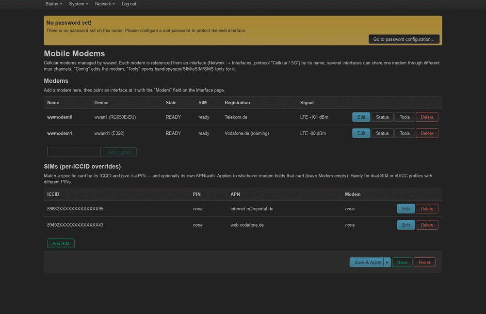

# wwand

**A lean, event-driven WWAN connection manager for OpenWrt.**
Native QMI / MBIM / NCM. ~3 MB. No uqmi, qmicli, libqmi, glib or ModemManager.

```
        ┌─────────────────────────────────────────────────────────┐
        │                        wwand                            │
        │   ┌─────┐   ┌──────┐   ┌─────┐     one daemon, one uloop │
        │   │ QMI │   │ MBIM │   │ NCM │     indication-driven      │
        │   └──┬──┘   └──┬───┘   └──┬──┘     ~3 MB RSS, 0 spawns    │
        └──────┼─────────┼──────────┼────────────────────┬─────────┘
               │ native  │ native+  │ AT                 │ ubus
               │ qmux    │ passthru │                    ▼
          /dev/cdc-wdm  cdc_mbim  ttyUSB           netifd (proto wwand)
          ────────────────────────────────►  wwand0 / wwandN  ──►  WAN
              modem  ◄── SIM · eSIM/eUICC · PIN · cell-lock · telemetry
```

wwand talks to cellular modems natively — a compact ucode daemon that decodes
QMI/MBIM on the wire, drives **netifd** directly (it owns the context lifecycle;
no per-interface monitor process), and manages the **SIM and eSIM** end to end.
It replaces the grown bash QMI dialer: its field-proven behaviours,
quirks and recovery strategies were ported deliberately, its bugs left behind.

---

## Screenshots

A quick tour of the LuCI UI (modems overview · modem config · interface · SIM/APN/PIN · Modem Tools with eSIM · live status) — full-size, captioned gallery in **[docs/luci.md](docs/luci.md)**:

[](docs/luci.md)

---

## Why wwand

- **Tiny & quiet** — ~3 MB RSS, **zero** processes spawned in normal operation,
  one uloop, fully indication-driven (no polling). Compare ModemManager +
  libqmi + glib at 15–30 MB.
- **Three backends, one contract** — QMI, MBIM and NCM sit behind a single
  daemon-neutral interface, so netifd, the ubus API and the UI never care which
  a modem speaks. MBIM even tunnels the whole QMI stack over an
  [MBIM passthrough](docs/architecture.md#5-control-backends-qmi-mbim-ncm).
- **Multi-modem, multi-context** — several modems, and several parallel PDP
  contexts per modem via QMAP multiplexing (rmnet / qmimux, auto-selected, auto
  channel assignment).
- **VRF-safe by construction** — the daemon touches only the link layer; all
  addressing/routing goes through netifd, so `ip4table`/`ip6table`/VRF just work.
- **Robust** — a persisted recovery ladder (retry → op-mode cycle → modem reset
  → board power-cycle / reset-GPIO → reboot), a zero-rx watchdog, non-destructive
  restart (the WAN survives a daemon restart; the daemon adopts the live session).
- **Diagnostic** — EMM reject cause + limited-service flag (QMI + `AT+CEER`),
  live cell environment (serving + neighbours, LTE & NR5G), signal, operator,
  data-system mode (LTE/NSA/SA), all on ubus.

## Features at a glance

| Area | What |
|---|---|
| **Connectivity** | QMI / MBIM / NCM behind one `proto wwand` (legacy `qmi` still accepted) · IPv4/IPv6/dual-stack · IPv4 /32 p-t-p or pushed prefix · IPv6 RFC-7278 PD · QMAP mux (multiple contexts/modem) with full **bidirectional aggregation** — downlink (modem→host) *and* uplink (host→modem, WDA-negotiated + rmnet egress coalesce), capability-gated so a non-QMAP modem falls back to plain framing |
| **Attach** | Attach profile programmed from config **before** registration → correct APN/IP family, avoids the EMM-33 IPv4-only reject |
| **SIM** | PIN unlock (UIM → DMS fallback, retry-guarded) · multi-slot switching · PIN enable/disable · per-SIM overrides by ICCID (`wwand_sim`) |
| **eSIM/eUICC** | Native ES10c list/enable/disable/delete · **SM-DP+ download** via bundled lpac · APDU transport auto-chosen: QMI UIM → **native MBIM MS UICC Low Level Access** → AT — so eSIM works on MBIM modems without an AT port |
| **Binding** | Pin a modem by USB **serial**, **IMEI**, or a stable **device path** (sysfs topology, PCIe/MHI-ready) so the right SIM/APN follows the right modem across re-enumeration; **stable L3 names** `wwand0…wwand100` (auto-assigned, kernel netdev renamed, written back) survive USB renumbering on multi-modem boxes |
| **RF unlock** | `option fcc_auth` unlocks laptop-SKU modems that boot radio-locked (Lenovo/Dell/HP Quectel EM1xx, Foxconn SDX55/SDX62, DW5821e) — QMI DMS/Foxconn auto-chain, MBIM Quectel radio-state |
| **Setup** | **Zero-config autosetup** (default on): a modem on an unconfigured box creates `wwmodem_auto` + interface `wwan0` (L3 device `wwand0`) in the default wan firewall zone, then a one-shot internal **ICCID/IMSI → APN table** copies the carrier defaults (APN, PDP type, auth, credentials) into the config |
| **Radio** | Mode/band restriction · manual PLMN · network scan & selection · Quectel cell-lock (4G anchor / 5G SA) · QMI LOC positioning · **idempotent, radio-safe sets** (skipped when the modem already runs the value; `unchanged`/`deferred` results) with a LuCI-offered modem reset for deferred-apply firmwares |
| **SMS** | Receive/list · read · delete stored messages (SIM or modem store) with a full GSM 03.40 PDU decoder (7-bit incl. umlauts, UCS2, alphanumeric sender, multipart merge) · transport auto-chosen QMI WMS (native / passthrough) → native MBIM SMS → AT · LuCI inbox on the Modem Tools page |
| **Board** | Auto-detected board profiles (MikroTik Chateau 5G, Zyxel LTE33xx / LTE5398-M904 / NR7101, Cudy LT300) drive modem **power/reset GPIOs** and **status LEDs** (5-bar signal graph or mobile/LTE) — absorbing the vendor helper scripts. Manual `modem_reset` / `modem_repower` (LuCI button); GPIO picker in the UI |
| **Ops** | Recovery ladder (opmode → modem reset → **board power-cycle / reset-GPIO** → reboot) + zero-rx watchdog · non-destructive restart + session adoption · **"waiting for modem"** surfaced to netifd/LuCI + logged · uniform rich telemetry line across all backends · per-model quirk tables · AT side channel · **`at2_external`** reserves the secondary AT port for external tools (gpsd, scripts) |

## Packages

The daemon is a backend-neutral base plus per-backend packages — install only
what your modems need. Package definitions live in the
[openwrt-repo](https://github.com/ddimension/openwrt-repo) feed, which also
publishes **prebuilt, signed binary repositories** (snapshot, 25.12 and 24.10
across seven architectures) at
`https://ddimension.github.io/openwrt-repo/<release>/<arch>/` — see the
[feed README](https://github.com/ddimension/openwrt-repo#binary-package-repositories)
for device setup (apk/opkg lines and signing keys).

| Package | Role |
|---|---|
| `wwand` | daemon + framework + codec + shared core + the native `wwand_io.so` I/O module (no backend on its own) |
| `wwand-qmi` | QMI backend — the common case (`DEPENDS wwand`) |
| `wwand-mbim` | MBIM backend (`DEPENDS wwand-qmi` — the passthrough reuses QMI) |
| `wwand-ncm` | NCM/ECM backend (`DEPENDS wwand`) |
| `wwand-mhi` | PCIe/MHI transport + MHI drivers (`DEPENDS wwand`; backend-neutral, add wwand-qmi or wwand-mbim) |
| `wwand-esim` | eSIM management + SM-DP+ download (`DEPENDS wwand-qmi + lpac`) |

The ucode tree ships **precompiled to bytecode** by default (faster start, no
on-device parse); build with `CONFIG_WWAND_UCODE_SOURCE` for editable source.

A typical QMI router installs **`wwand-qmi`** (which pulls in `wwand`). The LuCI
UI is [luci-proto-wwand](https://github.com/ddimension/luci-proto-wwand) +
[luci-app-wwand](https://github.com/ddimension/luci-app-wwand).

## Quick start

All configuration lives in `/etc/config/network` (WireGuard-style):

```
config wwand_modem 'm0'
	option device 'wwan0'            # netdev name or /dev/cdc-wdm0
	# option path '1-1.2'            # optional: pin to a fixed USB topology path
	# option reset_gpio 'modem-reset' # optional: GPIO to reset the modem on recovery
	option modes 'lte,nr5g'
	option pincode '1234'            # if the SIM needs one

config interface 'wan'
	option proto 'wwand'                 # one proto for QMI/MBIM/NCM
	option modem 'm0'
	option apn 'internet'
	option pdp_type 'ipv4v6'
```

`ifup wan` — done. wwand installs alongside the stock uqmi/umbim/comgt-ncm
packages and leaves their `proto qmi`/`mbim`/`ncm` interfaces alone; migrate one
to `proto wwand` on demand from the LuCI modem list, with
`/usr/libexec/wwand/migrate --apply`, or unattended at the next boot via the
example uci-defaults script in `/usr/share/wwand/examples/`. See
[docs/reference.md](docs/reference.md) for every option.

## Documentation

| Doc | For |
|---|---|
| [docs/luci.md](docs/luci.md) | Visual tour of the LuCI web UI (screenshots) |
| [docs/reference.md](docs/reference.md) | Config options, ubus API, eSIM, quirks, troubleshooting, FAQ |
| [docs/vrf.md](docs/vrf.md) | VRF & DMZ deep-dive (L3 isolation, NAT66, field notes) |
| [docs/connection-flow.md](docs/connection-flow.md) | How a connection comes up — wwand, modem and network side, phase by phase |
| [docs/architecture.md](docs/architecture.md) | How it works: layering, backends, netifd coupling, VRF, recovery |
| [docs/extending.md](docs/extending.md) | Add a modem/quirk, a config option, a backend, telemetry, a ubus method |
| [docs/backend-interface.md](docs/backend-interface.md) | The daemon-neutral backend contract |

## Layout

| Path | Description |
|---|---|
| `src-ucode/` | The daemon (ucode): codec, session, backends, integration |
| `io/` | Native C module — cdc-wdm/tty I/O, rmnet netlink helper, non-blocking `spawn()` |
| `files/` | netifd proto shim, init, hotplug, migration helper + uci-defaults |
| `tests/` | Host-side suites — `sh tests/run_tests.sh`, no hardware needed |
| `docs/` | Reference, architecture, extending guide |

## Status

Production-tested across MikroTik Chateau 5G (Quectel RG650E-EU + Huawei E392),
Zyxel NR7101, Cudy LT300 (MeiG SLM770A) and GL.iNet X3000 (RM520N), plus further
Quectel modems (RG502Q, EG06). A hardware-free host suite runs on every change —
current suite/check counts live in [docs/STATUS.md](docs/STATUS.md).

## License

GPL-2.0-only. The AT port table is generated from ModemManager's udev rules
(GPL-2.0-or-later); see the file header for attribution.
