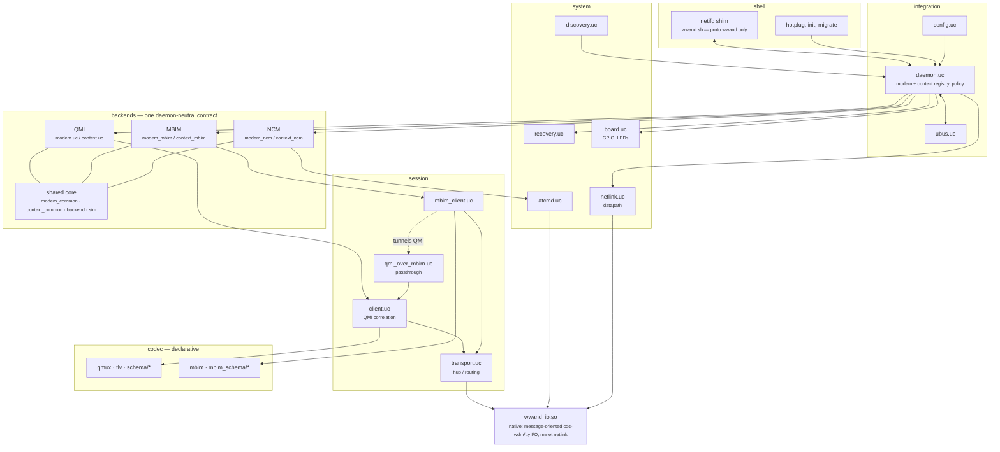

# wwand — architecture

A from-scratch native QMI/MBIM/NCM stack in ~3 MB — a tenth of ModemManager —
that has survived a dwc3/swiotlb 4-byte-URB storm, provider-side SIM purges, and
five datapath variants (rmnet / qmimux / vlan / raw_ip / NCM-ECM-RNDIS) in production. This
document is how it's built and why each decision was forced by the field; read
[`connection-flow.md`](connection-flow.md) next to it for the runtime bring-up
sequence, and [`luci.md`](luci.md) for the web UI.

Status: three control backends (QMI, MBIM, NCM) behind one daemon-neutral
contract, all config in `/etc/config/network`, native SIM/eSIM. In production on
a MikroTik Chateau 5G R17 ax (Quectel RG650E-EU, 5G NSA, two parallel PDP
contexts). RSS figures below are for the QMI-only base; MBIM/NCM add ~200–400 KB
per modem and load only when their package is installed.

**Design principle — three separable concerns.** wwand deliberately keeps the
**control protocol** (QMI / MBIM / AT), the **datapath** (QMAP/RmNet, MBIM,
NCM/ECM/RNDIS, raw-ip) and the **physical transport** (USB today; PCIe/MHI on the
roadmap) as distinct axes rather than one "modem protocol". QMI and MBIM are
co-equal first-class control backends (the market splits QMI/QMAP —
Quectel/SIMCom/MeiG — vs MBIM — Sierra-Semtech/Telit/Fibocom/u-blox); QMAP is a
*datapath capability*, not a synonym for QMI; and the control plane does not bake
in USB, so `control=QMI datapath=QMAP transport=PCIe/MHI` (and QRTR) plug in
without a redesign. See [`design/interface-landscape.md`](design/interface-landscape.md) for
the vendor/interface survey behind this.

## 1. Measured baseline (Chateau)

One process. Zero per-context spawns. ~3 MB resident. The measured baseline:

| Metric | Value | Context |
|---|---|---|
| Daemon RSS | **~2.9 MB** | ModemManager + libqmi + glib: typically 15–30 MB |
| Open fds | 36 | cdc-wdm, tty, ubus, uloop; watched for leaks in soak tests |
| ucode sources | 196 KB uncompressed | ≈ 40–50 KB on squashfs |
| Native module | ~68 KB stripped | I/O + rmnet netlink helper |
| Processes | **1 daemon, 0 per context** | no per-interface supervisor (no-proto-task) |
| External spawns at runtime | 0 | only reboot in recovery (repower is a board GPIO) |

## 2. Layering

```
 native (C):   wwand_io.so       — message-oriented cdc-wdm/tty I/O
                                   (protocol-agnostic), rmnet netlink helper
 codec:        qmux.uc, tlv.uc, hex.uc, schema/*.uc  — QMI, declarative
               mbim.uc, mbim_schema/*.uc             — MBIM, declarative
 session:      transport.uc (hub/routing), client.uc (QMI correlation),
               mbim_client.uc, qmi_over_mbim.uc (QMI-over-MBIM passthrough hub)
 backends:     QMI  — modem.uc/context.uc + extracted helpers modem_init_qmi.uc,
                      telemetry_qmi.uc, datapath_qmi.uc, context_monitor_qmi.uc,
                      regdetail.uc, config_check.uc
               MBIM — modem_mbim/context_mbim + telemetry_mbim.uc
               NCM  — modem_ncm/context_ncm + telemetry_ncm.uc (NCM/AT)
               one daemon-neutral contract; shared core:
                      modem_common.uc, context_common.uc, backend.uc,
                      qmi_backend.uc, mbim_backend.uc, sim.uc
 system:       netlink.uc (datapath), recovery.uc, board.uc (power/reset/LEDs),
               atcmd.uc + atcmd_parse.uc (+atport),
               discovery.uc (control-type detection), modeswitch/protocol_switch
 integration:  daemon.uc + netsel_ops.uc (registry/policy), config.uc
               (+migrate/compat), ubus.uc, main.uc
 shell:        wwand-proto.sh (thin netifd shim → wwand.sh, proto `wwand` only), init, hotplug,
               wwand-migrate + an example uci-defaults script (user-triggered config migration)
```

As a picture — the ASCII block above is the inventory, this is the shape:



Two edges in that picture are the ones worth remembering. **MBIM reaches the QMI
client** through the passthrough — that is why `wwand-mbim` depends on
`wwand-qmi`. And **the netifd shim is bidirectional**: it hands wwand the
interface, and wwand drives netifd back over ubus, because the daemon owns the
lifecycle and the shim runs no monitor process.

The three control backends (QMI, MBIM, NCM) sit behind one **daemon-neutral
contract** (`docs/backend-interface.md`): identical modem methods and an
identical context `settings` shape, so everything above the backend layer is
protocol-agnostic. `discovery.resolve_control` picks the backend per modem from
the driver/device. Backends load lazily and ship as **separate packages**
(`wwand-qmi` / `wwand-mbim` / `wwand-ncm`) on a backend-neutral `wwand` base; a
missing backend package is reported (`control_note` in `status()`), not fatal.
All configuration lives in `/etc/config/network` (see `docs/reference.md`).

Design principles, all validated in the field:

- **Effect injection everywhere** (`fx`, `transport_open`, `deps`): the whole
  logic runs host-side against mocks (current suite/check counts live in
  `docs/STATUS.md`); every
  field bug becomes a scenario in the suite.
- **Declarative message schemas** (field tables verified against libqmi's
  JSON definitions) instead of generated code.
- **All state per modem/context instance** — multi-modem is a requirement,
  not an afterthought. Logs are prefixed accordingly.
- One process, one uloop, indication-driven; timers only where indications
  don't exist (packet stats, registration guard, settle delays).
- **Never trust modem echoes blindly.** The WDA negotiation renegotiates on
  rejection and never adopts zeroed values (see the field lesson below).
- sysfs attributes differ per kernel (e.g. `rx_urb_size` is a vendor patch;
  mainline usbnet derives the URB size from the parent MTU) — every
  attribute write distinguishes "absent on this kernel" from "write failed".

> **Field lesson — the 4-byte-URB storm.** A v5 QMAP aggregation request once
> came back answered with "aggregation disabled, size 0". Taken at face value,
> that zero drove a 4-byte URB configuration into the driver and set off a
> dwc3/swiotlb storm that took the datapath down. The fix — and the reason the
> WDA path treats a zeroed echo as a rejection to renegotiate, never a value to
> adopt — is the single most load-bearing "don't trust the modem" rule in the
> codebase.

## 3. Selected mechanisms

### Modem lifecycle

Bring-up is a linear step chain per modem; any step failure tears down and
schedules a capped-backoff retry that climbs the recovery ladder (§ Recovery).

```
  ABSENT
    │ start()
    ▼
  INIT_TRANSPORT ─► INIT_SERVICES ─► INIT_DATAPATH ─► SET_OPMODE
                                                          │ set-online
                                                          ▼
                             ┌── low power ──  VERIFY_ONLINE ◄──┐
                             ▼                 (GET_OPMODE)      │ retry
                          FCC_AUTH ────────────────────────────┘
                       (dms 0x555F / foxconn 0x5571)
                                                          │ online
                                                          ▼
                                    (read active ICCID)  SIM_UNLOCK ──blocked──► SIM_BLOCKED
                                    pick wwand_sim PIN        │                   (terminal until
                                                              ▼                    config reload)
                                                        CONFIGURE_NET
                                                        (attach profile
                                                         set from config)
                                                              │
    ┌── fail: teardown + backoff ◄──── REGISTERING ◄──────────┘
    │   retry (recovery ladder)            │
    │                                      ▼ registered
    └────────────────────────────────►  READY
                                           │  emits 'registered'
                                           ▼
                                the daemon binds/kicks each interface;
                                contexts activate (per PDP / mux channel)
```

`device removed` → `ABSENT` + `removed` at any point; hotplug rebuilds it.
MBIM and NCM run the same shape with protocol-specific steps (e.g. MBIM
`OPEN → DEVICE_CAPS → SUBSCRIBER_READY → PIN → REGISTER → PACKET_SERVICE`).

**FCC RF unlock.** Laptop-SKU modems (Lenovo/Dell/HP Quectel EM05/EM120/EM160,
Foxconn SDX55/SDX62, Dell DW5821e-class) accept set-online but stay in
(persistent) low power until the host sends an FCC authentication message. So
after `SET_OPMODE` the QMI init re-reads `GET_OPERATING_MODE`
(`modem_init_qmi.uc` `verify_online`): a modem still reporting a low-power mode
runs the `fcc_auth` chain (`qmi_backend.fcc_auth` — DMS Set FCC Authentication
`0x555F`, no args; or Foxconn `0x5571` with a u8 magic — `option fcc_auth`
selects `dms`/`foxconn[:magic]`, `auto` tries both, `off` disables), sets
online again and retries. An ordinary modem answers online on the first pass and
never sees an FCC message. MBIM does the equivalent through the vendor Quectel
Radio State service (`codec/mbim_schema/quectel.uc`, mirroring `mbimcli
--quectel-set-radio-state=on`).

### Datapath (QMAP muxing)

Backend selection per modem: rmnet pass-through preferred (needs
`kmod-rmnet`), qmimux via sysfs `add_mux` as fallback, plain raw-ip without
muxing. Sequence preserved from years of field experience: link down →
`raw_ip` (before `pass_through` — driver requirement) → MTU 1504 → create
mux links → parent MTU = negotiated aggregation size + 4 → children up.
rmnet links are created through the native helper including
`IFLA_RMNET_FLAGS` (ingress deaggregation is mandatory; MAPv5 checksum
offload flags are set only when the modem confirms v5 — the RG650E declines
it on USB). Aggregation size comes from a model table (e.g. RG650E 31 KB),
then a board table, config override wins; the modem clamps the request and
the echoed value drives the driver side.

**Bidirectional aggregation, endpoint typing & client type.** `SET_DATA_FORMAT`
negotiates **uplink** QMAP aggregation as well as downlink — `ul_max_datagrams`
/`ul_max_size` (libqmi TLVs 0x1B/0x1C) alongside the DL parameters — and the host
side is switched on to match via the rmnet **egress coalesce** (ethtool `TX_AGGR`,
since mainline rmnet has no `IFLA_RMNET_UL_AGG_PARAMS`; a native genl helper in
`wwand_io`). So a QMAP link aggregates in **both** directions, not just downlink.
The endpoint-info TLV carries the real bus — `ENDPOINT_TYPE_HSUSB` vs `PCIE`,
derived from the netdev's sysfs path (`netlink.ep_type_number`) — so PCIe/MHI
modems (e.g. RG500Q on M.2) are typed correctly instead of a hardcoded HSUSB, in
both `SET_DATA_FORMAT` and `BIND_MUX_DATA_PORT`; the bind also tags the client as
tethered (`client_type`). A vendor `qmi_wwan` that gates each mux behind a
`link_state` sysfs node is opened per channel (existence-gated, no-op on mainline).

**Pluggable.** rmnet, qmimux and the cdc_mbim session mux (`vlan`) are entries
in one datapath interface (probe/pre/links/prune/child_name), not special cases
beside it — the MBIM one had a `setup_mbim()` of its own until 1.6 and the copy
drifted, which is the argument for one path rather than two. A further datapath
— a vendor driver with its own mux mechanism —
can be added as an add-on package without patching wwand: `option mux` names it,
the daemon `require()`s `wwand.datapath_<name>` and threads the returned
implementation into `netlink.setup()`, which calls it for the one step that is
actually specific (creating/adopting the children) and keeps everything else
shared. Deliberately threaded through rather than collected in a module-level
registry: ucode gives a `require()`d plain script its **own copies** of the
modules it imports, so a plugin registering itself in `netlink.uc` would
populate a different instance than the daemon's and silently do nothing. Under
`auto` the daemon scans its module directory for installed plugins and each
decides, by its declared control protocol and its own `probe()`, whether the box
is its hardware — that is how an accelerated datapath (`rmnet_nss` and
`rmnet_nss_mhi`, which adopt the QMAP children a vendor driver registered so
Qualcomm NSS offload survives) takes over on a zero-config box; a plugin without a probe is explicit-only, and `option mux` naming one wins
over everything. Contract: [datapath-interface.md](datapath-interface.md); how
to write one: [extending.md §4](extending.md#4-adding-a-datapath-backend).
All of it stays **capability-gated**: aggregation is applied only when the modem
confirms QMAP in its echo (non-zero DL size) — a non-QMAP modem, or a config
without a mux, drops to plain raw-ip framing and the extra TLVs are harmless.

**Stable L3 device names.** USB enumeration order is not stable, so wwand gives
every interface a deterministic L3 device name instead of inheriting whatever the
kernel picked. `config.uc` `assign_l3_names` walks the contexts in config order
and hands each one a name from a single flat namespace **`wwand0`..`wwand100`**,
independent of which modem it lives on; an explicit interface `option device`
(any non-path name) pins the name instead. How that name is realised depends on
the datapath:

- **Non-mux datapaths** (QMI/MBIM without a mux, and NCM/ECM): the daemon
  **renames** the kernel netdev to the assigned name over netlink
  (`daemon.uc` `rename_l3` → `link_set {rename}`). If the target name is already
  in use, or the link is busy and the rename fails, it logs an error and **keeps
  the kernel name** — it never forces the issue.
- **Muxed datapaths** (QMAP): the mux **child** is created directly under the
  assigned name (`mux_link` is unified onto `l3_name`); the muxed **parent**
  keeps its kernel name and is never renamed.

On `registered` the daemon writes the resolved name back onto the interface
section as `option device` (`main.uc` `learn_device`): idempotent, `commit`-only
so no interface bounce, and it **never clobbers a user-set value** — gated by
`wwand_globals.write_device` (default on). That gives VRF `list ports`, firewall
and LuCI one explicit, editable, stable handle onto the datapath.

### netifd coupling (no-proto-task; daemon drives netifd in place)

There is **no per-interface monitor process**. The proto handler declares
`no-proto-task`, so after setup netifd leaves the interface `IFS_UP` with no
supervisor task, and the **daemon** owns the context lifecycle — it drives
netifd over ubus (`network.interface <x> up/renew/down`).

```
  ifup wan
     │
     ▼
  netifd ──proto_wwand_setup──► wwand-proto.sh ──ubus wwand context_up──► daemon
                                                                          │ activate
                                                                          │ PDP context
     ◄──────────── reply { ipv4{…}, ipv6{…}, mtu } ◄───────────────────── ┘
     │
  proto_add_ipv4_address / proto_add_*_route / proto_add_dns_server
  proto_send_update (keep=1)          ← addressing/routing = netifd's job (VRF-safe)
     │
     ▼
  interface IFS_UP        (no task — daemon owns the lifecycle from here)
     ⋮
  transient loss ─► daemon reconnects the session in place
                    ─► ubus network.interface renew
                    ─► proto_wwand_renew re-reads context_settings → delta update
                       (no teardown → IPv6-PD + VRF routes preserved)
     ⋮
  permanent loss / hold_max expiry ─► network.interface down (accept the flush)
```


A **transient** loss (network drop, registration loss, recovery reset, brief
modem-lost) keeps the netifd interface up and reconnects the modem session **in
place**: on success the daemon fires `network.interface renew`, whose
`proto_wwand_renew` re-reads `context_settings` and re-sends the update with
`keep=1`, so netifd diffs against the live config and applies only the delta.
No teardown fires, so `interface_ip_flush` never runs and the downstream
IPv6-PD assignments and VRF-table routes are preserved. The blackhole is bounded
by a hold timer (`hold_max`, default 90 s); if the context never recovers the
daemon drives `network.interface down` (accepting the flush) and revives it when
the modem is usable again. A **permanent** loss (`sim_blocked`, admin/config
down) drives `down` immediately.

Because a plain daemon exit is non-destructive (`stop_local` does not bring
contexts down), the WAN stays up and traffic keeps flowing across a wwand
restart; the fresh daemon **adopts** the live session on modem-ready — it probes
`network.interface status` and, if the interface is still up, re-activates the
context and renews in place (never a down/up), otherwise kicks netifd to re-run
setup. Settings changes while connected work the same way: the context
re-queries `GET_CURRENT_SETTINGS` on serving-system changes (plus a slow safety
poll) and emits `settings`, which the daemon maps to `renew`.

A config **reload** (`apply_config`) is likewise scoped: it diffs the new config
against the running state and bounces **only** the modems/contexts that actually
changed, keyed on a per-modem signature (its cfg plus its derived mux set + L3
name) and a per-context signature (its cfg). An unchanged section keeps its live
`modem`/`ctx` object untouched, so editing one interface's APN reconnects only
that context while every other session — including sibling contexts on the same
modem — runs uninterrupted. Adding/removing a mux channel changes that modem's
datapath signature, so its own contexts bounce (scoped to that modem). A forced
single-interface restart stays available through `ifup`/`ifdown`, which act on
exactly one interface regardless of the diff.

(Earlier designs — a `context_wait` long-poll monitor, and driving the mux
child's carrier so netifd's own link tracking would teardown/re-setup — were
dropped: the deferred long-poll still cost a process per interface, and
rmnet/qmimux children do not implement `ndo_change_carrier` so the carrier
cannot be toggled per context.)

### Dependent tunnels (WireGuard / xfrm / gre) over a wwand WAN

A wwand interface is a first-class netifd L3 interface with a **stable netdev
name** (`wwandN`), so a tunnel/xfrm can bind to it as a parent — `option tunlink
'<wwand-iface>'` (gre/vti/ipip/6in4/xfrm) or an xfrm `dev <wwandN>`. Bring-up and
teardown propagate correctly through netifd's host-dependency graph: when the
wwand interface goes fully **down** (permanent loss), dependents are torn down
(`IFEV_DOWN`); when it comes **up**, they re-resolve and re-run their setup,
re-reading the current local address.

**The subtlety — in-place renew with a changed IP.** wwand's non-destructive
reconnect renews the address *in place* (no `down`→`up`, to preserve IPv6-PD/VRF).
netifd delivers that as `IFEV_UPDATE`, which a *resolved* host dependency
**ignores** (netifd `proto-ext.c`: the resolved-dep callback reacts only to
DOWN/UP, not UPDATE). Classic tunnels and xfrm therefore keep the **stale local
address / SA source** and silently break until a real down→up; WireGuard is
immune (address-agnostic — it follows the route). This is a netifd property that
affects *any* in-place-renewing manager (a DHCP renew that changes IP has the
same effect), not a wwand-specific bug.

**Mitigation — `option hard_reconnect_on_ip_change '1'`** (per interface, default
off). When wwand detects that a reconnect changed the IP, it asks the proto shim
for a one-shot **link down→up** (`relink`: `proto_send_update` with link-down then
link-up) instead of the plain renew — so dependents see `IFEV_DOWN`→`IFEV_UP` and
re-follow the new address. This toggles only netifd's L3 view; the **modem session
is not re-dialled**. Cost: the WAN's own IPv6-PD/VRF is rebuilt and the WAN blips
briefly. Leave it off for WireGuard-only setups.

### Routing / VRF compatibility (invariant)

The daemon touches only the **link layer** of the datapath — mux creation,
MTU, carrier, rename, up/down (`RTM_NEWLINK`) and qmi/sysctl sysfs. It never
adds IP addresses, routes or policy rules, and never sets `IFLA_MASTER`. All
addressing and routing is handed to **netifd** via the proto shim
(`proto_add_ipv4_address` / `proto_add_*_route` / `proto_send_update`).

This is what makes wwand VRF-safe: netifd applies the interface's
`ip4table` / `ip6table` (and thus any VRF / l3mdev binding) to every address
and route it installs, entirely at the interface level and independent of the
protocol. Because the daemon never enslaves the l3 device or writes a routing
table itself, netifd is free to enslave the mux child (e.g. `wwand0`) to a
VRF master and place its routes in the VRF table. A regression test
(`test_datapath`, "vrf: datapath performs no direct addressing/routing")
fences this invariant: any future `ip route` / `ip addr` / `ip rule` in the
datapath fails the suite. Deeper netifd integrations (runtime `notify_proto`
updates, carrier-driven teardown, renew) must keep addressing in netifd to
preserve this.

One caveat follows from the same split: when the daemon *recreates* the mux child
(QMAP renegotiation, a backend/mode switch that re-enumerates the netdev) the new
device comes up **unenslaved**, and netifd re-applies `IFLA_MASTER` only when it
observes the device reappear — so a brief window exists where the netdev is up but
not yet in the VRF. Holding the netdev stable (renew **in place** rather than
teardown/recreate) keeps that window from opening; it is another reason the
transient-loss path never tears the device down.

### IPv6 addressing & prefix delegation

wwand configures the WAN's IPv6 from the modem's `GET_CURRENT_SETTINGS`: a global
address (published as a `/128`) plus the on-link `/64`, which the proto shim
shares toward the LAN per RFC 7278 (`proto_add_ipv6_prefix`). There is **no
IA_PD request to the modem** — QMI/MBIM only ever expose that single `/64`.

True prefix delegation (a separate, shorter prefix from the carrier) is therefore
layered **on top**, not folded into the daemon: a stacked `proto dhcpv6` interface
riding on wwand's l3 device (`option device '@wan'`) runs a DHCPv6-PD client for
the delegation, while wwand keeps owning the GUA + default route unchanged. Two
constraints shape this: the exchange is a DHCPv6 IA_PD toward the P-GW (only works
where the carrier delegates), and it needs a **global** source address — hence the
stack must inherit wwand's GUA (a link-local source generally does not carry over
the bearer, and odhcp6c cannot be told to pick the source). See the
[deployment examples](reference.md#deployment-examples) for the concrete config.

### Recovery ladder

Failed connection cycles climb: attempt 8 → operating-mode low-power/online
cycle, 16 → modem offline/reset, 24 → **hardware repower** — a modem/board
`reset_gpio` pulse or a USB-power-cycle via the [board profile](reference.md#board-integration)
(replacing the old external `usb-repower` tool) — > `failreboot` → system
reboot. QMI request errors have a separate ceiling (25 → reboot). Counters
persist in tmpfs across daemon restarts and are intentionally cleared by
reboot. A zero-rx watchdog (packet stats delta) triggers the same repower.

Alongside the automatic ladder, the `modem_reset` ubus method
(`hwops.uc`, installed into the daemon) offers an admin-driven reset with the
same GPIO-first priority: it
pulses the modem/board `reset_gpio` when one is configured, else falls back to
the backend soft reset (QMI DMS offline→reset, NCM `CFUN=1,1`). Board-default
GPIOs are gated by `board_gpio_ok` (a shared board power/reset rail is only
touched on a single-modem box); a per-modem `reset_gpio` is the multi-modem path.

### Boot robustness

The daemon may start before USB enumeration: modems resolve lazily, the
hotplug script re-triggers resolution and binds contexts afterwards. netifd
may give up after early setup failures — on modem registration the daemon
kicks the affected interfaces (`network.interface up`).

### AT side channel (best-effort)

Port discovery: config override → board quirk table → USB id + interface
number lookup in a table generated from ModemManager's udev rules (225
devices; lazily loaded) → first-tty heuristic. Serialized command engine
with echo filtering and OK/ERROR/+CME parsing. Used for model init quirks
(Quectel MBN autoselect — a QMI-native PDC replacement is a future option),
cell locking, the Huawei mode fallback, and ad-hoc diagnostics via ubus.
Connection bring-up never depends on AT.

## 4. Maintainability review — open items

The cross-backend duplication (scaffolding, fail/backoff, the telemetry watch
loop, the zero-rx watchdog) has been consolidated into `modem_common.uc` /
`context_common.uc`; the remaining fork between the three backends is genuine
per-protocol logic (step chains, teardown, `with_nas`). Open items:

1. A ~25-line `series()` helper would flatten the deeper callback chains
   (`_read_info`, sim flows).
2. Error objects are ad hoc; an `errors.uc` with constants and a QMI
   error-code name table would improve logs and grep-ability.
3. Recovery persistence writes on every counter change; a dirty-flag with a
   1 s timer would throttle failure storms (tmpfs, so hygiene only).

(The old per-interface shell monitor is gone — the no-proto-task model in §3
removed it entirely, so its process cost no longer applies.)

## 5. Control backends (QMI, MBIM, NCM)

`discovery.resolve_control` classifies each modem by its driver/device and
builds the matching backend; all three satisfy the same contract, so nothing
above cares which one is in use.

```
              ┌──────────── daemon-neutral contract ─────────────┐
              │ modem: start/stop/state/with_nas/attach_context/ │
              │        note_connect_*/switch_protocol + events    │
              │ context settings: {ipv4{…}, ipv6{…}, mtu}         │
              └──────────────────────────────────────────────────┘
                   │                  │                    │
               ┌───┴───┐         ┌────┴────┐          ┌────┴───┐
               │  QMI  │         │  MBIM   │          │  NCM   │
               │ modem │         │ modem   │          │ modem  │
               └───┬───┘         └────┬────┘          └───┬────┘
      native qmux  │      native MBIM │  + QMI-over-MBIM  │  AT commands
                   │    (MS BasicConn)│    passthrough    │
                   ▼                  ▼   (reuses QMI)     ▼
            /dev/cdc-wdmX       /dev/cdc-wdmX        /dev/ttyUSBx  +
             (qmi_wwan)          (cdc_mbim)          cdc_ncm/cdc_ether
```

- **QMI** — native QMUX over `/dev/cdc-wdmX`, the reference backend.
- **MBIM** — native **MS Basic Connect Extensions** (v2/v3) for telemetry, plus a
  **QMI-over-MBIM passthrough** (`qmi_over_mbim.uc`): a hub-shim that tunnels raw
  QMUX frames through the MBIM `QMI` service, so the entire QMI stack
  (`client.uc`, schemas, `qmi_backend.uc`) runs unchanged over the open MBIM
  channel. This is why `wwand-mbim` depends on `wwand-qmi`. **Invariant: never
  send CTL SYNC over the passthrough** — it resets the modem's embedded QMI state
  and kills the live MBIM data session (HW-proven on EG06); the shim blocks it
  structurally.
- **NCM** — AT-controlled (`ncm_vendors.uc` `VENDORS` recipes, driven by
  `modem_ncm.uc`) over a plain `cdc_ncm`/`cdc_ether`/`rndis_host` netdev, for
  modems with no cdc-wdm control device. RNDIS modems (Fibocom FM350-GL) are
  the same backend — the control is AT either way, so no separate backend
  exists. Assigned IP config is always static from the modem (CGCONTRDP, or
  the per-vendor `ip_config` hook, e.g. CGPADDR on the T700) — DHCP is never
  used. rndis_host datapaths come up with ARP disabled (NOARP): the
  gateway-less /32 device route then works without neighbour resolution
  (Linux treats NOARP interfaces as NUD_NOARP for IPv6 NDP as well).

Shared logic is extracted once and installed by every backend:
`modem_common.uc` (state/context scaffolding, `make_fail`, the adaptive
telemetry `watch_driver`, AT bring-up, lazy `at2`) and `context_common.uc`
(zero-rx watchdog). A PPP-only modem is mode-switched once (`modeswitch.uc`) to a
richer usbnet mode and rebuilt by hotplug.

## 6. SIM, eSIM & eUICC

wwand owns the modem's UIM channel end to end, so SIM handling is native — no
separate AT port or helper daemon.

- **SIM** — PIN unlock (UIM `VERIFY_PIN` → DMS fallback, retry-guarded), multi-
  slot switching (`modem_sim_slots` / `modem_sim_switch_slot`), PIN
  enable/disable (`modem_sim_pin_lock`), and per-SIM config overrides
  (`config wwand_sim`, matched by ICCID) that pick the PIN/APN for the inserted
  card before unlock (the MF-level ICCID is readable while locked).
- **eSIM (eUICC)** — native **ES10c** profile management (list / enable / disable
  / delete) over the UIM APDU channel, plus **SM-DP+ provisioning** driven by a
  bundled **lpac** (optional `wwand-esim` package). The download runs the ES9+
  HTTPS on the router over the existing WAN — no dedicated provisioning APN:

```
  LuCI / ubus  ──►  daemon: modem_esim(op:"download", activation_code)
                       │
                       ▼
              esim_bridge spawns lpac  (env LPAC_APDU=stdio LPAC_HTTP=curl)
                       │
        ES9+ HTTPS ────┤  lpac ⇄ SM-DP+   (profile download, over the WAN)
                       │
        ES10 APDUs ────┤  lpac stdio ⇄ daemon ⇄ modem UIM
                       │                 (ubus modem_apdu — wwand stays the
                       │                  sole owner of the modem)
                       ▼
              profile installed on the eUICC
                       │
              op:"enable" ──► ES10c ENABLE + eUICC REFRESH ──► SIM re-init
                       │                                       ──► re-register
                       ▼
              set `option sim_slot` to the eUICC slot = permanent boot default
```

lpac is either the stock openwrt-packages `lpac` or the bundled `wwand-lpac`
(both provide `/usr/bin/lpac`); the stdio APDU bridge needs lpac ≥ 2.3.0.

The **APDU transport** is chosen per modem (`sim.uc apdu_backend`): native
**MBIM MS UICC Low Level Access** → **QMI UIM** (native or over the
QMI-over-MBIM passthrough) → **AT** (`CCHO`/`CGLA`/`CCHC` — the path for
AT-only modems like the Fibocom FM350-GL, whose T700 answers `CCHO` with a
bare session id). On dual-SIM modules the eUICC is its own physical slot; the
internal LPA re-claims the ISD-R, so host APDU access is a **window** that
opens after a slot switch — wwand re-probes the backend per operation instead
of caching a dead channel, and the modem's `esim_ready` event (fired after the
bring-up esim-surface probes) triggers the daemon's `eid`/`profiles` refresh
into status.

## 7. Configuration & migration

All config lives in `/etc/config/network` (WireGuard-style typed sections):
`wwand_modem` (hardware + SIM slot + radio), `wwand_sim` (per-ICCID override),
`interface` with `proto wwand` + `option modem` (the connection), `wwand_globals`.
The netifd shim registers **`wwand` and nothing else** — the `qmi` proto name
stays uqmi's. That is deliberate: netifd sources every script in
`/lib/netifd/proto`, so two handlers claiming `qmi` would be settled by load
order, which no package can control. **wwand is a good citizen:** it installs
alongside the stock uqmi/umbim/comgt-ncm packages (no CONFLICTS) and manages only
`proto wwand` interfaces — bare `proto qmi`/`mbim`/`ncm` interfaces are left to the
stock stack, so exactly one dialer owns any interface and its control device.
Moving one to wwand is always explicit: `config.migrate_plan` converts it **in
place** to `proto wwand` (+ a linked `wwand_modem`), driven from the LuCI modem
list (the `migrate` ubus method), the `wwand-migrate` CLI, or the example
uci-defaults script in `/usr/share/wwand/examples/` for a one-shot unattended
conversion at the next boot. See `docs/reference.md`.

## 8. PCIe/MHI transport

A PCIe modem speaks the same QMI/MBIM the USB ones do, but everything *around*
the protocol differs: how the control node is found, where the data netdev
lives, and which sysfs knobs exist. Measured on a Quectel RM520N-GL
(`qcom-sdx65m`) in the M.2 key-B slot of a BananaPi BPi-R4, kernel 6.18.

### 8.1 Control port: one modem, several nodes

The kernel `wwan` framework publishes each control channel separately:

```
/sys/class/wwan/wwan0qmi0   type QMI
/sys/class/wwan/wwan0mbim0  type MBIM
/sys/class/wwan/wwan0qcdm0  type QCDM
```

They attach in the kernel's order, not in ours, so binding whichever hotplug
fires first is a coin toss — on the R4, MBIM attached before QMI and autosetup
took the weaker channel. `discovery.preferred_wwan_port()` resolves a hotplug
name to the best sibling *on the same wwan device*: QMI over MBIM, never AT.
Ports of a different `wwanN` are not siblings and are never adopted.

Both families are bare kernel names in the hotplug event and both live under
`/dev`, so autosetup prefixes `wwanNqmi0` exactly like `cdc-wdmN`. Without that
the daemon reported `control device not present` for a node sitting right there.

### 8.2 Data netdev: not under the wwan device

`mhi_wwan_mbim` hangs its netdev off the wwan device, and the exact-match
lookup in `discovery.netdev_for_device()` finds it. `mhi_net` does **not**: the
control ports live at `…/mhiN/wwan/wwanN` while the data channels are siblings
one level up.

```
…/mhi0/wwan/wwan0        <- control ports
…/mhi0/mhi0_IP_HW0       <- mhi_hwip0, hardware-accelerated data channel
…/mhi0/mhi0_IP_SW0       <- mhi_swip0, software path
```

So the search widens to the shared `mhiN` parent and takes the hardware
channel, falling back to the software one. A second MHI instance is not
mistaken for the same modem.

### 8.3 The `qmi` sysfs group is qmi_wwan's, not everyone's

`raw_ip`, `pass_through`, `add_mux` and `rx_urb_size` live in
`/sys/class/net/<dev>/qmi/` — a **qmi_wwan** group. `mhi_net` has no such
directory: it is raw-IP by construction and hands frames up untouched. wwand
therefore treats a *missing group* as "nothing to configure" and only a knob
missing from an *existing* group as fatal. Before that distinction, MHI died at
`raw_ip unavailable` on a link that needed no configuring.

### 8.4 Multiple PDP contexts

Same model as USB QMI — QMAP plus kernel `rmnet`, one child netdev per
`mux_id`, stacked on the parent; the parent is renamed out of the way so the
child can carry the configured L3 name.

The one structural difference: `pass_through` exists only because `qmi_wwan`
would otherwise parse the QMAP frames itself. A driver without the `qmi` group
never does, so rmnet stacks on it directly — `select_backend` accepts rmnet on
such a device without looking for a knob that cannot exist. (While it did look,
MHI answered `mux_backend_unavailable` and multi-PDP was impossible there.)
`qmimux` is genuinely unavailable on MHI, since it *is* a qmi_wwan feature.

**RX buffers are sized by the MTU.** This is the part worth remembering.
On USB, `rx_urb_size` bounds the aggregated frame. On MHI there is no such
attribute — `mhi_net` sizes each RX buffer as

```c
size = mhi_netdev->mru ? mhi_netdev->mru : READ_ONCE(ndev->mtu);
```

and `mru` comes from the controller profile. `mhi_qcom_sdx65_info` sets no
`mru_default` (only the MBIM profiles do, 32768), so **the parent netdev's MTU
is the receive buffer size**. wwand sets it to `urb_size` = datagram + 4, which
is what makes it match the `dl_max_size` negotiated over WDA. Raising
`dl_datagram_max_size` per modem carries the MTU along, and `mhi_net` allows up
to 0xffff — but decoupling the two would silently truncate aggregated frames.

Measured with two contexts (`mux_id` 1 and 2):

```
wda format negotiated: llp 2, ul/dl aggregation 5/5, dl max 32 x 4096 bytes, ul max 11 x 4096
datapath: parent wwand0 renamed to raw wwan0 so the mux child can take the name
datapath: rmnet, urb 4100, mux [wwand0 wwand1]

10: wwan0:        <POINTOPOINT,NOARP,UP,LOWER_UP> mtu 4100   <- parent = RX buffer
13: wwand0@wwan0: <UP,LOWER_UP> mtu 1500
14: wwand1@wwan0: <UP,LOWER_UP> mtu 1500
```

The RM520N refuses MAPv5 (`requested proto 8` -> aggregation `0/0`) and accepts
plain QMAP (`proto 5` -> `5/5`); the existing v5-then-fallback path handles it.

### 8.5 Runtime PM must be pinned off

`mhi-pci-generic` runtime-suspends the endpoint into D3 a few seconds after it
goes idle, and this modem does not survive the resume: the link comes back
throwing `Uncorrectable (Non-Fatal)` / `CmpltTO` and the endpoint stops
answering permanently. Nothing in software recovers it — `remove`+`rescan`, the
bridge's `reset_subordinate` (secondary bus reset) and a re-probe of the whole
`mtk-pcie-gen3` controller all end at `LTSSM detect.quiet`. Only a cold boot
does, and the board has no modem GPIO to pulse (M.2 slot power is hard-wired,
PERST# comes off the PCIe pinmux).

So `netlink.pin_runtime_pm()` climbs from the control port to the PCI endpoint
and its bridge and pins both to `power/control = on`. The daemon calls it the
moment the control device is known present — before the state machine, because
a later suspend is unrecoverable and the fatal one hit while the modem sat idle
in `SIM_BLOCKED` with the polls stopped. Silent no-op on USB.

### 8.6 No AT port, and why

The generic Qualcomm entry `PCI_DEVICE(PCI_VENDOR_ID_QCOM, 0x0308)` ->
`mhi_qcom_sdx65_info` uses `modem_qcom_v1_mhi_channels`, which declares DIAG,
MBIM, QMI, IPCR, FIREHOSE, IP_SW0 and IP_HW0 — but **no DUN**. `mhi_wwan_ctrl`
maps `DUN` to `WWAN_PORT_AT`, i.e. `/dev/wwanNat0`, so without the channel
there is no AT port at all. The vendor profiles (Quectel EM1xx, Telit FN990,
Sierra EM919x) all declare DUN 32/33; the generic one does not, and a module
that identifies only as `17cb:0308` — subsystem `17cb:0308`, no vendor
subsystem — falls through to it.

QMI service `0x08` is not a substitute. It is Qualcomm's
`access_terminal_service_v01` (ATCoP *forwarding*, IDL 1.6 — the `8(1.6)` the
modem advertises): a client registers AT command **names that the modem then
forwards to it**; no message executes an AT command. Probing confirms the IDL
exactly — `0x0020/0x0022/0x0024/0x0025/0x0027` exist, the indication ids
`0x0021/0x0023/0x0026` answer error 71 when sent as requests, and `0x0027`,
present only from IDL minor 6, answers and so pins the version.

**The way in is AT over MBIM.** Even on a QMI-mode modem the MBIM channel is a
separate MHI channel with its own `/dev/wwanNmbim0`, and Quectel exposes an AT
pipe there: service **`6427015f-579d-48f5-8c54-f43ed1e76f83` (QDU), CID 8**,
SET only.

```
request  InformationBuffer = u32 LE CommandType (0 = AT, 1 = SYSTEM) || raw ASCII
response InformationBuffer = u32 LE Status      (0 = OK)             || raw ASCII
```

Both byte arrays are *unsized and unpadded* — no offset/length pair, unlike
ordinary MBIM string fields. The modem echoes the command back as the first
response line, so strip through the first `\n`. HW-verified on the RM520N-GL
over MHI while the QMI backend held `/dev/wwan0qmi0`: `MBIM_OPEN` succeeds, the
device-services list carries the QDU UUID, and `ATI` returns the model banner.

wwand implements this as `atcmd_mbim.uc`, an ordinary atcmd transport: the
engine above writes `cmd + CR` as it always does, the transport buffers until a
command is complete, runs one QDU transaction, strips the echo and hands the
answer back through the same `on_data` callback a tty would use. `open_at()`
reaches for it only when `find_at_channels` finds no tty — a real port is
full-duplex and carries URCs, which this cannot. `option at_mbim '0'` opts out.
Reached through the plain-script shim `atcmd_mbim_lazy.uc`, so the
backend-neutral base package never pulls in the MBIM codec.

**Limitation:** a request/response pipe has no unsolicited output. Everything
wwand *polls* works — identify, telemetry, `AT+QSIMDET`, `protocol_switch` —
but a URC never arrives. That is the one reason a DUN channel remains the
better long-term answer: it is a real port, and it needs no MBIM.

HW-verified end to end on the RM520N-GL: `ubus call wwand modem_at` returns
parsed responses and correct CME codes on a modem with no AT port at all.

### 8.7 SIM diagnosis on a board with no AT

`GET_SLOT_STATUS` and `GET_CARD_STATUS` report through **different enums**, and
conflating them costs hours. Slot status carries `QmiUimPhysicalCardState`
(0 unknown / 1 absent / 2 present) — that view follows the slot's card-detect
line, which is reported inverted on some BPi-R4 units. Card status carries
`QmiUimCardState` (**0 absent / 1 present / 2 error**) plus a per-card
`error_code` (`QmiUimCardError`).

A card that is physically there but never answers sits in `CARD_STATE_ERROR`
with `error_code 3 = no ATR received` — which is what a SIM inserted the wrong
way round, or not fully seated, looks like. An empty slot reports
`CARD_STATE_ABSENT` instead. wwand reports the two apart rather than calling
both `no_sim`, and names the modem's own reason; it also stops reading EFs off
a slot it already knows it cannot read (`modem._no_card`), which otherwise cost
four `err 48` warnings per LuCI status poll.

## 9. Roadmap

1. Byte-trace captures from real modems as codec regression fixtures.
2. QMI-native cell-lock / PDC (replacing the AT `QNWLOCK` / `QMBNCFG` quirks).
3. Wider modem coverage in the quirk tables (see `docs/extending.md`).
