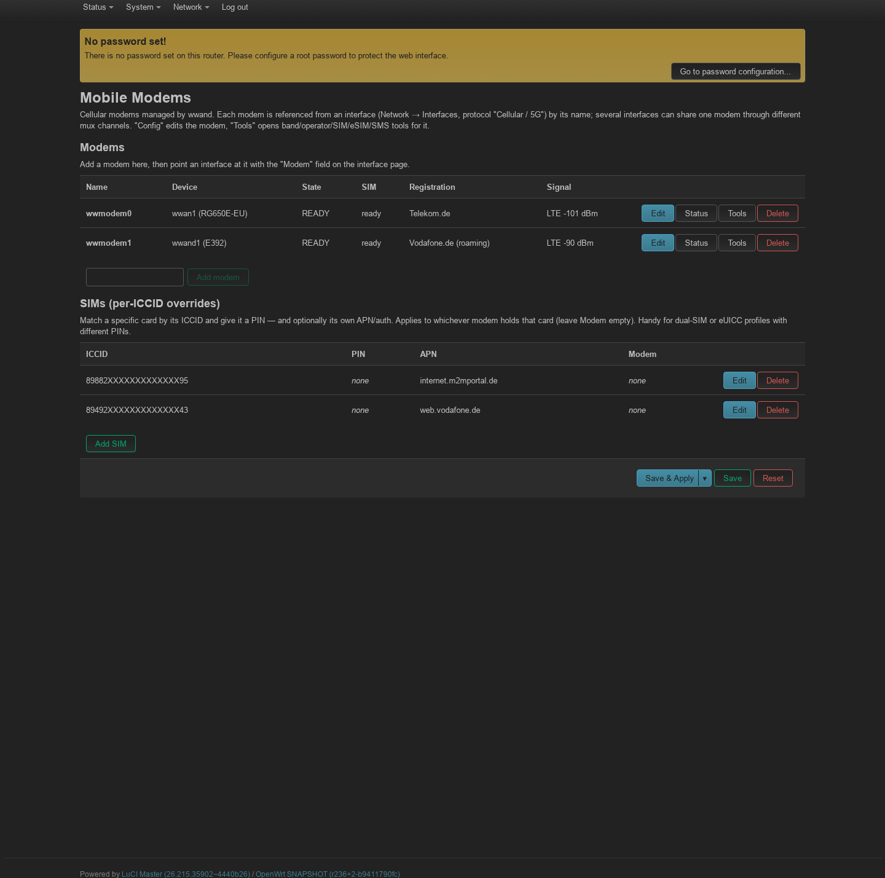
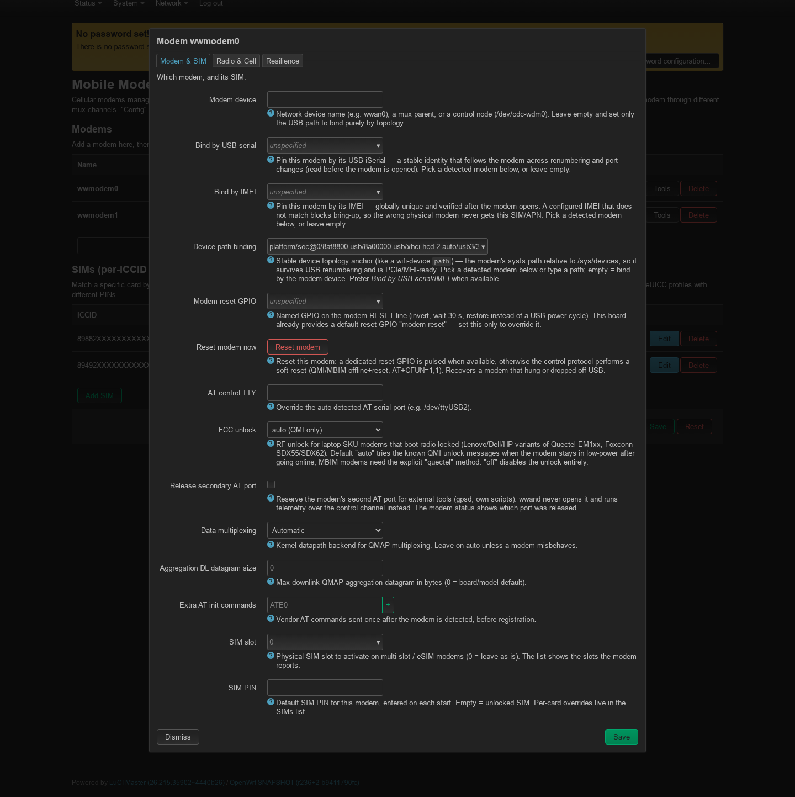
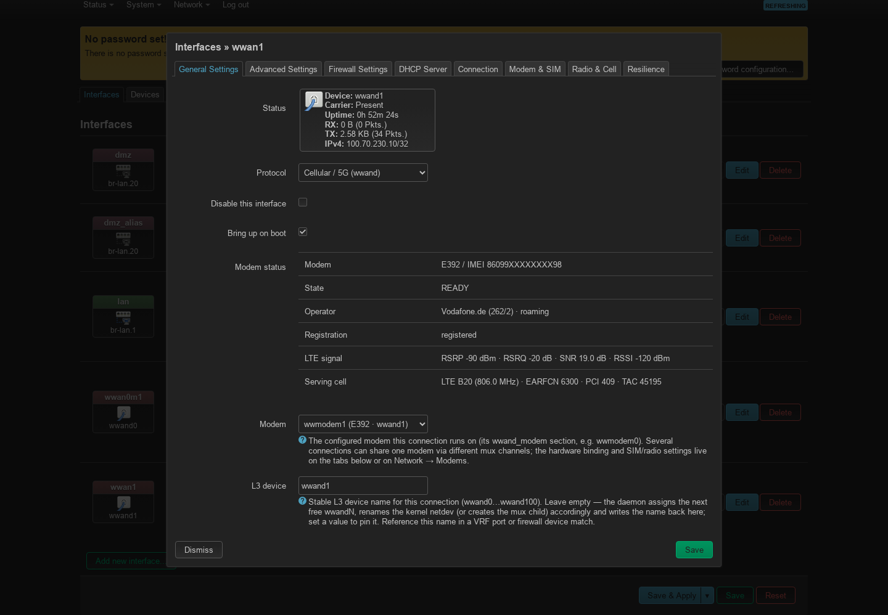
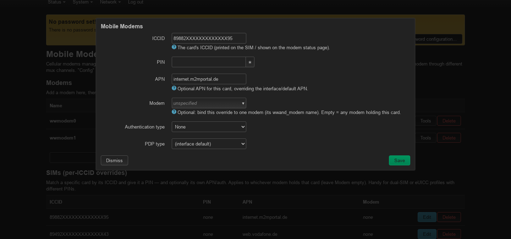
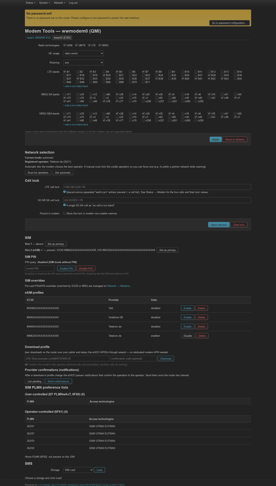
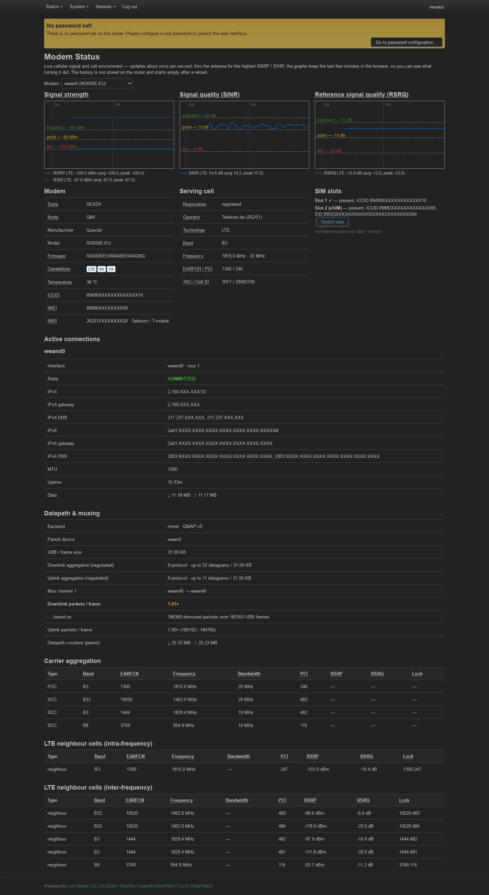
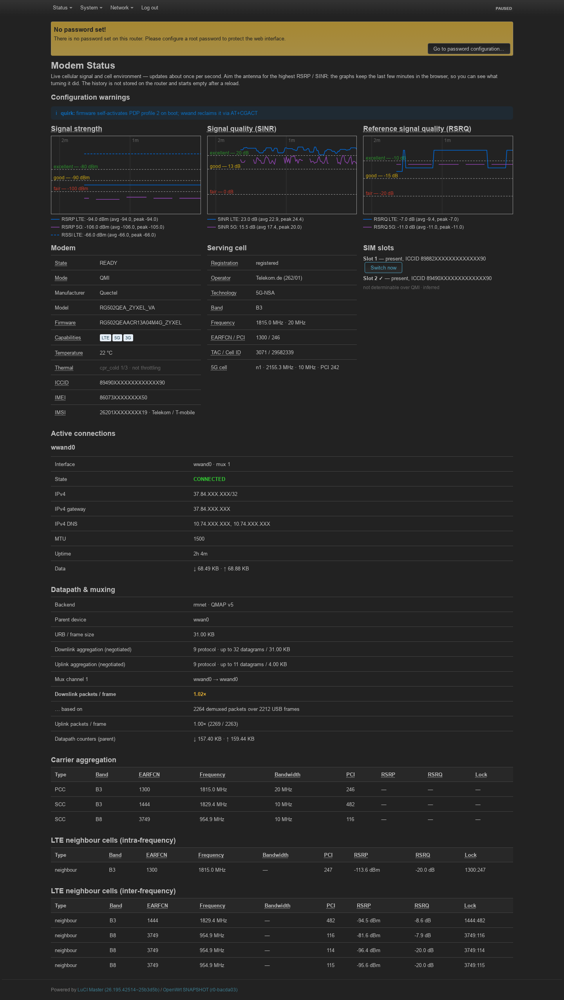

# wwand in LuCI — a visual tour

The LuCI web UI (`luci-app-wwand` + `luci-proto-wwand`) drives the whole
`/etc/config/network` model — every screen below writes the same config you
could edit by hand (see [reference.md](reference.md)). ICCID / IMSI / IMEI /
EID are masked in these screenshots.

## Network → Modems — the overview

The entry point. Lists every managed **and** detected modem with live SIM and
registration status, its **backend** (QMI/MBIM/NCM) and the number of **up
connections** per modem, plus the per-ICCID SIM override table. Each row has
**Config** (edit the modem), **Status**, **Tools** and **Reboot** — the last
resets just that modem (GPIO reset if the board exposes one, otherwise a backend
soft reset; its connections drop briefly and recover on their own).

Below the SIM list, a **Migratable interfaces** section appears whenever the box
still has stock `proto qmi`/`mbim`/`ncm` interfaces that wwand does not manage
yet. Tick the ones to convert and press **Migrate selected**: each is rewritten
**in place** to `proto wwand` (its name, firewall zone and IP settings are kept)
and a `wwand_modem` section is created and linked — wwand then takes over managing
it. This is the recommended way to hand a stock cellular interface to wwand; the
global `option takeover` (default off) is only needed for the old fully-automatic
adoption.

## Modem config

The per-modem dialog (Config button). Hardware binding by **device path**
(a dropdown of detected modems + free text), USB serial or IMEI; the **FCC
unlock** method for laptop-SKU modems; the generic **Reset modem** button;
SIM slot, PIN, radio and resilience tabs.

## Interface config (Network → Interfaces)

Editing a `proto Cellular / 5G (wwand)` interface: live modem status, the
**Modem** selector (which `wwand_modem` this connection runs on), the APN /
PDP / auth, and the stable **L3 device** name (`wwand0…wwand100`, auto-assigned
and written back). Extra tabs cover Connection, Modem & SIM, Radio & Cell,
Resilience.

## Per-SIM override editor (SIM / APN / PIN)

Match a specific card by its ICCID and give it a PIN — and optionally its own
APN / auth / PDP type, optionally bound to one modem. Ideal for dual-SIM or
swapping eUICC profiles with different PINs.

## Modem Tools — bands, operator, cell lock, SIM, eSIM, SMS

Radio-technology and per-band selection, manual/automatic **network
selection** with an operator scan, **cell lock**, SIM slot & PIN control, full
**eSIM profile management** (download via activation code through lpac,
enable/disable/delete, provider confirmations), SIM PLMN preference lists and
SMS.

## Modem status

Live signal (aim-the-antenna bars with peak hold), serving cell, SIM slots,
the active connection (IP/DNS/MTU, uptime, data), carrier aggregation and
neighbour cells. Refreshes about once a second.

A single-modem box (Zyxel NR7101):

