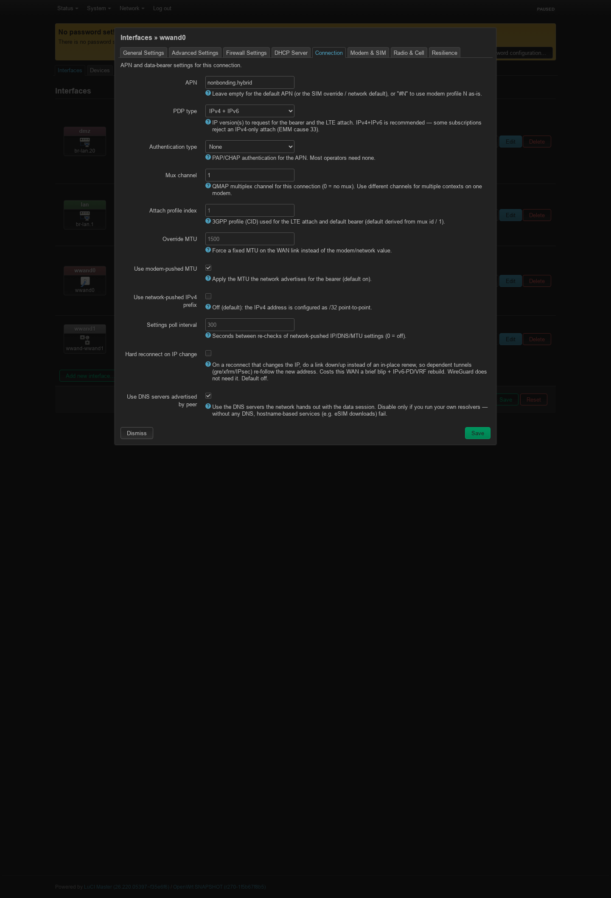

# wwand in LuCI — a visual tour

The LuCI web UI (`luci-app-wwand` + `luci-proto-wwand`) drives the whole
`/etc/config/network` model — every screen below writes the same config you
could edit by hand (see [reference.md](reference.md)).

ICCID / IMSI / IMEI / EID and the assigned addresses are masked in these
screenshots — a public IPv6 prefix identifies a subscriber line as surely as an
IMSI does. They are captured by `tools/luci-screenshot.py`, which stops the
one-second refresh, applies that masking and grabs the full page, so redoing
them after a UI change is one command and not an afternoon with an image
editor:

    tools/luci-screenshot.py --login root \
        --url http://ROUTER/cgi-bin/luci/admin/status/wwand \
        --out docs/images/luci-status-chateau.png

## Network → Modems — the overview

The entry point. Lists every managed **and** detected modem with live SIM and
registration status, its **backend** (QMI/MBIM/NCM) and the number of **up
connections** per modem, plus the per-ICCID SIM override table. Each row has
**Config** (edit the modem), **Status**, **Tools** and **Reboot** — the last
resets just that modem (GPIO reset if the board exposes one, otherwise a backend
soft reset; its connections drop briefly and recover on their own).

Below the SIM list, a **Migratable interfaces** section appears whenever the box
still has stock `proto qmi`/`mbim`/`ncm`/`modemmanager` interfaces that wwand
does not manage yet. Tick the ones to convert and press **Migrate selected**: each is rewritten
**in place** to `proto wwand` (its name, firewall zone and IP settings are kept)
and a `wwand_modem` section is created and linked — wwand then takes over managing
it. This is the recommended way to hand a stock cellular interface to wwand. For
an unattended one-shot conversion there is an example uci-defaults script in
`/usr/share/wwand/examples/` that runs the same migration at the next boot.

## Modem config

The per-modem dialog (Config button). Hardware binding by **device path**
(a dropdown of detected modems + free text), USB serial or IMEI; the **FCC
unlock** method for laptop-SKU modems; the generic **Reset modem** button;
SIM slot, PIN, radio and resilience tabs.

## Interface config (Network → Interfaces)

Editing a `proto Cellular / 5G (wwand)` interface: live modem status, the
**Modem** selector (which `wwand_modem` this connection runs on), the APN /
PDP / auth, and the stable **L3 device** name (`wwand0…wwand100`, auto-assigned
and written back). Extra tabs cover Connection, Modem & SIM, Radio & Cell,
Resilience.

The **Connection** tab holds the data-bearer settings: APN, PDP type and auth,
the QMAP **mux channel** that lets several connections share one modem, the
3GPP **attach profile index**, MTU handling and the reconnect behaviour.

Note that `ip6ifaceid` — pinning the IPv6 interface identifier against a carrier
that rotates it — is *not* on this tab. It is netifd's own option and LuCI
claims it for every protocol as the **IPv6 suffix** box under *Advanced
Settings*; see [reference.md](reference.md).

## Per-SIM override editor (SIM / APN / PIN)

Match a specific card by its ICCID and give it a PIN — and optionally its own
APN / auth / PDP type, optionally bound to one modem. Ideal for dual-SIM or
swapping eUICC profiles with different PINs.

## Modem Tools — bands, operator, cell lock, SIM, eSIM, SMS

Radio-technology and per-band selection, manual/automatic **network
selection** with an operator scan, **cell lock**, SIM slot & PIN control, full
**eSIM profile management** (download via activation code through lpac,
enable/disable/delete, provider confirmations), SIM PLMN preference lists and
SMS.

## Modem status

Configuration warnings first, then **live signal graphs**, then the panels:
modem identity, serving cell, SIM slots, the active connection (IP/DNS/MTU,
uptime, data), datapath and muxing, carrier aggregation and neighbour cells.
Refreshes about once a second.

The graphs keep the last few minutes **in the browser** — nothing is stored on
the router, so the window starts empty and a reload clears it. That is the job
they are for: watching what turning an antenna does, while turning it.

Each canvas carries **one quantity** with its own quality thresholds, and one
**series per radio technology** rather than a single line that quietly changes
meaning when the modem switches: on EN-DC the LTE anchor and the NR carrier
arrive in the same reply and can differ by 10 dB, and a gap in the 5G line is
itself the information that 5G stopped serving. Solid lines are the serving
cell's own power (RSRP, or RSCP on 3G); dashed lines are the band-wide RSSI in
the same colour, and an RSSI keeps the RAT that measured it — only a modem
reporting an untagged value gets the plain amber line.

A canvas and its legend rows **appear with their data**: an LTE-only modem
never shows the 3G Ec/Io graph, and a 2G-camped one shows nothing but its RSSI.
The thresholds come from the published vendor tables (and match the ladder the
router's own signal LEDs step at) — hover a heading or its legend for the
sources and the caveats.

The **Modem** selector above the graphs appears once a box has more than one
configured modem; each keeps its own history, so switching back to one shows
the window it had rather than starting over.

A Zyxel NR7101 on **5G NSA** — both radios report at once, so every canvas
carries an LTE line and a 5G line, and a break in the purple one is 5G dropping
out rather than a missing reading:

