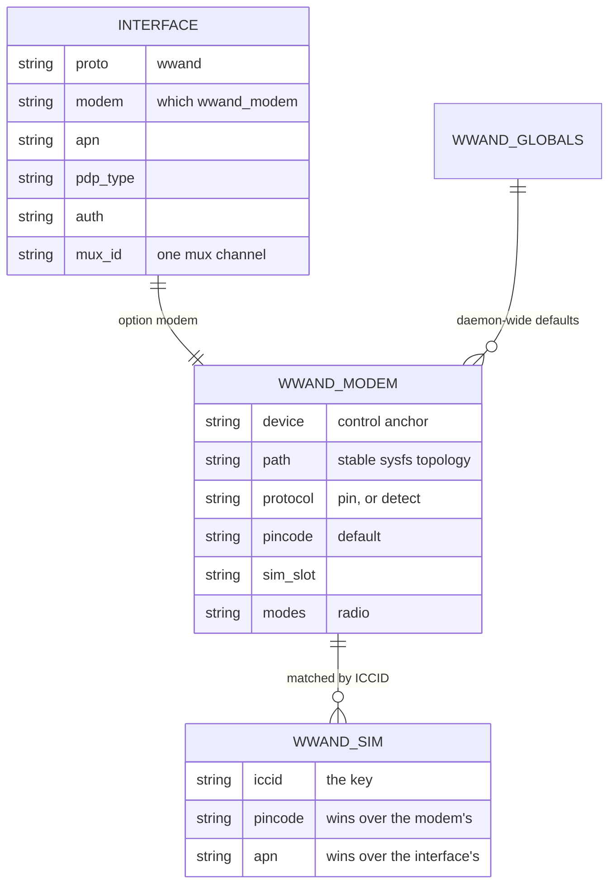
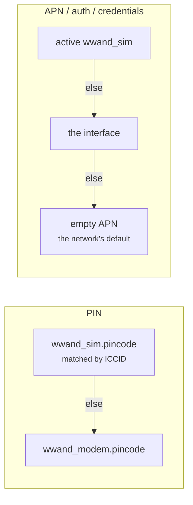

# wwand package — configuration and API reference

wwand is an event-driven QMI / MBIM / NCM connection manager for OpenWrt, written
in ucode. It owns the modem's control port, drives netifd, and exposes a ubus
API. This document is the reference for configuration, the ubus API, diagnostics
and troubleshooting. For the design rationale see [architecture.md](architecture.md);
to add a modem, quirk or backend see [extending.md](extending.md).
How a connection actually comes up — from the wwand, modem and network
perspective — is [connection-flow.md](connection-flow.md); the documentation
map is [README.md](README.md).

**Contents:** [Zero-config autosetup](#zero-config-autosetup) ·
[Configuration](#configuration) ·
[Configuration workflows](#configuration-workflows) ·
[netifd integration](#netifd-integration-no-proto-task) ·
[Deployment examples](#deployment-examples) (multi-PDN/mux, VRF, DMZ,
dual-stack) · [Performance & tuning](#performance--tuning) ·
[ubus API](#ubus-api) · [eSIM](#esim-management--provisioning) ·
[SMS](#sms) · [Board integration](#board-integration) ·
[Telemetry & diagnostics](#telemetry--diagnostics) ·
[Troubleshooting](#troubleshooting) · [Quirk handling](#quirk-handling) ·
[Glossary](#glossary) · [FAQ](#faq) · [Development](#development)

## Zero-config autosetup

On a device with **no wwand configuration at all** (no `wwand_modem`
section, no `proto 'wwand'`/`'qmi'` interface), wwand sets itself up when a
modem appears: it creates `config wwand_modem 'wwmodem_auto'` (anchored to
the detected device) and `config interface 'wwan0'` (`proto 'wwand'`),
joins `wwan0` to the default `wan` firewall zone and brings it up. Once the
SIM is read, the ICCID/IMSI is matched against a small internal APN table
(`apndb.uc`: prefix → apn/pdp type/auth/credentials); on a match the values
are **copied into `/etc/config/network` once** and the `autosetup` marker
is removed — afterwards the config is an ordinary hand-editable config. That
happens in the autosetup run only: the marker is removed on the first card
read with or without a match, so no later boot fills anything. Whatever the
modem's attach profile held is not consulted. No table match keeps the APN
empty — the network's default (see the precedence below); a card that needs
its own APN (an operator's special APN such as a Telekom hybrid card's) gets
it configured.
A modem that cannot do IPv6 (`ipv4_only` in `modem_quirks.uc` — the Sierra
MC7710) is filled with the carrier's IPv4 APN where the table has one
(`apn_ipv4`, e.g. `internet.telekom`) and `pdp_type 'ipv4'`.

On **QMI** the created interface also gets `mux_id 'auto'` — but only when this
modem can actually carry a channel: the question is asked per modem, against the
netdev behind its own control device, so a datapath must claim it (rmnet,
qmimux, or an installed add-on). A modem with no mux datapath is left unmuxed,
and so are **MBIM and NCM**, which keep their defaults — an MBIM session is not
a QMAP channel and NCM has no mux at all.

`auto` rather than a channel number, because at this point only half the
question can be answered. What autosetup can see is the HOST side: the driver's
sysfs nodes and which datapath claims the netdev. Whether the **modem** speaks
QMAP is only knowable from its reply to WDA `SET_DATA_FORMAT`, which arrives
much later. Some modems pass the host-side test and have no QMAP at all — a
Huawei E392 (WDA 1.0, 2012 firmware) answers "aggregation disabled" to every
QMAP version offered — so writing a `1` here would strand exactly those with a
channel they cannot carry. `auto` keeps the intent and lets the datapath settle
it against the modem's own answer; see **`mux_id 'auto'`** below. The point of the channel is what hangs
off it: an accelerated datapath attaches to the QMAP child, and a second APN
added later needs no re-plumbing. With the channel, the parent keeps its raw
kernel name and the stable `wwand0` moves onto the mux child.

Disable with `option autosetup '0'` in `config wwand_globals`. Autosetup
never runs when any wwand config exists, and the one-shot fill never
overwrites operator-set values.

## Configuration

**All configuration lives in `/etc/config/network`** (WireGuard-style). Three
wwand section types plus the netifd interface — no separate config file:

- **`config wwand_modem '<name>'`** — the modem: hardware + primary SIM slot +
  default PIN + radio/cell/PLMN. Identity: **`device`** — a control node
  (`/dev/cdc-wdm0`) **or** a network device name (`wwan0`); or **`path`**, an
  *optional* stable USB topology anchor (like a wifi-device `path`, e.g. `1-1.2`,
  stable across renumbering on multi-modem setups). Plus tty, mux, sim_slot,
  pincode, modes, mcc, mnc, lock_4g/5g/persist, at_init, location, delay,
  failreboot, unarmed_reset_after, zero_rx_timeout, bearer_poll_count, stats_interval,
  dl_datagram_max_size, and
  **`reset_gpio`** — a named GPIO wired to the modem RESET line, pulsed by the
  recovery ladder instead of a USB power-cycle (see [Board integration](#board-integration)) —
  and **`repower_time`** (seconds, default 30) — how long the modem is held
  de-powered during a recovery power-cycle, or held in reset when `reset_gpio` is used —
  and **`reset_fallback`** (seconds, default 30) — how long an admin `modem_reset` waits
  for the modem's own reset to take it off the bus before the reset line is pulsed —
  and **`sim_detect`** (`high`\|`low`\|`off`, Quectel only) — SIM hot-plug detection
  (`AT+QSIMDET`): on with the tray's detect pin high / low meaning "card inserted", or
  off. The level is the board's wiring, so unset leaves the modem's value alone; with
  the wrong level the modem takes an inserted card for removed.
- **`config wwand_sim '<name>'`** *(optional)* — a per-SIM override, matched at
  runtime to the inserted card by `option modem` + `option iccid`: overrides the
  modem's `pincode` and, optionally, `apn`/`auth`/`username`/`password` and
  `pdp_type` for that card (e.g. different eUICC profiles / dual-SIM with
  different PINs). **`pdp_type` belongs here when the IP family is a property of
  the SUBSCRIPTION** — two cards through one interface, one answering IPv4 only
  and one wanting dual stack, cannot both be served by the interface's single
  value; before this the only way out was a global `pdp_type 'ipv4'`, which cost
  the other card its IPv6 (ddimension/wwand#35). An unrecognised value is
  reported and ignored rather than silently becoming dual stack.
  Alternatively `option imsi` matches by the card's IMSI (an IMSI accidentally
  put into `option iccid` is accepted too) — but the IMSI is only readable
  *after* PIN unlock, so a `pincode` override needs the real ICCID; the
  apn/auth/credential overrides (incl. the LTE attach APN) work with either.
  A section named `wwsim_<iccid>` with **`option origin`** was written by a
  plugin (an SGP.32 assistant reports the enabled profile's connectivity
  parameters this way). The plugin keeps it current and never touches any other
  section: a hand-written `wwand_sim` for the same card wins over it, and
  deleting the `origin` line takes the section over for good.
- **`config interface '<name>'`** with `option proto 'wwand'` — the connection:
  `option modem <name>` + `apn`, `pdp_type`, `auth`, `username`, `password`,
  `profile`, `mux_id` (0 = no mux, N = channel N), `mtu`, `use_pushed_mtu`,
  `use_pushed_prefix`, `settings_poll`, `hard_reconnect_on_ip_change` (default
  off; on a reconnect that changes the IP, do a netifd link down→up instead of an
  in-place renew so dependent tunnels/xfrm/IPsec re-follow the new local address —
  costs the WAN's own IPv6-PD/VRF a rebuild + a brief blip; WireGuard doesn't need
  it), `ipv6_pd`, `clat`, `address_allocation` (see below) + the usual netifd knobs. Several interfaces referencing one `wwand_modem` =
  multiple mux contexts on one modem.
- **`config wwand_globals 'globals'`** — `log_level`, `hold_max`, `write_device`
  (write the resolved L3 name back onto interfaces, default on), `autosetup`
  (zero-config autosetup, default on).
- **`config wwand_plmnlist '<name>'`** *(optional)* — a named PLMN list wwand
  restores to the SIM/modem **before every radio-on** (so operator edits and
  modem reboots don't lose it): `option type 'nas'|'user'|'fplmn'` (default
  `nas`) and a repeatable `list plmn '<mccmnc> [rat,rat…]'` (e.g. `list plmn
  '26201 utran,eutran'`; a `fplmn` forbidden entry carries no access technology,
  just `list plmn '26202'`). Attach it with **`option plmn_list '<name>'`** on a
  `wwand_modem` (that modem) or a `wwand_sim` (per-card, wins over the modem's).
  `nas` = QMI preferred networks, `user` = SIM EF 6F60 (AT+CPOL), `fplmn` = SIM
  EF 6F7B forbidden (QMI UIM / AT+CRSM). Note the preferred lists (`nas`/`user`)
  are *ordering hints* for automatic selection, not locks; only `fplmn` hard-
  blocks a network. Managed from the LuCI modem settings page.

> **Proto name.** The netifd/LuCI protocol is **`wwand`** — one handler for all
> backends (QMI/MBIM/NCM; the driver decides which). Use `proto wwand` for
> cellular interfaces. wwand is a **good citizen by default**: it manages only
> `proto wwand` interfaces and coexists with the stock uqmi/umbim/comgt-ncm
> packages (no package conflict). It does **not** touch existing `proto
> qmi`/`mbim`/`ncm` interfaces unless you migrate them — from the LuCI modem
> list, with `/usr/libexec/wwand/migrate --apply`, or unattended at the next boot
> via the example uci-defaults script (see below). Migration converts an
> interface to `proto wwand` **in place**; wwand never claims the `qmi` proto
> name, so uqmi keeps every interface you do not move.

```
config wwand_modem 'm0'
	option device 'wwan0'            # netdev name or /dev/cdc-wdmX
	# option path 'platform/soc/8af8800.usb/xhci-hcd.2.auto/usb3/3-1'
	#                                # preferred: stable sysfs path (like
	#                                # wifi-device `path`); bare '3-1' works too
	# option protocol 'qmi'          # pin the control protocol; unset = detect
	# option cat_mode 'disabled'     # SIM toolkit routing; unset = leave as-is
	# option init_apn 'ims'          # attach bearer, when it differs from the data one
	# option lowpower '1'            # park the radio while nothing is up (battery/solar)
	option pincode '1234'
	option sim_slot '1'
	option modes 'lte,nr5g'

config wwand_sim 'vodafone'          # optional per-card override
	option modem 'm0'
	option iccid '89490...'
	option name 'Work'                # a label, shown wherever the card is
	option pincode '5678'
	option apn 'internet'

config interface 'wan'
	option proto 'wwand'
	option modem 'm0'
	option apn 'internet'
	option pdp_type 'ipv4v6'
```

**Precedence:** PIN = matching `wwand_sim.pincode` → `wwand_modem.pincode`;
APN/auth/username/password = active `wwand_sim` → `interface` → **empty**
(the network's default APN, no login); `pdp_type` = active `wwand_sim` → `interface` → `ipv4v6` — and `ipv4` on a modem whose firmware cannot take IPv6 at all (`ipv4_only` quirk, the Sierra MC7710: an IPv6 request crashes it), whatever was configured
(there is no card-provisioned IP family to fall back to — the default is the
dual stack an interface that never said gets). The SIM-specific entry is more specific than the
SIM-agnostic dial profile, so it wins (same rule as the PIN) — swap SIMs and
the matching `wwand_sim` carries its carrier's credentials without touching
the interface; the interface value is the generic default.
**The login goes with the APN:** a `wwand_sim` that sets its own `apn` also
decides `auth`/`username`/`password` — the ones it gives, or none — and
never takes the interface's, which were written for the interface's APN
(a user and password without `auth` dial as PAP/CHAP). A `wwand_sim` without
an `apn` of its own (a PIN only, say) dials the interface's APN with the
interface's login. Without `init_apn`, the same APN and login also go into the
modem's LTE attach profile.

How the sections relate (all in `/etc/config/network`):

```
  config interface 'wan'          config interface 'ims'
    proto wwand                      proto wwand
    option modem 'm0' ───┐           option modem 'm0' ───┐      the connection:
    option apn 'internet'│           option apn 'ims'     │      apn / pdp_type /
    option mux_id '1'    │           option mux_id '2'    │      auth / mux channel
                         ▼                                 ▼
                    config wwand_modem 'm0'                       the modem: device/
                      device / pincode / sim_slot / modes …       SIM slot / radio
                      (path optional)
                         ▲
       matched by ICCID  │  (at bring-up, before PIN unlock)
                    config wwand_sim 'vodafone'                   per-SIM override,
                      iccid / pincode / apn   (option modem       keyed by ICCID —
                                               optional)          PIN + carrier APN
```



Two interfaces share one `wwand_modem` = two mux contexts on one modem. A
`wwand_sim` is picked by the inserted card's ICCID (modem binding optional).

**Precedence, drawn once because it is asked about repeatedly** — the more
specific section wins, and PIN and APN resolve on different paths:



### Device naming

`option device` means **two different things** depending on the section — this is
the top point of confusion, so keep them straight:

- On **`config wwand_modem`** it is the **control anchor**: a `/dev/cdc-wdm0`
  control node or a netdev name (`wwan0`) that identifies *which modem*. Prefer
  `path`/`serial`/`imei` over it on multi-modem boxes.
- On **`config interface`** it is the **L3 device name** — the datapath device
  the connection runs on. Leave it empty and the daemon assigns a stable
  **`wwand0…wwand100`** name (one flat namespace across all modems),
  **renames the kernel netdev** (or creates the mux child) to match, and writes
  the name back here. That name is only a SUGGESTION — set any name you like and
  it is used instead, muxed or not. Whichever name ends up here is what you
  reference in a VRF `list ports` or a firewall `option device`. Full rules in
  [Stable L3 names](#deployment-examples) below.

**Coexistence & migration.** wwand installs alongside the stock uqmi/umbim/
comgt-ncm packages without conflict and, by default, leaves their `proto
qmi`/`mbim`/`ncm` interfaces untouched. Two ways to move an interface to wwand:

- **User-triggered (recommended).** In LuCI → Network → Modems, the *Migratable
  interfaces* section lists every legacy `proto qmi`/`mbim`/`ncm`/`modemmanager`
  interface; pick the ones to convert and press *Migrate selected*. Each is
  rewritten **in place** to `proto wwand` (its name, firewall zone and IP settings
  are kept) and a `wwand_modem` section is created and linked. The same conversion
  is available on the command line: `/usr/libexec/wwand/migrate` (dry-run) /
  `--apply`.

  For a **ModemManager** interface the option translation is: `device` (a sysfs
  path) → modem `path`; `iptype` → `pdp_type`; `allowedauth` → `auth`
  (pap+chap → `both`; mschap/eap have no equivalent and are dropped);
  `allowedmode` → modem `modes` (`4g|5g` → `lte,nr5g`); `plmn` → modem
  `mcc`/`mnc`; `signalrate` → modem `stats_interval`; `pincode` moves to the
  modem. `apn`/`username`/`password`/`metric` stay on the interface.
  `preferredmode`, `lowpower`, `allow_roaming`, `force_connection` and the
  `init_*` attach-bearer group are dropped — wwand programs the LTE attach
  profile from the connection's `apn`/`pdp_type`. **`sourcefilter` is kept**:
  the proto handler has the same option with MM's semantics, so a migrated
  interface keeps the IPv6 default route it had.
  **After migrating, stop and remove the ModemManager service** — it would
  otherwise keep claiming the modem's control port.

  A legacy `option device` naming a `/dev/...` node is an
  enumeration-order artifact, not an anchor: with a second modem the
  cdc-wdm/tty number can flip. Migration resolves it to the stable
  wireless-style `option path` instead (`/dev/cdc-wdm0` on USB → the short
  port id `1-1.3.4`, a wwan-framework port → its sysfs path); a node that
  does not resolve (hardware absent) keeps the raw device.
- **Unattended, once, at the next boot.** The package ships an example
  uci-defaults script that runs the same migration for you:

  ```sh
  cp /usr/share/wwand/examples/99-wwand-migrate /etc/uci-defaults/
  chmod +x /etc/uci-defaults/99-wwand-migrate
  reboot
  ```

  uci-defaults scripts run once at boot and are removed afterwards, so the
  conversion happens exactly once. It is not installed active: wwand never
  migrates a configuration on its own. Stop the stock dialer for the modems you
  migrate, or two dialers race for the same control device.

*(The pre-network-native `/etc/config/wwand` file — `config modem`/`config
context` — is no longer read at runtime; migrate it via the network-native model
above.)*

For example, a stock `proto ncm` interface is rewritten in place:

```
  before (stock comgt-ncm)          after (wwand, network-native)
  ─────────────────────────         ─────────────────────────────
  config interface 'wan'            config wwand_modem 'wwmodem0'
    option proto 'ncm'                option device 'wwan0'
    option device 'wwan0'             option pincode '1234'
    option apn 'internet'             option mode 'lte'  → modes
    option pincode '1234'
    option mode 'lte'               config interface 'wan'
    option pdptype 'ipv4v6'           option proto 'wwand'    ← wwand's proto
                                       option modem 'wwmodem0'
                                       option apn 'internet'   ← connection stays
                                       option pdp_type 'ipv4v6'
```

wwand then detects at runtime (by the `cdc_ncm` driver) that it is an NCM modem.

### RNDIS IPv6 — the dhcpv6 subinterface

On an **RNDIS datapath** (e.g. the Fibocom FM350-GL) the modem's IPv6 arrives
via **router advertisements on the parent netdev** — there is no separate v6
session device of its own. To let netifd run the v6 client natively, wwand
ensures a **dhcpv6 subinterface** named **`<parent>_6`** (the OpenWrt
convention for companion interfaces, e.g. `sim_6` for `sim`):

```
config interface 'sim_6'
	option proto 'dhcpv6'
	option device '@sim'      # the @-alias: the parent's L3 device
	option auto '1'
	option zone 'wan'         # the parent's firewall zone (read-only lookup)
	option extendprefix '1'   # ipv6-only APN only — see below
```

The section is **persisted** (it appears on the LuCI Interfaces page) and
**never deleted by wwand**. `auto: 1` hands the lifecycle to netifd (the
subif follows the parent's device across reconnects and re-enumeration);
`option zone` joins it to the parent's firewall zone (fw4 reads it from the
network dump).

The section is then **committed** and brought up with `network reload` +
`down`/`up` — the same sequence `/sbin/ifup` performs, which calls
`ubus call network reload` before its down+up for exactly this reason. The
**commit is the load-bearing step**: netifd re-reads uci on reload, so the
section has to be on disk before it. `down`/`up` rather than a bare `up`,
because netifd's `up` returns early on an interface that is already up, and
switching the APN between families changes nothing in uci — so netifd never
re-evaluates the section on its own and odhcp6c would keep its old state
(field-seen on the FM350-GL, where only a reboot used to bring v6 back).

Nothing is created at runtime any more. There used to be a second description
of the same interface — an `add_dynamic` payload assembled separately from the
uci section — and the two came apart on the first option that was added to only
one of them.

- **Created automatically** when a context on an `rndis_host` datapath with a
  v6-capable PDP (`ipv6`/`ipv4v6`) connects. Re-running it is harmless: an
  existing section is not rewritten, and reload + down/up is idempotent.
- **User-defined section wins:** a section with `option device '@<parent>'`
  (or legacy `ifname`) + proto dhcpv6 — wwand writes nothing.
- **`extendprefix '1'` on an ipv6-only APN** (RFC 7278). A mobile network hands
  out a single `/64` on the WAN link and delegates no prefix, so odhcp6c has
  nothing to give the LAN and clients end up with no address at all. This flag
  is what makes it share that `/64` (`dhcpv6.script`: mask 64 + no delegated
  prefix + `EXTENDPREFIX` → `proto_add_ipv6_prefix`). The `proto wwand` path
  needs no equivalent — the shim already shares its own `/64` — so this applies
  precisely where the ipv6-only RNDIS model has its only address.

  Set **only for `pdp_type 'ipv6'`**: on `ipv4v6` the v4 half keeps LAN clients
  working, so turning prefix sharing on by default there would be a larger
  change than the situation warrants. Set it by hand if you want it.

  It is a **default, not a policy**: an explicit `option extendprefix '0'`
  is never overwritten, and only a section wwand named itself (`<parent>_6`)
  is ever filled in — a section you wrote is left alone, as above. A
  subinterface created before this default existed gets it on the next
  ipv6-only connect (logged once at `notice`).
- Applies to **every RNDIS-class modem**, not only the FM350-GL. QMI/MBIM
  modems handle v6 backend-natively — this does not apply.

### Modem section — `config wwand_modem`

The full modem option set, with defaults:

```
config wwand_globals 'globals'
	option log_level 'info'          # err|warn|notice|info|debug (to /dev/log with
	                                 #   real priorities, else stderr; see below)
	option hold_max '90'             # seconds to hold a lost interface up while
	                                 #   reconnecting in place before downing it
	option write_device '1'          # write the resolved wwandN L3 name back onto
	                                 #   the interface as `option device` (0 = off)
	option autosetup '1'             # zero-config autosetup (0 = off)

config wwand_modem 'm0'
	option device '/dev/cdc-wdm0'    # control port, or a netdev name (`wwan0`)
	                                 # or 'qrtr': QMI over the Qualcomm IPC router,
	                                 #   for an SDX modem on PCIe/MHI whose QMI
	                                 #   lives only on the QRTR bus (no cdc-wdm,
	                                 #   e.g. an RG520N on an IPQ5018). QMI backend
	                                 #   only. The modem counts as present once a
	                                 #   node on the bus serves QMI DMS and WDS;
	                                 #   until then
	                                 #   it waits (status: "no QMI service on the
	                                 #   QRTR bus"), retried every 30 s. The data
	                                 #   netdev comes from the interface's
	                                 #   `option device` (the mhi_net link).
	option qrtr_node ''              # device 'qrtr' only: the QRTR node to use when
	                                 #   more than one serves DMS + WDS (default:
	                                 #   the first that does)
	                                 # or `option path` — PREFERRED for multi-modem
	                                 #   setups: netdev/cdc-wdm names follow USB
	                                 #   enumeration order and can swap on reboot.
	                                 #   Two accepted forms:
	                                 #     'platform/…/usb3/3-1'  full sysfs path
	                                 #        relative to /sys/devices (same
	                                 #        convention as wifi-device `path`;
	                                 #        also covers future PCIe/MHI modems)
	                                 #     '3-1' / '1-1.2'        bare USB port id
	                                 #   (`usb_path` still accepted as option name)
	option serial '99efe861'         # bind by USB iSerial — stable identity, matched
	                                 #   pre-open; follows the modem across re-enum
	option imei '350000000000000'    # bind by IMEI (example value) — verified post-open; a mismatch
	                                 #   blocks bring-up (wrong-modem safety)
	option tty ''                    # AT port override (auto-detected otherwise). May be
	                                 #   a cdc-wdm node: `option tty '/dev/cdc-wdm0'`
	                                 #   pins the huawei_cdc_ncm-style AT channel
	                                 #   explicitly (see the at_mbim note below)
	option pincode '1234'            # SIM PIN; entered on each start
	option sim_slot '0'              # physical slot to activate (0 = leave as-is)
	option modes 'lte,nr5g'          # lte umts gsm nr5g td-scdma cdma / all / unset
	option mcc '262'                 # manual PLMN selection (optional, needs mnc)
	option mnc '01'
	option mux 'auto'                # auto|raw_ip|ethernet|untagged|rmnet|qmimux|vlan — the kernel
	                                 #   datapath (or the name of a datapath
	                                 #   plugin package, see below)
	option dl_datagram_max_size '0'  # QMAP DL aggregation bytes; 0 = model/board table
	option qmap_version '0'          # cap the QMAP header version the datapath
	                                 #   negotiates: 5|4|1 (0 = whatever the
	                                 #   datapath can drive, trying best first).
	                                 #   Changing it on a RUNNING modem needs
	                                 #   every context on it down first (ifdown):
	                                 #   the modem accepts the new format but
	                                 #   latches the old one while a session is
	                                 #   up, and the downlink goes silent.
	                                 #   A version the modem refuses — by echoing
	                                 #   another one or with InvalidOperation
	                                 #   (QMI error 70) — makes the ladder try the
	                                 #   next lower one; any other error fails.
	option ep_type ''                # WDA/WDS data endpoint override: type
	option ep_id ''                  #   (2 HSUSB, 3 PCIE, 4 EMBEDDED) and
	                                 #   interface. Normally derived from the data
	                                 #   netdev (USB: the QMI interface; PCIe: 4).
	                                 #   Set them only for a modem that refuses the
	                                 #   derived endpoint.
	list at_init 'ATE0'              # extra AT commands, sent once before registration
	option at2_external '0'          # 1: reserve the secondary AT port for external tools
	option gnss '0'                  # 1: start the modem's GNSS receiver, so its NMEA port
	                                 #    streams. The port is reported as `gps_port`; with
	                                 #    wwand-gps installed, wwand also READS it and
	                                 #    answers `modem_gps` with the fix (see below)
	option gnss_set_time '0'         # 1: step the system clock from the receiver's own
	                                 #    time — but only when the clock is plainly unset
	                                 #    (pre-2021), so it never fights sysntpd. Off by
	                                 #    default — the router has NTP; for RTC-less installs
	option nitz_time '1'             # the network's time (NITZ) steps the system clock
	                                 #    when it is more than 120 s off; smaller
	                                 #    differences stay NTP's. ON by default: an
	                                 #    RTC-less box boots with its image's build date,
	                                 #    which the gnss rule above takes for a set clock.
	                                 #    The time zone is not touched. '0' = record only
	                                 #    (status `network_time`), never set the clock.
	                                 #    Sources: QMI NAS network time, MBIM MS Voice
	                                 #    Extensions NITZ (only when the firmware answers
	                                 #    the query), and +CTZV on any modem's AT port
	option diag_port '/dev/ttyUSB0'  # explicit DM/DIAG node for the wwand-qlog add-on.
	                                 #    wwand NEVER opens it; it is REPORTED as
	                                 #    `diag_port` in `ubus call wwand status`.
	                                 #    Unset = resolved from the generated port-role
	                                 #    table / the vendor /dev/mhi_DIAG / the
	                                 #    kernel-wwan qcdm node. See "The diag port"
	option at_mbim '0'               # 0: disable the automatic AT-over-MBIM fallback
	option at_over_mbim ''           # force AT over the vendor MBIM CID instead of a
	                                 #   tty: fibocom|compal|1 (unset = automatic:
	                                 #   a tty when there is one, else the MBIM pipe)
	                                 #    (gpsd, scripts) — wwand never opens it; telemetry
	                                 #    runs over the control channel. The released tty
	                                 #    shows up as `at2_released` in `ubus call wwand status`
	option at_mbim '1'               # 0: never carry AT over MBIM. A PCIe/MHI modem often
	                                 #    has no AT tty (no DUN channel); wwand then opens the
	                                 #    MBIM sibling of its control port as an AT pipe
	                                 #    (Quectel QDU CID 8). Only used when there is no tty,
	                                 #    and it carries no URCs — polls only.
	                                 #    AT channel order without `option tty`: a detected
	                                 #    tty → an AT-bearing cdc-wdm (huawei_cdc_ncm
	                                 #    registers its wdm as the AT port — the fallback
	                                 #    is gated on the driver table, AT is never poked
	                                 #    into a QMI/MBIM channel) → the MBIM pipe.
	option fcc_auth 'auto'           # RF unlock for laptop-SKU modems that boot radio-locked
	                                 #    (Lenovo/Dell/HP variants of Quectel EM1xx, Foxconn
	                                 #    SDX55/SDX62, DW5821e-class). QMI values:
	                                 #    auto (default: try dms, then foxconn, when the modem
	                                 #    stays low-power after set-online) | off | dms
	                                 #    (DMS 0x555F, Quectel EM1xx) | foxconn[:<magic>]
	                                 #    (DMS 0x5571 v1, default magic 0) |
	                                 #    foxconn2:<string>:<number> (0x5571 v2, SDX62).
	                                 #    MBIM modems: 'quectel' (vendor Radio State = on,
	                                 #    EM120R-GL/EM160R-GL in MBIM mode) — explicit only.
	option lock_4g '1300:246'        # earfcn:pci — LTE cell lock (repeatable / list)
	option lock_5g '242:431070:15:1' # pci:arfcn:scs:band — NR SA cell lock
	option lock_persist '0'          # store the cell lock in modem NV
	list band_lte '3'                # LTE bands, one per line — Fibocom FM350/FM150 only (see below)
	list band_lte '20'
	list band_nr '78'                # NR bands, one list for SA and NSA alike
	# list band_umts '1'             # UMTS bands (rarely wanted, see below)
	option location '0'              # old name of `gnss` (alias): GNSS has one switch
	option stats_interval '60'       # telemetry period in seconds (0 = off)
	option delay '0'                 # seconds to wait before the first init
	option failreboot '100'          # attempts before the final reboot rung (0 = never reboot)
	option unarmed_reset_after '300' # s: pulse THIS modem's reset_gpio once if it never answered (0 = never)
	option card_hold '2100'          # s: after the card's own IPA (SGP.32 IPAe) changed the
	                                 #    subscription, no modem reset / power-cycle / reboot
	                                 #    for this long (0 = off); see "Recovery and IPAe cards"
	option proto_error_limit '25'    # protocol-error ceiling before a reboot (gated by failreboot)
	option zero_rx_timeout '21600'   # no-rx watchdog in seconds (0 = off)
	option bearer_poll_count '3'     # NCM only: consecutive dial-status answers that
	                                 # list no context, with the rx counter standing
	                                 # still, before the bearer counts as gone.
	                                 # Minimum 2 — see below; values under it are lifted.
	option repower_time '30'         # recovery power-cycle off / reset-hold seconds
	option auto_correct_config '0'   # learn + write back a missing imei anchor so a
	                                 #   loose config self-stabilises (default off)
```

**Band allow-lists (`band_lte` / `band_nr` / `band_umts`).** A **list** of 3GPP
band numbers (`3`, `28`, `78`), not a mask or a vendor token. They exist for
modems whose band command **does not persist**, and today that is one family:
the Fibocom FM350-GL / FM150 over NCM, whose `+GTACT` is documented
`Persistent: No` and was seen to lose its mask across a power cycle even when the
write returned OK (evidence: ddimension/wwand#43). There wwand keeps the lists
itself and applies them at **every bring-up, before the dial** — the write costs
one re-registration (20–30 s measured), so it is paid on the way up and never on
a bearer that was just established. A mask the modem already runs is not
written, and every write is **verified with a read-back**.

A QMI or MBIM modem keeps its bands in its own NV (the settings editor writes
them with a permanent change duration), so these options are not applied there,
nor on any other NCM modem: set the bands in *Modem Tools* instead. A list
configured on such a modem is reported in `status` as a `band_lists` config
warning, as is a list the FM350 could not take (see the tuple rule below). An
NCM modem that has not identified itself yet — the FM350 refuses `AT+CGMM` for
a while after a slot switch — gets no verdict and no write; the next bring-up
with a model applies the lists.

**The settings editor keeps them for you.** A band edit in *Modem Tools* (or the
`modem_set_settings` ubus call) on an FM350 is written to the modem's
`wwand_modem` section, so it survives a power cycle the way a QMI band edit does.
Unticking every band of a RAT means "all bands the module supports" and removes
that option. Editing the options by hand and reloading applies them to the
running modem **without restarting it** — a band list is not part of the restart
signature.

```sh
# Orange Romania: LTE B1/B3/B7/B20/B28 + NR n3/n7/n20/n28/n78
uci add_list network.wwmodem_wan.band_lte='1'
uci add_list network.wwmodem_wan.band_lte='3'
uci add_list network.wwmodem_wan.band_lte='7'
uci add_list network.wwmodem_wan.band_lte='20'
uci add_list network.wwmodem_wan.band_lte='28'
uci add_list network.wwmodem_wan.band_nr='3'
uci add_list network.wwmodem_wan.band_nr='7'
uci add_list network.wwmodem_wan.band_nr='20'
uci add_list network.wwmodem_wan.band_nr='28'
uci add_list network.wwmodem_wan.band_nr='78'
uci commit network && wwandctl reload
wwandctl settings          # read back what the modem actually runs
```

An **unset list leaves that RAT's bands as the modem runs them**, so a partial
edit never drops the other RATs' bands. That also means deleting a list by hand
does **not** widen the modem again until it is power-cycled; to go back to every
band now, untick all bands of that RAT in the settings editor, which writes the
module's full list and removes the option. Once the module has answered
`AT+GTACT=?`, only bands it lists are accepted; any other is refused by name
instead of being sent, because one unknown token aborts the whole `+GTACT`
command. A band list for a group the running tuple does not carry (NR on the
LTE/UMTS tuple 4) is refused as well rather than kept unapplied.

These options do **not** choose the RAT. `+GTACT` carries the RAT tuple in front
of the bands and refuses a write that contradicts it, so wwand keeps the tuple
the modem runs and changes only the bands. And the tuple decides whether a band
list can be written at all: the parser reads the first band as a **UMTS** band,
so every write it accepted led with a UMTS group — `AT+GTACT=20,6,3,1,2,4,5,8,…`
and `AT+GTACT=4,3,3,1,2,4,5,8,103` were taken, while the NR/LTE tuple's own
read-back `AT+GTACT=17,3,6,101,…,503,…`, sent back verbatim, was refused.
wwand therefore writes bands only while the modem runs tuple **20**
(NR/WCDMA/LTE) or **4** (LTE/UMTS) — the shapes proven on the FM350-GL,
firmware 81600.0000.00.19.11.17 — and says so for any other tuple instead of
sending a command it knows to fail.

> **`band_umts` is rarely what you want.** Because of that parser rule a
> write always carries the UMTS group; leave the option unset and the modem's
> current UMTS bands are kept. Set it only to pin 3G deliberately.

**Dead-bearer detection on NCM (`bearer_poll_count`).** An AT dial-status query
that succeeds and lists no context for the connection's cid means "no contexts" —
the bearer is gone. Some firmware announces this (`+CGEV: NW PDN DEACT`, a vendor
`^DEND`) and wwand acts at once; some announces nothing at all, and then the
periodic liveness poll is the only detector. Because a single empty answer may
also be a firmware quirk wwand simply failed to parse, the verdict needs a **run**
of them — `bearer_poll_count` of them, once per `stats_interval` — with the rx
byte counter standing still across the whole run.

Lowering it shortens the outage after an unannounced drop (at the default 60 s
poll, 3 → roughly three minutes, 2 → two) and raises the chance of dropping a
healthy connection. **The minimum is 2, and smaller values are lifted to it.**
The rx condition is weaker than it looks: traffic on the bearer vetoes the
verdict, but an *idle* bearer has a frozen counter exactly like a dead one, so
the absence of traffic never confirms death by itself. At 1, one unparsed status
answer on a quiet link would be enough to tear down a working connection — the
run length is what makes it two independent observations rather than one.

**Binding a modem to hardware.** The anchors are tried most-stable first:
`serial` (USB iSerial, matched in sysfs before the modem is opened) → `imei` →
the topological anchors `device` / `path` / netdev. `imei` is normally *verified*
after open (a mismatch halts bring-up so the wrong physical modem never gets this
SIM/APN); additionally, modems that publish their IMEI **as** the USB iSerial are
matched pre-open too, exactly like `serial`. A short vendor serial or a dummy
constant (e.g. the EG06 `0123456789ABCDEF`) never false-matches an IMEI and just
falls through to the post-open check. `serial` and `imei` follow the modem across re-enumeration, a port change,
or two identical modems; the topological anchors do not. An empty or duplicated
iSerial is treated as ambiguous and falls back to the next anchor. With
`auto_correct_config` set, a modem that pinned no `imei` learns the one it
discovers (written back onto its `wwand_modem` section) so a loose config
self-stabilises. The LuCI Modems page and the inline interface editor populate the
serial/IMEI fields from `ubus call wwand modem_probe`.

### Connection section — `config interface`

The connection (apn/pdp/auth/mux/MTU) lives directly on the netifd interface,
alongside `option modem`:

```
config interface 'wan'
	option proto 'wwand'             # wwand manages this proto and no other
	option modem 'm0'                # the wwand_modem this connection runs on
	option device 'wwand0'           # optional: pin the L3 name, any name you like
	                                 #   (else wwand suggests the next wwandN)
	option mux_id '1'                # QMAP channel: 1-254, or 'auto'
	option profile '1'               # 3GPP profile (CID) for the attach + bearer
	                                 #   (default: mux_id, else 1)
	option apn 'internet'            # or '#2' = keep profile 2's APN/login; pdp_type
	                                 #   and the profile flags below still apply
	option pdp_type 'ipv4v6'         # ipv4|ipv6|ipv4v6
	option auth 'none'               # none|pap|chap|both
	option username ''
	option password ''
	option mtu ''                    # fixed MTU (else the pushed MTU when enabled)
	option use_pushed_mtu '1'        # apply the network-advertised MTU
	option use_pushed_prefix '0'     # keep the pushed IPv4 prefix (default: /32 p-t-p)
	option settings_poll '300'       # re-check pushed IP/DNS/MTU every N s (0 = off)
	option ipv6_pd ''                # QMI + NCM/Quectel: profile flag "IPv6 prefix
	                                 #   delegation", 1 = allow, 0 = clear, unset = leave it
	option clat ''                   # QMI: profile flag "CLAT Enabled" (464XLAT in
	                                 #   the modem), same tri-state, IPv6 bearers only
	option address_allocation ''     # QMI + NCM: profile preference nas|dhcp, unset = leave it
	option metric '10'               # metric / peerdns / defaultroute / ip4table /
	                                 #   ip6table / VRF are handled by netifd as usual
```

**IPv6 prefix delegation (`ipv6_pd`; QMI, and NCM on Quectel).** Two halves, both on the
modem side; the router runs no DHCPv6 client of its own on the bearer, because
on these modems the bearer's DHCPv6 is the modem's business (a host Solicit
with IA_PD on the rmnet link went unanswered: RM520N-GL, 2026-10-09).

- **The request** is a flag in the 3GPP profile the modem dials (WDS Modify /
  Get Profile Settings TLV 0xDF, libqmi 1.38 `qmi-service-wds.json:424-428`;
  Quectel shows the same flag as `AT+QIP6CFG="PD_enable",<cid>`). With
  `ipv6_pd '1'` wwand writes it on the dialled profile and on the attach
  profile (when that is also the data profile, its bearer comes up at attach,
  before any dial), read first and only when it differs; `'0'` clears it;
  unset leaves whatever the profile holds. An `ipv4` connection does not touch
  it. A modem that rejects the TLV gets a warning and the dial goes on.
- **The prefix** is read back from the modem with Qualcomm's vendor message
  WDS `0x00AC` ("get delegated IPv6 prefix" — not in libqmi; layout from the
  RG650E firmware, see `codec/schema/wds.uc` GET_DELEGATED_PREFIX), on every
  settings fetch, so a prefix delegated later — or withdrawn — reaches netifd
  through the ordinary renew. The shim then hands netifd the delegated prefix
  instead of the RFC 7278 /64 extension, and, with source routing on, a
  default route sourced from it. A PDN with nothing delegated answers
  `INTERNAL` (logged at debug, not an error); a modem without the message is
  remembered and not asked again. `AT+QIP6CFG="PD_addr",<cid>` reports the
  same state (`::/0` = none).

The flag is necessary, not sufficient: the subscription has to delegate.

**On NCM** (AT-driven) the same two halves exist only where the vendor has
them: on Quectel, `AT+QIP6CFG="PD_enable",<cid>` is the flag (written read-first
on the attach context and on the dialled cid, before the dial) and
`AT+QIP6CFG="PD_addr",<cid>` the delegated prefix (`::/0` = none), read after
connecting and on every settings refresh. Other NCM vendors have no AT command
for it, and the option does nothing there. **MBIM** has no such field at all —
neither its provisioned contexts nor the LTE attach configuration carry one
(libmbim 1.32) — so the option has no effect on an MBIM modem.

**CLAT and address allocation (`clat`, `address_allocation`).** The
same kind of stored profile setting as the PD flag, through the same code
(`context.uc PROFILE_FLAGS`): read first, written only when they differ, on the
dialled profile and on the attach profile, unset = left alone. `clat` is the
profile's "CLAT Enabled" (TLV 0xDE, libqmi 1.38 `qmi-service-wds.json:417-422`):
464XLAT done by the modem on an IPv6-only bearer, so it is not touched for an
`ipv4` connection. `address_allocation` is "Address Allocation Preference"
(TLV 0x2D, json:372-377): `nas` = the IPv4 address comes with the PDN setup,
`dhcp` = by DHCP over the bearer afterwards. Whether a modem and network honour
either is theirs to decide; wwand only puts the setting into the profile.

On **NCM**, `address_allocation` is the standard `<IPv4AddrAlloc>` of
`AT+CGDCONT` (the 7th parameter, 3GPP TS 27.007), so it works for every vendor;
it is compared on the `AT+CGDCONT?` read-back like the APN. `clat` has no AT
equivalent and is QMI only. **MBIM** carries neither (libmbim 1.32: no field in
the provisioned contexts or the LTE attach configuration).

**Attach profile.** Before registration, wwand programs the LTE **attach
profile** (CID `profile`, normally 1) from the primary context's `apn` +
`pdp_type`, so the modem's *autonomous* attach uses the right settings. A stale
attach profile (wrong APN, or IPv4-only where the subscription needs IPv4v6)
otherwise gets the attach rejected with EMM cause 33 and registration wedges —
see [Troubleshooting](#troubleshooting).

**Muxing rules.**
- When any context of a modem is muxed, **all** its contexts get a channel (the
  QMAP parent device carries no IP traffic itself). Missing channels are
  auto-assigned; a warning names the assignment.
- A device name `wwan0m0` means "muxed, auto-assign the channel, keep this link
  name" (QMAP channel 0 itself is invalid).
- Two contexts of one modem cannot share a channel. If they do, the first in
  uci order keeps it, the second is auto-assigned another and a warning names
  both. Channels are per modem, so the same id on two modems is fine.
- `mux_id` is a QMAP channel: **1–254** (0 means "no mux"). Out of range is
  warned about and disables muxing for that interface, rather than being passed
  down to a kernel that would either refuse it or — after the 16-bit cast —
  silently use a different channel.

**`mux_id 'auto'`** — mux this modem if it can carry QMAP, run it as a plain
raw-IP parent if it cannot. This is what autosetup writes, and it is worth
writing by hand on a box whose modem may be replaced.

The number is still allocated at config time, by the same allocator that numbers
unnumbered siblings: the first `auto` interface on a modem takes the lowest free
channel, a pinned `mux_id 2` beside it keeps its 2, and a second `auto`
interface gets the next free one. Two `auto` interfaces never share a channel.

What is deferred is the *decision to mux at all*. The datapath asks the modem
and acts on the answer:

| The modem's answer | What happens |
|---|---|
| QMAP v5/v4/v1 agreed | the channel is built; identical to a pinned `mux_id` |
| "aggregation disabled" to every version | demoted to a plain raw-IP parent, one notice in the log, the interface comes up |
| no WDA service at all | demoted to `ethernet` (802.3 framing kept, ARP off) |
| 802.3 framing after raw IP was asked for | demoted to `ethernet` — the modem cannot do raw IP, and QMAP needs it |

Two limits, both deliberate:

- **A pinned `mux_id` is never demoted.** The operator asked for that channel;
  getting a different datapath silently is worse than being told, so the
  bring-up fails with `no_qmap_support`, `wda_unavailable_for_mux` or
  `no_raw_ip_support`.
- **Demotion needs the modem to have exactly one context.** A raw-IP parent
  carries one session. With two APNs configured on a modem that turns out to
  have no QMAP, demoting would bring one interface up and leave the other dead
  without saying why — so the permission is withheld and the error is reported
  instead.

A datapath that **adopts** a vendor driver's QMAP children (`rmnet_nss`,
`rmnet_nss_mhi`) is never demoted either: the driver put the modem into QMAP at
module load, so an unmuxed parent there carries QMAP frames with nothing to
unwrap them.

**The device name does not move with the outcome.** A muxed modem normally
leaves its parent on the kernel name, because the mux child takes the stable
`wwandN`. For a demotable modem that reasoning may turn out to be void, so the
parent is renamed to the stable name up front and the child displaces it if the
channel is built after all. The interface therefore has the same device name
whether or not the modem does QMAP — otherwise swapping the modem would rename
the interface, which is the instability stable L3 names exist to remove.

**The datapaths.** `rmnet` (QMAP through the kernel rmnet driver) and `qmimux`
(qmi_wwan's own `add_mux`) carry QMI modems; `vlan` carries MBIM ones, where each
session > 0 is an 802.1q sub-device of the parent. `raw_ip` is no multiplexing at
all — one plain raw-IP interface. `untagged` is the MBIM counterpart: session 0
carried on the bare parent with no 802.1q tag, which is what untagged traffic on
a cdc_mbim device already is (`drivers/net/usb/cdc_mbim.c:262-270`, Linux
6.18.41). `ethernet` is also no multiplexing, but keeps
the kernel's 802.3 ethernet framing (raw_ip off) with ARP disabled on the
point-to-point hop — the datapath for old QMI stacks that cannot negotiate the
link-layer format at all (no WDA service): under `auto` such a modem selects
`ethernet` on its own, and the IPv4/IPv6 configuration still comes over the QMI
channel (WDS). `auto` picks per hardware and control protocol, so there is
normally nothing to set here.

The no-mux datapath was called `none` until 1.6 and that spelling still works
(as does `raw-ip`); both mean `raw_ip`, which is what `status` reports.

**GNSS (`wwand-gps`).** wwand FINDS the modem's NMEA port during enumeration
(reported as `gps_port`), `option gnss` STARTS the receiver with the vendor AT
command — QMI's LOC service is broken on Quectel and AT is what works, and only
wwand has the port — and with `wwand-gps` installed wwand also READS that port
itself: NMEA 0183 framing and checksums, RMC/GGA/GSA/GSV/GLL/VTG/ZDA from any
talker, reported through `ubus call wwand modem_gps` as numbers, with the
satellites in view and their SNR, the fix type and the DOP values.

**One reader per modem**, so a two-modem router has two positions — and one
port is only ever read once: a second modem naming a tty that is already being
read is refused and told whose it is, because opening the same tty twice gives
both readers a torn stream rather than two of them. `option gnss_set_time`
hands the receiver's own time to the same `set_clock` NITZ uses; for the
receiver it steps the clock only when it is plainly unset (pre-2021) and so
never fights sysntpd. NITZ (`option nitz_time`, default on) uses a tolerance
instead: more than 120 s off and the clock is stepped, either direction. The LuCI status page shows the same as a GNSS panel, with a map link
rather than an embedded tile layer: a tile would have the router's own web
interface fetch from a third party, and send it this router's position to do
so, the moment anyone opened the page.

**Good citizen, here too.** Until 1.6.7 this package drove **ugps** (OpenWrt
base) by writing `/etc/config/gps`; it no longer does, and no longer depends on
it. wwand writes no GPS config at all and does not claim the `gps` ubus name,
so ugps and an operator's own receiver — a hat GPS on a serial port — are
unaffected by installing it. Nothing is opened for a modem without `option
gnss`.

**A modem without an NMEA port** gets the same NMEA over QMI LOC instead:
wwand-gps opens a LOC client through the modem's `extra_client` (natively on a
QMI modem, over the QMI-over-MBIM passthrough on an MBIM one), registers for
LOC's NMEA indications (`EVENT_NMEA`, 1 << 2; `NMEA` indication 0x0026; libqmi
1.38) and starts a position session. The sentences go into the same reader, so
`modem_gps` and the LuCI panel look the same — `source` says `qmi_loc` instead
of `nmea_port`, and `loc` carries the session's state. The port wins where
there is one: it needs no QMI session, and LOC is documented as broken on
Quectel. The LOC session is ended (LOC Stop) before its client is released —
the client's `before_release`, which the modem runs ahead of the RELEASE_CID:
releasing the client alone left the modem's location engine reporting every
second, and an EG25-G hung its QMI side after such teardowns (2026-10-01). Over
the MBIM passthrough, whether LOC indications are forwarded is the firmware's
choice; a session that runs and delivers nothing shows `sentences: 0`.
The session asks for periodic fixes (START `Fix Recurrence Type` 1 — left
out, an RG502Q gave one fix and fell silent) and for ALL NMEA sentence types
(`QMI_LOC_NMEA_TYPE_ALL`; the five named types are GPS-only, ALL brought
GLONASS and Galileo on the same modem). That setting is the ENGINE's, not the
session's: on the RG502Q the NMEA port emitted the other constellations too
afterwards. Valid NMEA the reader does not interpret (proprietary `$P…`, GNS)
is counted as `ignored`; `unparsed` stays what says the stream is not NMEA.
`option location`, the former QMI LOC switch, is now an alias of `option gnss`.
All of this is in the `wwand-gps` package (`gps.uc`, `nmea.uc`, the LOC schema);
the core has no GNSS. Cell location (LAC/TAC/cell id) is telemetry, not this.

**Datapath plugins.** `option mux` also accepts the name of an add-on datapath
package: `option mux 'vendorx'` makes the daemon load `wwand.datapath_vendorx`
(shipped by a `wwand-datapath-vendorx` package) and use it instead of
rmnet/qmimux — that one or nothing. If the package is missing, the modem is not
started and its `control_note` says which package to install; there is
deliberately no fallback to a datapath the config did not ask for.

Every datapath declares which control protocols it serves — `rmnet` and
`qmimux` QMI, `vlan` MBIM, an add-on whatever it says (QMI by default). That is
enforced rather than advisory: a modem is only ever given a datapath for its own
protocol, and `option mux` naming one that does not serve it is refused with an
error instead of coming up broken. LuCI offers each modem only the datapaths its
protocol can use.

Under `auto` (the default) the daemon looks at every installed plugin that
serves this modem's protocol and lets each decide via its own probe whether this
box is its hardware; one that says yes is preferred over the built-ins. This is
how an accelerated datapath — `wwand-datapath-rmnet_nss` on a Qualcomm NSS build
with the vendor `qmi_wwan_q` driver, or `-rmnet_nss_mhi` for its PCIe/MHI
counterpart — takes over on the boards it belongs to without any configuration,
autosetup included — the probes run whether or not
the config has channels. An interface still needs a `mux_id` for a mux datapath
to carry anything: with no channel to build, the selected datapath drops back to
the plain parent (logged) — `raw_ip` on QMI, `untagged` on MBIM — since muxed
framing with no mux child is a link that is up and passes no traffic.

**`mux_id 'auto'` on MBIM asks for no session at all.** The channel allocator
numbers auto channels from 1 because QMAP channel 0 is invalid; MBIM session 0
is not — it is the parent device, untagged. So a modem whose only muxed
interface is `auto` takes no session id, builds no sub-device, and carries no
802.1q tag on any frame, and its datapath reports `untagged`. Two interfaces on
one modem still take a tagged session each (one untagged parent carries one
session), and a pinned `option mux_id '1'` is the operator asking for a tagged
session 1 and keeps it. `wwandctl status` and the LuCI status page both print
this as `auto → untagged`, so what `auto` settled on is visible without
guessing.

> **Changing a modem's mux configuration on a running system** moves the stable
> L3 name between the mux child and the parent device, and netifd still holds a
> device record for that name in its old shape: it claims the device through a
> parent that is gone, `interface_set_up()` reports `DEVICE_CLAIM_FAILED` and the
> interface stays down behind a perfectly good session (netifd
> `interface.c:1349-1353`, 2026.07.08~6088f7b3). A `reload` does not clear the
> record; netifd frees it only with the device object (`device.c:238-240`), and
> only once nothing uses it. **wwand heals this itself** when netifd reports
> exactly that error for one of its interfaces: it points the interface at a
> placeholder device and reloads (the old record loses its last user and is
> freed), then points it back and reloads again (a fresh record reads its
> parent from sysfs) — the *netifd device detour*, at most once per 5 min per
> interface, through its own uci delta directory so an operator's staged
> changes are not committed with it. A detour cut short by a daemon restart is
> undone at the next start (`option wwand_detour` keeps the original device
> meanwhile). HW: NR7101, mux_id 1 → 0, up again one second after the error.
> A QMI config that drops its last mux channel also has the old QMAP child
> removed before the parent is renamed (it held the stable name, and the rename
> was not retried), and the modem is **reset once** early in its next init: an
> RG650E kept enough of its muxed data-session state to never answer a raw-IP
> dial — sessions stopped cleanly, aggregation explicitly disabled and
> confirmed, pass-through off, the data port bound to mux 0, a radio cycle —
> until it was reset (245, 2026-10-05). The way back (raw → mux) needs no reset. `/etc/init.d/network restart` remains the manual remedy. A
> fresh boot is unaffected. A plugin that ships no probe is
never self-selected. `ubus call wwand status` reports the datapath each modem
actually came up on (`modems.<name>.datapath`), and the choice is logged. The
same call lists what is selectable on this box in `globals.datapaths` — name,
kind (`mode`/`builtin`/`plugin`), the control protocols it applies to and a
one-line description — which is where LuCI's dropdown comes from, so an
installed plugin needs no UI change to be offered. Writing one:
`docs/extending.md`.

### Old-style configurations (compat layer)

Interfaces with `proto wwand` and **no** `option modem`/`option context` are
read the old way
(options on the interface section: `device wwan0`/`wwan0mN`, `apn` incl. `#N`,
`auth`, `username`, `password`, `pincode`, `modes`, `mcc`/`mnc`, `ipv4`/`ipv6`/
`pdptype`, `mtu`, `use_pushed_mtu`, `sim_slot`, `at_init`, `lock_4g`/`lock_5g`/
`lock_persist`, `location`, `delay`, `failreboot`, `zero_rx_timeout`,
`stats_interval`). They are translated in memory at daemon start; nothing is
written back. `dhcp`, `autocreateif`, `customroutes` and `strongestnetwork` are
obsolete and ignored with a warning. A `disabled` interface is skipped entirely.

`/usr/libexec/wwand/migrate` prints the equivalent native configuration (dry
run); `--apply` writes it and strips the old options from the network sections.

## Configuration workflows

Task-oriented recipes. Each ends in an ordinary `/etc/config/network` you can
keep editing by hand; LuCI (Network → Modems, the per-interface proto dialog
and Network → Modem Tools) performs the same edits through the same model.

### Fresh box (zero-config)

Plug the modem in, boot, done — autosetup creates `wwmodem_auto` +
`interface wwan0` (device `wwand0`, wan firewall zone) and fills the APN from
the SIM's ICCID/IMSI once (see [Zero-config autosetup](#zero-config-autosetup)).
Check with `ubus call wwand status`; then edit APN/PIN in place if needed.

### Manual single modem

```
config wwand_modem 'm0'
	option path '…/usb3/3-1'         # from: ubus call wwand modem_probe
	option pincode '1234'

config interface 'wan'
	option proto 'wwand'
	option modem 'm0'
	option apn 'internet'
```

`modem_probe` lists detected control devices with their stable `path`; leave
`apn` empty to attach with the network's default APN — wwand writes the
configured APN into the modem's attach profile, an unset one as empty, so a
stale APN in profile 1 (from the modem's previous life, say) never stays. A
`#N` APN leaves profile N's APN and login as the modem has them (the
configured PDP type and explicit profile flags still apply). A changed APN, PDP type
or login takes effect on the running modem at once (the attach profile is
re-programmed on reload). The L3 device gets
the next free `wwandN` name and is written back as `option device`.

### A second APN / PDN on the same modem (mux)

Add another interface with a `mux_id` — see the multi-PDN example under
[Deployment examples](#deployment-examples). QMI/MBIM only; NCM is single-PDN.

### A second modem

Add another `wwand_modem` (anchor it with `path` — USB enumeration order is
not stable) and its own interface. Each connection gets its own `wwandN`
device; firewall/VRF rules can rely on those names. `option serial`/`imei`
add identity pinning on top (the daemon refuses a foreign modem on a bound
path).

### Per-SIM settings / dual-SIM

`config wwand_sim` sections match the *active card* by ICCID (or IMSI) and
override pincode/apn/credentials — nothing to reconfigure when swapping SIMs;
see [Configuration](#configuration). Physical slot switching:
`ubus call wwand modem_sim_switch_slot` or the SIM panel in LuCI Modem Tools
(`option sim_slot` selects the boot-time slot).

On the **NCM/AT backend** the slot is switched through the vendor slot recipe
(Fibocom `AT+GTDUALSIM`; a modem without a recipe raises a `sim_slot` config
warning and keeps the active slot). The switch always ends in a modem reset, so
bring-up asserts it **once per modem**: the reset normally re-enumerates the USB
device and the hotplug restarts the bring-up on the new slot; if the firmware
keeps the device across the reset a 60 s watchdog resumes the bring-up in place.
Should the slot still not be the configured one on that second pass, wwand logs
a warning and continues on the active slot rather than resetting again.

### eSIM: download and switch profiles

LuCI → Modem Tools → eSIM (or `ubus call wwand modem_esim`): list profiles,
download via activation code (lpac/SM-DP+), enable/disable/delete — writes go
through lpac, then wwand hot-resets the SIM and re-applies identity-matched
config ([eSIM management & provisioning](#esim-management--provisioning)).
M2M eUICCs (operator-managed, SGP.02) have no local management — wwand
reports `m2m_or_locked_euicc` instead of failing cryptically.

### Pin the radio: modes, bands, cell lock

`option modes` (e.g. `lte`, `nr5g`), band preferences via LuCI Modem
Tools → Settings (deferred-apply modems get an explicit "reset to apply"
button), `lock_4g`/`lock_5g` for hard cell locks with live candidates from
the cell scan ([Configuration](#configuration), Troubleshooting for the
scan).

### FCC-locked laptop modem

If a Lenovo/Dell/HP-SKU modem stays in low power (no RF), set
`option fcc_auth` — or leave the default `auto`, which tries the known QMI
unlock messages by itself; MBIM-mode Quectel needs the explicit `quectel`
value. See the option in [Configuration](#configuration).

### Migrating from stock qmi/mbim/ncm/modemmanager

wwand coexists with the stock packages and does not touch their interfaces by
default. Open **Network → Modems** in LuCI: the *Migratable interfaces* section
lists your `proto qmi`/`mbim`/`ncm`/`modemmanager` interfaces — select them and
press *Migrate
selected* to convert them **in place** to `proto wwand` (name/firewall/IP kept).
The CLI equivalent is `/usr/libexec/wwand/migrate` (dry-run) / `--apply`, and
`/usr/share/wwand/examples/99-wwand-migrate` does it unattended at the next boot.
Details: [Configuration](#configuration) (migration notes).

## Device ownership (blocklist)

wwand manages `proto wwand` interfaces only, and it will not touch a device that
some **other** interface in `/etc/config/network` names. At start it collects
every `device` / `ifname` / `ctldevice` from non-wwand interface sections and
logs the set once:

```
device blocklist: /dev/cdc-wdm0 (interface wan, proto qmi) — owned by a
non-wwand interface, wwand will not touch it
```

A `wwand_modem` pointing at a blocked device is **not started**; the reason
appears on its `control_note` in `status()` and in LuCI, so it reads as
"someone else owns this" rather than as a missing modem. Zero-config autosetup
refuses such a device too, which is the case the proto check alone missed — a
`proto dhcp` on `wwan0` left over from a comgt-ncm setup is not a cellular proto
but still owns the netdev.

The stock handlers bind hardware two ways, and only one of them is a device
name — so both spellings are collected:

| handler | uci options it binds hardware with |
|---|---|
| `qmi` (uqmi) | `device`, **`devpath`** |
| `mbim` (umbim) | `device`, **`devpath`** |
| `ncm` (comgt) | `device`, `ifname` |
| `wwan` (generic auto-detect) | **`bus`** — declares no `device` at all |

(Read off the handlers' own `proto_config_add_*` lists. `PROTO_DEFAULT_OPTIONS`
is `defaultroute peerdns metric`, so nothing device-shaped arrives through
`proto_config_add_defaults`. wwand additionally reads its own legacy
`ctldevice`.)

`devpath` is an absolute sysfs path and `bus` a USB bus id; both are normalised
to the `/sys/devices/`-relative form wwand stores in `option path` and compared
on the hardware path, so a claim on a USB device also covers its functions. A
claim that resolves nowhere under `/sys/devices` is dropped rather than matched
against everything.

Two exclusions:

- a **disabled** interface (`option disabled '1'`) claims nothing — netifd never
  brings it up, so a stale section must not block a device forever;
- `option device '@name'` references an *interface*, not a device.

To hand a device to wwand, migrate the owning interface (LuCI modem list,
`/usr/libexec/wwand/migrate --apply`, or the example uci-defaults script) — it
is rewritten to `proto wwand` in place and stops being a foreign claim.

## netifd integration (no-proto-task)

The proto handler sets `no_proto_task=1`: after setup the interface stays
`IFS_UP` with **no monitor process**. The **daemon owns the context lifecycle**
and drives netifd over ubus:

- **Transient loss** → the interface is held up, the session reconnects, and the
  daemon issues an in-place `renew` (no teardown → IPv6-PD / VRF preserved).
  Bounded by `hold_max` (~90 s), then `down`.
- **Permanent loss** (`sim_blocked`, admin/config down) → `down` immediately.
- **wwand restart is non-destructive** (`stop_local`, not `shutdown`): WAN and
  live traffic survive; the daemon **adopts** the running session on `registered`.
- **A config reload is idempotent** — it re-applies only what actually changed.
  Editing one interface's APN reconnects **only that context**; its modem and the
  other modems' sessions keep running untouched. See *Idempotent reload* below.

The daemon touches only the link layer (mux/MTU/carrier, sysctl); **all**
addressing and routing go through netifd, so `ip4table`/`ip6table`/VRF apply.

**`disabled` and `auto`** on the netifd interface are honoured:

- `option disabled '1'` — the interface is not linked to its context at all;
  the daemon never manages, kicks or reconnects it.
- `option auto '0'` — the daemon does **not** proactively bring the interface up
  on modem-ready (it only *adopts* it if it is already up, e.g. after a manual
  `ifup` or a wwand restart). With `auto '1'` (the default) the daemon kicks the
  interface up as soon as the modem registers.

### Idempotent reload

A UCI change on `/etc/config/network` fires a procd reload trigger, which calls
`ubus call wwand reload`. The reload is a **diff**, not a rebuild: wwand compares
the new config against what is running and touches **only what changed**.

- **Unchanged config** → no-op. The reload trigger also fires for edits to
  *unrelated* interfaces (any `network` commit), so an idempotent reload is what
  keeps an unrelated change from bouncing the cellular WAN.
- **One context changed** (APN / auth / PDP type / MTU …) → **only that context**
  reconnects. Its modem stays up; sibling contexts on the same modem and every
  other modem keep running without a blip.
- **A modem added / removed / changed** → scoped to that modem: its own contexts
  bounce, the others are untouched.
- **A mux channel added or removed** on a modem changes that modem's datapath, so
  **that modem's** contexts bounce (only its own) — adding a second APN/mux to
  modem A never disturbs modem B.

This matters most on multi-modem boxes and on modems carrying several
APNs/connections: a settings edit no longer takes down the whole box.

**Forcing a full restart of one interface** stays available through the usual
netifd path — `ifdown <iface>` / `ifup <iface>` act on exactly that interface
regardless of the diff (`ifdown` also clears the daemon's `wanted` flag so it is
not immediately re-established; `ifup` sets it again). *(HW-verified on the
dual-modem Chateau: changing modem A's APN kept modem B CONNECTED across the
whole reload; a no-op reload bounced nothing.)*

An `ifdown` is **recorded** (`/tmp/wwand/state/admin_downs.json`, by the
daemon's `context_down`, or appended by the shim when the daemon cannot be
reached, under a flock on `admin_downs.lock` that the daemon also holds while
it rewrites the file) and stays in force across daemon restarts until the next `ifup` of
that interface; a down wwand issued itself (a SIM block, a give-up) is not
recorded and is undone when the modem registers again. The file is replaced
whole on every change and trusted only when intact — an empty or damaged one,
or the first start since boot, falls back to reading "autostart cleared and no
`wwand` error on the interface" as an `ifdown`, and records that reading. An
interface whose autostart is cleared with no record is looked at once more,
5 s later, before wwand brings it back.

## Deployment examples

Two ways to isolate a cellular WAN together with a DMZ so that **all inbound
traffic reaches a single local host**, in full IPv4/IPv6 dual-stack. Both share
the base below and differ only in how the routing is separated — per-interface
policy routing (variant 1) or a VRF (variant 2). All addressing and routing is
netifd's, per the
[routing/VRF invariant](architecture.md#routing--vrf-compatibility-invariant):
wwand only builds the link.

### Base scenario

A cellular uplink (`wan`, proto wwand, dual-stack) plus a DMZ on a tagged VLAN
whose single host receives every inbound connection. The WAN reaches no other
network, the DMZ may go out, and inbound is allowed only to the DMZ host.

`/etc/config/network`:

```
config wwand_modem 'm0'
	option device 'wwan0'             # the modem's control/net device

config interface 'wan'
	option proto 'wwand'
	option modem 'm0'
	option device 'wwand0'           # stable L3 device name (see note)
	option apn 'internet'
	option pdp_type 'ipv4v6'          # dual-stack bearer

config device
	option type '8021q'               # DMZ on a tagged VLAN ...
	option ifname 'lan1'              #   ... off this switch port
	option vid '40'
	option name 'dmz0'

config interface 'dmz'
	option proto 'static'
	option device 'dmz0'
	option ipaddr '192.0.2.1'
	option netmask '255.255.255.0'
	option ip6assign '64'             # carve a /64 for the DMZ (see Dual-stack)
```

**Stable L3 names.** Every wwand interface gets a deterministic L3 device name,
independent of the modem and of USB enumeration order. **The name is yours** —
`wwandN` is only what wwand *suggests* when nothing was said, which is the case
for a new device or for autosetup:

- An explicit `option device` **pins** the name, on a muxed interface as much as
  an unmuxed one (a legacy `wwan0m1`-style muxed name additionally derives the
  mux id from its `…mN` suffix). Any name is accepted; a `/dev/...` path is not
  a name at all but a control device, and is ignored here.
- With no `option device`, the daemon auto-assigns `wwand0`, `wwand1`, … in
  config order — one flat namespace across all modems and both mux and non-mux
  interfaces.
- **One exception, and it is a disambiguation rather than a restriction:** on a
  *muxed* interface, a name that is this modem's own parent netdev (`option
  device wwan0` where the modem is bound to `wwan0`) reads as "this modem is the
  one on wwan0" — the meaning `option device` carries in uqmi-style configs —
  far more often than as "call the mux child wwan0". Taking it as a child name
  would put the child on the parent's name and displace the parent, which works
  but is nobody's intent. wwand keeps the suggested name there and **says so in
  a warning**; pin the child with any other name.
- **Non-mux datapaths** (QMI/MBIM without mux, NCM/ECM): the daemon **renames
  the kernel netdev** (netlink) to the assigned name. A name conflict is logged
  as an error and the kernel name is kept.
- **Mux children** are created directly under the assigned name.

**Muxing is opt-in** (`option mux_id 'N'` or `'auto'`, or a muxed explicit device
name);
without it QMI/MBIM run raw on the modem netdev (single PDN); **NCM never
muxes**. Enabling muxing on QMI is also a throughput win — see
[Performance & tuning](#performance--tuning). Whichever form applies, the
assigned device name — `wwand0` etc. — is what you reference in a VRF's
`list ports` and in firewall `option device` matches.

**The daemon materialises the name.** When a modem registers, the daemon writes
the resolved l3 device back onto the interface as `option device` (if you left it
empty) — so the config always carries the explicit name for VRF/firewall/LuCI to
reference, the auto-assigned number is pinned from then on, and LuCI shows it in
an editable **L3 device** field. It is idempotent and **never overwrites a value
you set** (you have the final say — clear the field to hand it back to
auto-fill). Turn the write-back off globally with
`config wwand_globals` → `option write_device '0'`. For an rmnet mux child the
daemon reads the MAP id back from the kernel (`IFLA_RMNET_MUX_ID`) when adopting a
live link on restart; qmimux has no such kernel attribute, so the daemon keeps its
remembered mapping there.

`/etc/config/firewall` — a `wan` zone that reaches nothing else, a **new `dmz`
zone**, DMZ→WAN allowed, and all inbound forwarded to one host:

```
config zone
	option name 'wan'
	list network 'wan'
	option input 'REJECT'
	option output 'ACCEPT'
	option forward 'REJECT'
	option masq '1'                  # IPv4 NAT outbound (IPv6 is routed, no NAT)

config zone
	option name 'dmz'
	list network 'dmz'
	option input 'REJECT'            # the router itself stays unreachable from DMZ
	option output 'ACCEPT'
	option forward 'REJECT'

config forwarding                    # DMZ may reach the internet
	option src 'dmz'
	option dest 'wan'

config redirect                      # all inbound IPv4 -> the DMZ host (DMZ host / 1:1 DNAT)
	option name 'dmz-host-v4'
	option src 'wan'
	option dest 'dmz'
	option proto 'all'
	option dest_ip '192.0.2.10'

config rule                          # all inbound IPv6 -> the DMZ host (no NAT, just allow)
	option name 'dmz-host-v6'
	option src 'wan'
	option dest 'dmz'
	option family 'ipv6'
	option proto 'all'
	option dest_ip '<dmz-host-GUA>'  # host address out of the DMZ /64
	option target 'ACCEPT'
```

`/etc/config/dhcp` — advertise the DMZ `/64` (RA + DHCPv6 server):

```
config dhcp 'dmz'
	option interface 'dmz'
	option ra 'server'
	option dhcpv6 'server'
	list ra_flags 'managed-config'
	list ra_flags 'other-config'
```

**Pinning the DMZ host's address.** The rules target the host by address, so it
needs a *stable* one. Give it a fixed interface identifier (say `::10`) so every
prefix yields the same host part — on the DMZ host itself, e.g. (OpenWrt):

```
config interface 'dmzhost'
	option proto 'static'
	option device 'eth0'
	option ipaddr '192.0.2.10'        # matches dmz-host-v4 dest_ip
	option netmask '255.255.255.0'
	option ip6ifaceid '::10'          # stable GUA/ULA host part -> <prefix>::10
	list ip6addr 'fe80::10/64'        # fixed link-local (or use the HW-derived LL)
```

- **ULA** (`fd88:ff8d:4303:4535::10`, from the router's `ula_prefix`) never
  rotates — the rotation-proof handle for stable internal reachability and rules.
- **GUA** (`<prefix>::10`) keeps a stable host part, but on mobile the `/64`
  *prefix* itself rotates per reconnect, so the `dmz-host-v6` rule's `dest_ip`
  still tracks the current prefix — set it to `<current-prefix>::10` (or drive it
  from the ULA/host part). Fixed link-local and ULA do not have this problem.
- **Link-local** (`fe80::10`, or the host's HW-derived LL) is a stable next-hop
  for the router↔host link, independent of any prefix.

This base keeps all routes in the single `main` table. Pick one variant below to
separate the WAN/DMZ routing from the rest of the router.

### Variant 1 — policy routing

Give the WAN and the DMZ their own routing table so only these two interfaces use
the cellular default route. Add `ip4table` / `ip6table` (same id) to both, and
keep the WAN's default route:

```
config interface 'wan'
	option proto 'wwand'
	option modem 'm0'
	option device 'wwand0'          # l3 device (stable wwandN name)
	option apn 'internet'
	option pdp_type 'ipv4v6'
	option ip4table '100'
	option ip6table '100'
	option defaultroute '1'          # default via WAN, into table 100

config interface 'dmz'
	option proto 'static'
	option device 'dmz0'
	option ipaddr '192.0.2.1'
	option netmask '255.255.255.0'
	option ip6assign '64'
	option ip4table '100'
	option ip6table '100'
```

netifd **auto-generates the `ip rule` source rules** — you do not write them: per
address a `from <host>` rule (prio 10000) and a `from <subnet>` rule (prio 20000)
into table 100, an `iif lo` rule (prio 90000+ifindex) so router-originated
traffic resolves there, and (IPv6) a reject rule at prio 4200000000 against
leakage. Inspect with `ip rule` / `ip -6 rule` and `ip route show table 100`.

### Variant 2 — VRF

Bind the WAN + DMZ into an L3 **VRF** (a `config device` of `type 'vrf'` with
its own routing table; each interface's stable `wwandN` L3 device is a `port`).
This isolates the cellular routing table completely — but the router itself no
longer terminates WAN traffic, so services on the cellular WAN IP need Variant 1
(policy routing) instead. The full config, the HW-confirmed l3mdev / DMZ field
notes, the NAT66 / nftables SNAT recipe and the
"router-can't-reach-its-own-WAN" caveat live in a dedicated doc:
**[VRF & DMZ deep-dive → docs/vrf.md](vrf.md)**.

### Dual-stack and IPv6 prefix delegation

The examples are already dual-stack: `pdp_type 'ipv4v6'` brings up both families,
wwand configures the WAN IPv6 GUA + default route and (RFC 7278) shares its `/64`,
so the DMZ's `ip6assign '64'` takes addresses from that same `/64`. One shared
`/64` is enough for a single downstream network.

For a **separately delegated** prefix (a real IA_PD — e.g. a `/56` the carrier
delegates so the DMZ gets its own `/64`) on a **QMI** modem, set
`option ipv6_pd '1'` on the wwand interface. wwand puts the request into the
modem profile and reads the prefix back from the modem (vendor WDS `0x00AC`, see
"IPv6 prefix delegation" above); netifd then has it as the interface's prefix,
and the DMZ draws its `/64` from it exactly as above (`option ip6assign '64'`),
advertised by odhcpd. No stacked DHCPv6 client is needed — and on these modems
one does not help: a Solicit with IA_PD sent by the router on the rmnet link was
never answered (RM520N-GL on a PD APN, 31 sent / 0 back, 2026-10-09), because
the bearer's DHCPv6 is the modem's business. Where the network delegates
nothing, you keep the shared `/64` above — nothing breaks.

On **MBIM and NCM** there is no such readback. The one thing to try there is a
stacked `dhcpv6` interface on the wwand device:

```
config interface 'wan6'
	option proto 'dhcpv6'
	option device '@wan'             # ride on wan's l3 device (inherits its GUA)
	option reqaddress 'none'         # wwand owns the address; request a prefix only
	option reqprefix 'auto'
```

It needs a global source address (riding on `@wan` gives it the GUA; the kernel
prefers a link-local, RFC 6724, and over a cellular bearer that often does not
carry) — check with `tcpdump -i <wan-l3dev> udp port 547` which source the
SOLICIT uses — and it only works where the modem passes the exchange through.

**How prefix delegation works on mobile (background).** In 3GPP every IPv6 /
IPv4v6 PDN connection is assigned its own `/64` by the network via SLAAC — the
connection is a point-to-point link between the modem and the P-GW, and that
single `/64` is exactly what wwand configures and (RFC 7278) shares. Delegating a
*separate*, shorter prefix is an **optional DHCPv6-PD feature** (RFC 8415; 3GPP
TS 29.061, overview in RFC 6459) that the operator must provision **per APN**: the
router is the requesting router, the P-GW the delegating server (often backed by
RADIUS, RFC 4818). Most consumer APNs do not enable it, and you are left with the shared `/64`:
on this project's test SIMs a consumer web/dial-up APN and a hybrid-stack APN
return no delegation. Business / M2M APNs with explicit PD provisioning are
where a delegated prefix is expected; whether the modem then fetches it on its
own, or only when asked, is not settled by anything here yet (STATUS.md,
"Profile flags").

## Performance & tuning

Two knobs dominate routed throughput on a cellular WAN.

### QMI muxing + QMAP aggregation

For the **QMI backend, enable muxing** (`option mux_id 'N'` on the context) even
with a single PDN. Muxing switches the datapath from raw-IP `qmi_wwan` to the
**rmnet driver with QMAP**, which aggregates many IP packets into one USB transfer
(plus MAPv5 checksum offload) instead of one URB per packet. On fast 5G/LTE links
the raw-IP path is CPU-bound well below line rate; QMAP aggregation is what reaches
full throughput — this is why the examples above set `option mux_id '1'`.

- Aggregation is **bidirectional**: downlink (the modem batches packets into the
  host's rx URB) *and* uplink (the host batches IP packets into QMAP frames —
  WDA-negotiated `ul_max_datagrams`/`ul_max_size` plus the rmnet egress coalesce).
  The **endpoint** (type and interface) is derived from the netdev's bus, so
  PCIe/MHI modems negotiate the data format correctly: USB gives HSUSB and the
  QMI function's interface, PCIe gives PCIE and interface 4, the fixed number
  Qualcomm firmware expects there (ModemManager uses the same). Without an
  endpoint an MHI modem refuses the data format with QMI error 70. It is capability-gated —
  a modem that does not confirm QMAP simply runs plain framing.
- Tune the aggregation buffer per modem with `option dl_datagram_max_size` on the
  `wwand_modem` section (default from a per-model table, ~31 KB): larger buffers
  aggregate more but cost latency/RAM. The daemon renegotiates plain QMAP if the
  modem rejects a datagram-aggregation size (e.g. the RG650E's DAP-8 edge case).
- **MBIM** aggregates natively (NTB) — no extra config. **NCM** (`cdc_ncm`) cannot
  mux and runs the plain netdev, so expect a lower ceiling there.

### Firewall flow offloading

For a router that forwards/NATs cellular traffic, enable **software flow
offloading** so established connections take the nftables fast path instead of
traversing the full netfilter chains per packet:

```
config defaults
	option flow_offloading '1'          # software fast path (recommended)
	option flow_offloading_hw '1'       # + hardware offload where the SoC supports it
```

- Software offloading is a large CPU win on any target. Hardware offloading
  (`flow_offloading_hw`) depends on the SoC — e.g. the Chateau's ipq60xx supports
  it, smaller ramips targets may not — and falls back to software when absent.
- Trade-off: offloaded flows **bypass per-packet netfilter**, so SQM/QoS shaping
  and some counters do not see them. If you shape the WAN with SQM, leave
  offloading off (or accept that offloaded flows are not shaped).
- Offloading works at the routing/conntrack layer, **independent of the mux
  datapath and of policy-routing / VRF** — it composes with both variants above.

`option packet_steering '1'` in `config globals` (as on the reference boards)
spreads softirq/RPS load across CPU cores and helps on multi-core targets.

## wwandctl — command-line control

`wwandctl` (in the base `wwand` package, `/usr/bin/wwandctl`) is the
human-friendly front-end over the ubus API below: no JSON to type, readable
output, and the modem argument may be omitted whenever exactly one modem is
managed. `wwandctl help` prints the full command list.

```
wwandctl status                      # modem + interface overview
wwandctl modems                      # one-line modem list
wwandctl signal / cells / datapath   # diagnostics (optional [modem] first arg)
wwandctl up wan / down wan           # connect / disconnect an interface
wwandctl reattach                    # network re-attach without a modem reset
wwandctl scan                        # operator scan (up to ~90 s)
wwandctl select auto                 # automatic network selection
wwandctl select 262 01               # manual PLMN selection
wwandctl slots / slot 2              # SIM slot status / switch
wwandctl pin [pin]                   # manual PIN release (low-retry guard)
wwandctl pin-lock 1234 / pin-unlock 1234
wwandctl puk 12345678 4321           # PUK entry: unblock + set NEW PIN 4321
wwandctl plmn                        # PLMN selector lists incl. FPLMN
wwandctl sms                         # list stored SMS
wwandctl sms-send +49170... "hi"     # send an SMS
wwandctl sms-delete 3
wwandctl reset / repower             # modem reset / hardware repower
wwandctl at AT+CSQ                   # raw AT command
wwandctl migrate [apply]             # config migration plan/apply
wwandctl log-level debug
wwandctl collectd                    # collectd exec feed (runs until orphaned)
wwandctl --json status               # machine mode (raw ubus reply)
```

Errors from the daemon surface as one-line messages (`wwandctl: <method>
failed: <reason>`), exit code 1.

### PUK entry

A PUK-locked SIM shows up as `SIM blocked: puk_required` in `wwandctl status`
(and on the LuCI modem list, which offers the same unlock dialog). Unblock it
with `wwandctl puk <8-digit PUK> <new PIN>` — the operation sets a NEW PIN in
the same step (that is how the SIM spec works, there is no "unblock only").
**A wrong PUK consumes one of ~10 attempts; after the last one the SIM is
permanently dead** — wwand therefore never falls back to a second transport
after an attempt reached the card, and never auto-retries. After a successful
unblock the daemon restarts the modem bring-up with the new PIN; update
`option pincode` (or the per-SIM `wwand_sim` override) to the new PIN so the
next boot unlocks cleanly.

### The diag port (`diag_port`)

The modem's Qualcomm DM/DIAG node is **resolved and never opened**, like the
NMEA port. wwand has no DM decoder. Resolution order: `option diag_port` on
the `wwand_modem` section → the `qcdm` role in wwand's generated port table
(from ModemManager's udev rules) → the vendor `pcie_mhi` node `/dev/mhi_DIAG`
→ the mainline kernel-wwan node `/dev/wwanNqcdmM`. The result is published as
`diag_port` in `ubus call wwand status`, for a capture tool to be pointed at.
No table is ever complete, hence the option.

Capturing from it (QMDL, through Quectel QLog) is the optional plugin
**`wwand-qlog`** (github.com/ddimension/wwand-qlog), which adds
`wwandctl qlog`.

### Feeding collectd (`wwandctl collectd`)

Long-lived RRD history for signal, temperature and connection state, using
OpenWrt's own collectd. It needs no extra package beyond `collectd-mod-exec`:

    config statistics 'collectd_exec'
            option enable '1'

    config collectd_exec_input
            option cmdline '/usr/bin/wwandctl collectd'
            option user 'nobody'

**The user matters, and it is not optional.** collectd's exec plugin *refuses to
run a command as root* — that is the plugin's rule, not ours — so the feed always
runs unprivileged, and an unprivileged process reaches the daemon only through a
ubus ACL. wwand ships one at `/usr/share/acl.d/wwand.json` for the user
`nobody`, granting exactly three read methods: `modem_telemetry`, `modem_signal`
and `modem_cells`. Run the feed as any other user and ubus answers

    Not found: Failed to invoke function 'status' on object 'wwand'

— ubus makes methods a caller may not use *invisible* rather than refusing them,
so the error says "not found", not "denied". If you prefer another user, copy the
shipped file and change its `"user"` field; ubusd reads every file in that
directory.

Note what is **not** in that ACL: `status`. It carries `iccid`, `imsi`, `imei`
and `msisdn`, and a ubus ACL cannot filter a result — it can only allow or deny a
whole method. `modem_telemetry` exists precisely so the feed can read the four
per-modem values it graphs (state, temperature, attempts, protocol errors)
and the state of each context, without subscriber identifiers being readable by every process running as
`nobody`.

collectd's exec plugin does **not** poll the command: it forks it once and reads
`PUTVAL` lines from its stdout for as long as it runs, so the cadence belongs to
`wwandctl`, and the `interval=` on each line is what RRD builds its files from.
`COLLECTD_INTERVAL` and `COLLECTD_HOSTNAME` arrive in the environment; naming
modems as arguments (`wwandctl collectd wwmodem0`) restricts the feed to them.

**The interval is floored at 30 s, and a lower one is raised with a warning.**
`modem_signal` keeps the adaptive fast-telemetry loop warm, and that loop polls
the modem at 1 Hz and decays 6 s after the last request — so one sample costs
about 6 s of 1 Hz modem traffic. The duty cycle is 6/interval: 10 % at 60 s,
20 % at 30 s, 60 % at 10 s, and **at 6 s or below the loop never decays at all**
and the modem is polled around the clock. A global `Interval 10` in
`collectd.conf` would do that silently.

Per round it makes ONE `status` call — which covers every modem and context and
does *not* wake the telemetry loop — plus one `modem_signal` per modem, which
does. Byte counters are deliberately absent: `wwand0` is an ordinary netdev and
collectd's own `interface` plugin already counts it.

Emitted as `<host>/wwand-<modem>/<type>-<instance>`, one series per radio
technology, and only for values the modem actually measured:

| Value | collectd type | Instance |
|---|---|---|
| RSRP / RSCP, RSSI, RSRQ, Ec/Io | `signal_power` | `rsrp_lte`, `rssi_nr5g`, … |
| SINR | `gauge` | `sinr_lte`, `sinr_nr5g` |
| modem temperature | `temperature` | `modem` |
| READY / attempts / protocol errors | `gauge` | `registered`, `attempts`, `proto_errors` |
| per interface, CONNECTED as 0/1 | `gauge` | `<interface>` / `connected` |

SINR is `gauge` on purpose: collectd's `signal_quality` has a floor of 0 and
`signal_power` a ceiling of 0, and SINR runs roughly −20…+30 dB, so either would
silently discard half its range — a sponsor box reported −2.5 dB and −0.8 dB on
two modems at once. The `-32768` "not measured" sentinel is filtered before it
can reach RRD, where it would be a real data point flattening every graph that
shares its scale.

luci-app-statistics renders graphs from a per-plugin definition, and there is no
`wwand.js` there yet; without one the data still lands in RRD but is not drawn.

## ubus API

Object `wwand`. Every method also accepts `ubus_rpc_session`: uhttpd-mod-ubus
adds the session id to every call made from LuCI, as a string (uhttpd `ubus.c:564-579`,
2026.06.16~7b1bec45; rpcd only answers the ACL question, `session.access`), and
ucode's ubus module refuses an argument a method's policy does not declare
(`lib/ubus.c:2377-2385`, ucode 2026.07.09~b885dd0f). `tests/test_ubus.uc` holds
every method to it.

| Method | Arguments | Description |
|---|---|---|
| `status` / `modem_list` | — | modems (state, identity, registration, `registration_detail`, counters, `control_note`, `apdu_backend`, `at2_released` — the secondary AT port left to external tools, `gps_port` — the modem's NMEA tty when its port table names one (read by wwand-gps when `option gnss` is set; see `modem_gps`), `diag_port` — the modem's DM/DIAG node, likewise resolved and never opened (see "The diag port"), `locks` — cell/frequency-lock read-back, `rat` — the current fine access technology incl. IoT/RedCap/NTN (`NB-IoT`/`LTE-M`/`5G-SA`/…, identified over AT where QMI/MBIM can't name it), `caps` — best-effort `{ rats, iot_modes, ntn }` capability summary, `fcc_lock` — the FCC/RF-lock probe read-back, `esim` — `{ eid, profiles }` once the `esim_ready` bring-up refresh ran, `remote_sim` — `{ supported, via \| reason }`: whether the modem can run on a remote SIM, from the services it lists itself (QMI UIM Remote, service 0x32, natively or over the QMI-over-MBIM passthrough); `supported: null` while not known yet — listed is not switched on, see `wwandctl rsim MODEM switch`, `radio_held` — why a plugin holds the radio off (`<plugin>: <reason>`, null when nothing does; see "Radio hold" under Plugins), `radio_hold_error` — `cannot hold this modem (<why>)` when that hold cannot be honoured and the radio is in fact on, null otherwise) + contexts + `board` (detected profile, power/reset capability) |
| `reload` | — | re-read UCI and apply the **diff** — only changed/added/removed modems and contexts are touched (idempotent; see *Idempotent reload*) |
| `set_log_level` | `level` | change the log level at runtime |
| `hotplug` | `action`, `device` | device add/remove (from the hotplug script) |
| `modem_signal` | `modem` | last raw signal info (LTE/NR5G/WCDMA/GSM metrics) |
| `modem_telemetry` | `modem` (optional) | per-modem state, temperature, attempts and protocol errors, plus each context's state — **no subscriber identifiers**, so it can be granted to an unprivileged reader (see [Feeding collectd](#feeding-collectd-wwandctl-collectd)) |
| `modem_cells` | `modem` | registration + `registration_detail` + signal + decoded cells + `dsd` + `ca` + `temperature` (also on `status`, which is the canonical place — same field, kept here for compatibility) |
| `modem_location` | `modem` | last GNSS fix, short form — a view over the `modem_gps` reader, whichever source feeds it (needs `option gnss` and `wwand-gps`) |
| `modem_at` | `modem`, `command`, `timeout?` | run an AT command on the modem's AT port |
| `modem_get_settings` / `modem_set_settings` | `modem`, `settings?` | NAS system-selection prefs (modes/bands) — the settings editor. Sets are **idempotent**: values the modem already carries are dropped; nothing left → `unchanged: true`, no NV write, no radio disturbance. On a Fibocom FM350/FM150 (NCM) the same calls speak `+GTACT` instead: the get adds `settable` (the keys a set may carry — band lists only, none on a tuple bands cannot be written for), `supported` (the module's own band catalogue), `nr_bands_shared: true` and `persistent: false`; a set refuses any other key, and an accepted band edit is also written to the modem's `band_*` options (see *Band allow-lists*) |
| `modem_scan` / `modem_scan_start` / `modem_scan_status` | `modem` | visible-operator scan (sync, or async start+poll — a scan takes up to ~90 s) |
| `modem_set_network_selection` | `modem`, `mode`, `mcc?`, `mnc?` | `auto` or `manual` PLMN selection (QMI NAS / MBIM passthrough / AT+COPS). Idempotent (`unchanged: true` when the modem already runs the requested selection); on deferred-apply models the result carries `deferred: true` + `apply: 'modem_reset'` |
| `modem_reset` | `modem` | generic admin modem reset — the apply step for `deferred` results (write ACL). Order: the backend soft reset FIRST (QMI: DMS offline→reset, MBIM: passthrough-DMS or `AT+CFUN=1,1`, NCM: `AT+CFUN=1,1`) — it lets the modem shut down cleanly, where a pulse of the reset line cuts it mid-write and can corrupt its file system. The dedicated reset GPIO (per-modem `reset_gpio`, or the board default when only one modem is managed) is the fallback: pulsed at once when the soft reset is refused or there is none, and after `reset_fallback` seconds (default 30) when the modem acknowledged but never dropped off the bus. The result then carries `fallback_gpio` and `fallback_in`. When the QMI side or the MBIM passthrough is what hangs — no DMS client, or the request times out — QMI and MBIM reset over AT instead (`AT+CFUN=1,1`, opening the AT port for the one write if it is not open yet); the result then carries `via: 'at'`. The recovery ladder's modem-reset rung takes the same way. Result reports `action: 'gpio'\|'backend'`. The recovery ladder's own hardware rung (`modem_repower` below) is unchanged: it is reached because the soft path already failed. The modem re-enumerates and every `auto` interface comes back up on its own |
| `modem_plmn_lists` | `modem` | read the PLMN selector lists: `user` (EF 6F60), `nas` (QMI preferred networks), `operator`/`home` (read-only) and `fplmn` (EF 6F7B forbidden) |
| `modem_plmn_set` | `modem`, `list_type`, `entries` | write a PLMN list to the SIM/modem; `list_type` = `user`\|`nas`\|`fplmn`; `entries` = `[{mcc,mnc[,gsm,utran,eutran,ngran]}]` (fplmn carries no AcT). Reads back for cross-verification (write ACL) |
| `modem_plmn_restore` | `modem` | re-apply the modem's effective configured list (per-SIM `plmn_list` wins over the modem's) — the same list restored before every radio-on (write ACL) |
| `modem_sim_slots` | `modem` | `slots[]` — physical slots: card presence, active, ICCID, eUICC flag, EID, per-slot `cpin`/`atr` (Fibocom `AT+ESLOTSINFO` carries all six per slot; other vendors via their own slot recipes) — plus `multisim`, the read-only shape summary below |
| `modem_carrier_config` | `modem`, `op`, `id` | carrier configuration (MBN) over QMI PDC. `op` = `list` (every config with its description and version) \| `get` (the active one, plus `pending` when a switch is waiting for a reset) \| `set` (select `id`). A selection takes effect only after a **modem reset** and is reported as `pending` until then. The protocol-native form of what `AT+QMBNCFG` does on Quectel alone; wwand selects among the blobs the vendor shipped and never writes or deletes one |
| `modem_probe` | — | detected modems for the stable-binding picker: `managed[]` (live IMEI/model/device) + `present[]` (every control device in sysfs with its iSerial, read pre-open) |
| `modem_sim_switch_slot` | `modem`, `slot` | switch the active physical SIM slot (drops the connection) |
| `modem_sim_reinit` | `modem` | re-initialise the card in the active slot without a modem reset: power it off and on (QMI UIM, MBIM UICC reset, or an AT CFUN cycle), then re-read it as after a slot switch — for a card swapped in a slot the modem does not watch. The connection drops and comes back. Result `{ slot }` |
| `modem_sim_pin_lock` | `modem`, `pin`, `enable` | enable/disable the SIM PIN lock (QMI first, AT fallback; idempotent) |
| `modem_sim_pin_verify` | `modem`, `pin?` | manual PIN release past the low-retry safety block (the daemon refuses to auto-enter with ≤1 attempt left, to avoid a PUK lock); `pin` overrides the configured one for this attempt (write ACL) |
| `modem_sim_puk` | `modem`, `puk`, `new_pin` | **PUK entry**: unblock a PUK-locked SIM and set a NEW PIN in one operation (UIM Unblock PIN → native MBIM PIN/PUK1 → `AT+CPIN="puk","pin"`; the chain never re-tries a PUK on a second transport — wrong PUKs brick the SIM). PUK = 8 digits, new PIN 4–8 digits. On success the modem restarts its bring-up with the new PIN as one-shot override; **update the configured `pincode` afterwards** (write ACL) |
| `modem_esim` | `modem`, `op`, … | eSIM (list/enable/disable/eid/download/…); needs the optional `wwand-esim` package |
| `modem_plugin` | `modem`, `plugin`, `op`, `args` | an operation of an installed plugin (see "Plugins") |
| `modem_plugin_status` | `modem`, `plugin`, `op` | its read-only twin: only the ops the plugin declares read-only (LuCI read ACL) |
| `modem_euicc_profiles` | `modem`, `slot` | the MODEM's own eUICC profile read (QMI UIM), no lpac. For a card lpac structurally cannot enumerate: an SGP.02 **M2M eUICC** has no local ES10 — it is managed over the air by its SM-SR and refuses STORE DATA — so host-driven enumeration is impossible by design there, while the modem's own interface does not go through ES10 at all. Read-only. Not every firmware implements it (both modems here answer *not supported*), and a failure on the FIRST index is reported as `no_native_euicc` so a caller falls back to lpac rather than believing in an empty card. Note the eUICC is not necessarily in the ACTIVE slot — pass the slot that holds it |
| `modem_apdu` | `modem`, `op`, … | raw ISO-7816 APDU channel (advanced) |
| `modem_sms_list` | `modem`, `storage?` | list stored SMS (decoded: sender, timestamp, text, multipart merged); `storage` `SM` (SIM, default) or `ME` (modem) |
| `modem_sms_read` | `modem`, `storage?`, `index` | read one stored SMS by index |
| `modem_sms_delete` | `modem`, `storage?`, `index` **or** `indices` | delete stored SMS by index. `indices` (a list) deletes a set in one call, highest index first, and answers `{ ok, deleted, requested, failed[] }` — every index is attempted even after one fails. `index` (a single number) keeps answering `{ ok: true }`. There is deliberately **no "delete all"**: every backend offers one, and all of them delete what is in the store when the *modem* runs the request rather than what the operator was shown, so a message arriving between the listing and the click would go with it (write ACL) |
| `modem_sms_send` | `modem`, `number`, `text` | send an SMS (SMS-SUBMIT, GSM7/UCS2, auto-segmented): QMI WMS RAW_SEND (native/passthrough) else AT+CMGS PDU mode (write ACL) |
| `modem_repower` | `modem?` | hardware repower: pulse the modem `reset_gpio` (or, single-modem only, the board default), else power-cycle the modem USB power (also single-modem only — on a multi-modem box the board lines would hit the wrong hardware: error `multi_modem_needs_reset_gpio`). Same path as the recovery ladder; recovers a hung / vanished modem |
| `modem_set_protocol` | `modem`, `protocol` | switch the control protocol (`qmi` ⇄ `mbim`); the modem resets |
| `modem_reattach` | `modem` | detach/re-attach at the registration level (QMI DMS low-power→online bounce natively, `AT+COPS=2`→`0` fallback; on NCM the COPS bounce also down→up's every CONNECTED context — the T700's data path does not survive the deregister/attach cycle) without a full modem reset (write ACL) |
| `modem_datapath` | `modem` | datapath diagnostics: driver/protocol, mux channels, aggregation state, netdev counters |
| `migrate` | `interfaces?`, `apply?` | plan (default) or apply the config migration of the named (or all) stock `proto qmi`/`mbim`/`ncm` interfaces to the network-native `proto wwand` model (same engine as the `/usr/libexec/wwand/migrate` CLI and the LuCI *Migrate selected* button) |
| `context_up` / `context_down` | `context` or `interface` | connect / disconnect (deferred reply with the IP config) |
| `context_status` / `context_settings` | `context` or `interface` | state, per-family cid/pdh, IP settings |
| `context_failed` | `context` or `interface`, `reason?` | an external connection monitor declaring this connection dead: drop the session, redial, and **count it against the recovery ladder**. See below |

### Connection monitoring (`context_failed`)

wwand does not ping. L3 reachability is measured **outside** the daemon, by
whatever already knows the routing: `watchcat` in `restart_iface` mode with its
`option script`, an `mwan3` hotplug, or a cron one-liner. That is a correctness
choice, not a shortcut — with mwan3 or a policy rule steering, the source
address and the routing table are decided elsewhere and can change under the
daemon, so a probe wwand built itself would fail in the direction of *false
alarms*: tearing down a working session because its own packet took the wrong
path.

What the daemon owns, and no external tool can reach, is the **recovery
ladder**. `context_failed` is the join between the two:

    ubus call wwand context_failed '{"interface":"wan","reason":"probe"}'

It drops the live session, redials, and counts the failure against the ladder —
redial, opmode cycle, modem reset, board power-cycle / reset GPIO, reboot. The
reply names the rung that fired (`action`), or `throttled: true` with
`retry_in` when called again too soon.

Why not the obvious alternatives:

- **`ifup`** does nothing useful here. On a `no_proto_task` interface the
  session is live and the interface is already up, so netifd has nothing to
  re-run.
- **`context_down`** says the opposite of what a monitor means: it records
  **operator** intent and parks the context. `context_failed` leaves the
  context `wanted`, so the daemon reconnects it.

It is rate limited per context (30 s, `wwand_globals option failed_min_gap`)
because it drives hardware: a prober stuck in a loop would otherwise walk a
healthy modem up to the reboot rung in under a minute. A call inside the window
is refused out loud rather than silently dropped.

Example, as a watchcat recovery script:

    #!/bin/sh
    # /usr/libexec/wwand-monitor — watchcat `option script`
    ubus call wwand context_failed "{\"interface\":\"$1\",\"reason\":\"watchcat\"}"

### Idempotent sets & deferred apply

Radio-sensitive writes are guarded end to end: network selection, the
settings editor, the WDS profile writes at activation, the NCM `CGDCONT`
programming at dial time and the SIM slot switch all **read the live state
first and skip the write when nothing would change** (`unchanged: true` in
the result). Configured credentials always write — they cannot be read back
for comparison.

Some modems (quirk-flagged, e.g. MeiG SLM7xx) apply selection/band NV
changes only after a modem reboot. Their set results carry
`deferred: true` + `apply: 'modem_reset'` — the **caller decides**: the
LuCI settings page shows a notice and offers a "Restart modem now" button
(`modem_reset`). During **boot/init** a needed reset is applied
automatically but **batched** — changes collect in the init-reset list and
one single modem reset at the end of init applies them all.

**Events.** The daemon broadcasts `wwand.modem` (`{ modem, event, … }`, events
`registered` / `deregistered` / `sim_blocked` / `removed` / …) and
`wwand.context` (`{ context, interface, event }`, events `up` / `down` /
`renew`). These are for observers (e.g. LuCI); netifd itself is driven directly
by the daemon (see above), not via an event subscription.

## eSIM management & provisioning

eSIM support lives in the optional **`wwand-esim`** package
(`DEPENDS +wwand +wwand-lpac`). Without it the `modem_esim` methods answer
`{ "error": "esim_not_installed" }` and core wwand is unaffected.

wwand owns the eUICC's APDU channel and drives **ES10c** natively for profile
management (list / enable / disable / delete / EID). Profile **download** from
an SM-DP+ is delegated to **lpac** (shipped as the self-contained `wwand-lpac`,
bundled wolfSSL + libcurl): lpac runs the **ES9+ HTTPS** session to the SM-DP+
over the router's normal uplink — any existing WAN, **no dedicated provisioning
APN** — while the ES10 APDUs travel over wwand's channel (the daemon bridges
lpac's stdio APDU protocol inline). AT-only modems download internally instead
(Quectel `AT+QESIM`).

The **APDU channel** is chosen per modem by `backend.choose`, in order:
**QMI UIM logical channel** (native, or tunnelled over the QMI-over-MBIM
passthrough) → **native MBIM MS UICC Low Level Access** (`OPEN_CHANNEL` /
`APDU` / `CLOSE_CHANNEL`, so eSIM works on an MBIM modem even without an AT port)
→ **AT** (`CCHO`/`CGLA`/`CCHC`, for firmwares that report the QMI channel as
`NOT_SUPPORTED`). The same `_apdu_be` choice serves both the raw `modem_apdu`
channel and the ES10c eSIM path.

All operations go through `modem_esim { modem, op, slot?, … }` (`slot` defaults
to 1):

| op | args | Description |
|---|---|---|
| `eid` | — | read the eUICC EID |
| `backend` | — | which APDU transport the eUICC uses (`qmi` / `mbim` / `at`) |
| `profiles` | — | list installed profiles (ICCID, state, provider / nickname) |
| `enable` | `iccid` | enable a profile (eUICC REFRESH → SIM re-init → re-register) |
| `disable` | `iccid` | disable a profile |
| `delete` | `iccid` | delete a profile (guarded) |
| `download` | `activation_code`, `confirmation_code?`, `auto_notify?` | install a profile from an SM-DP+ (async) |
| `download_status` | — | poll a running download: `idle`/`running`/`done`/`failed` + live lpac log |
| `notifications` | — | list pending eUICC notifications (ES9+) |
| `notify` | — | send the pending notifications to the SM-DP+ |

**Provisioning a profile (download flow):**

1. Get an activation code from the operator —
   `LPA:1$<sm-dp+ host>$<matching-id>` (plus a confirmation code if required).
2. Start the download (async, returns immediately):
   ```
   ubus call wwand modem_esim '{"modem":"m0","op":"download",
     "activation_code":"LPA:1$smdp.example.com$ABC-123"}'
   ```
3. Poll until it settles:
   ```
   ubus call wwand modem_esim '{"modem":"m0","op":"download_status"}'
   ```
   With `auto_notify` (default on) wwand sends the ES9+ install notification to
   the operator after a successful download; otherwise run `op:"notify"` later.
4. Enable the new profile:
   ```
   ubus call wwand modem_esim '{"modem":"m0","op":"enable","iccid":"8988..."}'
   ```
   The eUICC issues a REFRESH; the SIM stack re-initialises and the existing
   recovery/registration path re-establishes the connection.

**A profile switched by somebody else** — an SGP.32 IPA on the card or on the
router, a remote SIM OTA — is handled the same way. wwand watches for the card
re-initialising: on QMI the UIM REFRESH indication (any mode but FCN), on MBIM
the native Basic Connect ready-state leaving `initialized`, which every MBIM
modem sends (no QMI passthrough, no MS extensions needed). A refresh that ends
re-reads the identity. One that has not ended after 10 s (`refresh_end`) — the
common case, the card closes the session and goes quiet — gets the apply of an
eSIM switch: SIM power-cycle (QMI UIM, else the native MBIM UICC reset, else
AT CFUN), unlock, identity re-read and `wwand_sim` re-match. The new ICCID then
drops the old subscription's session and re-dials (`sim.uc refresh_fallback`).
A refresh that wwand's own eSIM operation already applied is left alone.

**Dual-SIM modems (e.g. Fibocom FM350-GL):** the eUICC is a separate physical
slot — `AT+GTDUALSIM=<0|1>` parks the active slot on the eSIM before eSIM
operations (`modem_sim_slots` shows both slots; `AT+ESLOTSINFO` supplies the
per-slot CPIN/ATR/EID/ICCID surface). On the T700 the modem-internal LPA
re-claims the ISD-R, so host APDU access only exists in a **window**: it opens
after the slot switch and stays usable while the card idles (measured stable
≥10 min; modem events and daemon restarts close it, and it is not yet open
right after the switch — an early probe times out). wwand re-probes the APDU
backend **per operation** (`backend.forget`) instead of caching a dead channel,
so an op run inside the window succeeds; the T700 answers `CCHO` with a **bare
session id** (no `+CCHO:` prefix — parsed). While an eSIM op runs, the NCM
URC-driven background actions are paused (`_esim_op` quiet flag) so long APDU
sessions are not starved behind poll bursts. After the esim-surface probes the
modem emits an **`esim_ready`** event; the daemon then refreshes `eid` +
`profiles` into the status `esim` field (bring-up refresh — no manual poll
needed). Enabling/disabling a profile hot-resets the SIM (or falls back to a
full modem reset) so the modem drops its stale identity; disable the
`wwand_globals` eSIM support by not installing `wwand-esim`.

**Switching to the eSIM permanently:** set `option sim_slot` to the eUICC's
physical slot (so it is selected on every start) and enable the desired profile.
Activation codes and confirmation codes are validated for shell-safe characters
before reaching lpac.

The LuCI **Network → Modems** page (Tools view of the selected modem) surfaces the profile list,
enable/disable, the download form with live progress, and notification handling;
the eSIM sections hide themselves when `wwand-esim` is not installed.

### Cards managed by a plugin

An optional package can take a card over, e.g. an SGP.32 eIM client (see
"Plugins" below). While it does, `status` names it (`esim_managed_by`), and
`modem_esim` refuses `download`, `enable`, `disable`, `delete` and `notify`
with `esim_managed`: the plugin keeps its own record of the card, and a
change made past it puts the two out of step. `"force": true` overrides.
LuCI does not offer those controls on such a card.

## SMS

Receive-only (list / read / delete stored messages — no send). `modem_sms_list`
returns each message decoded — sender (incl. alphanumeric), timestamp, text
(GSM 7-bit incl. umlauts, 8-bit, UCS2), with concatenated multipart messages
merged. `storage` selects the **SIM** (`SM`, default) or the **modem** store
(`ME`). Backend-neutral, chosen once per modem (`sms.uc`, like the APDU path):

1. **QMI WMS** — native, or over the QMI-over-MBIM passthrough. The probe issues
   a real *List Messages*, so a modem whose firmware rejects it (the Quectel
   RG650E returns QMI `MISSING_ARGUMENT`) falls through instead of being picked.
2. **native MBIM SMS** (`uuid_sms`) — for a pure-MBIM modem without the
   passthrough; it has no storage selector (reads the modem's store), so it is
   tried after QMI.
3. **AT** — `AT+CPMS` + `AT+CMGF=0` + `CMGL`/`CMGR`/`CMGD` in PDU mode.

The one GSM 03.40 PDU decoder (`sms_pdu.uc`) serves every backend. LuCI exposes
an **SMS** section on the **Modem Tools** page: a storage selector, load, and a
per-row delete. HW-validated on the RG650E (AT) and the EG06 (passthrough +
native MBIM).

## Board integration

Cellular routers wire the modem's **USB power** and **RESET** lines, and its
**status LEDs**, to board GPIOs — historically driven by a vendor helper script.
wwand absorbs that: it detects the board from `/etc/board.json` and applies a
built-in profile.

- **Power / reset** — a profile may expose a modem power GPIO and/or a reset
  GPIO. The recovery ladder's hardware rung uses them (a modem `reset_gpio` in
  config, or the board default, is **pulsed** — read, inverted, held for
  `repower_time` (default 30 s), restored; otherwise the USB power is **power-cycled**), fully replacing the old
  external `usb-repower` tool. Trigger it by hand with `modem_repower` (a "Reset
  modem" button in LuCI) to recover a modem that hung or dropped off the USB bus.
  A modem `reset_gpio` works **without** a board profile, so any router can wire a
  GPIO reset into the ladder.

The recovery ladder escalates on consecutive failed connection attempts:
op-mode cycle (8) → modem reset (16) → board repower / reset-GPIO pulse (24) →
system reboot (> `failreboot`, default 100). The three **hardware** rungs fire
on their thresholds **independent of `failreboot`**; `failreboot 0` disables
**only** the final reboot — the hardware recovery still runs and the ladder then
keeps retrying forever, so a headless box stays up for logging/debugging.
`proto_error_limit` (default 25) is a separate ceiling on protocol-level errors,
applied in two stages: when errors first cross the limit the modem gets one
hardware repower/reset; only when they reach **2× the limit** does it reboot (and
that reboot is gated by `failreboot` — with `failreboot 0` it keeps retrying
instead). A success resets the counter.

**`option init_apn` / `init_auth` / `init_user` / `init_pass`** — the
**initial-attach bearer**, when the network wants a different one from the data
connection. The attach happens *before* wwand activates any session, and some
networks want their own APN and credentials for it (an IMS or admin bearer)
while the data connection uses another. Unset means "the same as the interface",
which is what every deployment did before these existed and stays the default.
Credentials come along only with an `init_apn`: applying them to whatever APN
the attach profile already held would be a change nobody asked for, and a
warning says so.

**`option sourcefilter`** (default on, i.e. the filter is applied) controls how
the IPv6 default route is installed. By default it carries a source prefix
(`default from <addr>/<plen> via <gw>`), which is what uqmi's `qmi.sh` does
line for line — this is the stock OpenWrt behaviour, not something wwand
invented, and it is the right default: with a delegated prefix, a source filter
stops the modem's default from capturing traffic that belongs to another
uplink. Set it to `0` on an interface to install a plain default instead. The
name and semantics are ModemManager's, which has carried the same switch for
the same reason, so nobody has to learn a third spelling for it.

**`option ip6ifaceid`** (alias **`option ifaceid`**, default **empty = change
nothing**) pins the interface identifier — the low 64 bits — of the interface's
IPv6 address, while the network keeps assigning the prefix. Some carriers rotate
that identifier on a *live* bearer, on the order of once a minute; every
source-restricted route, firewall rule, port forward and DNS record naming the
address dies with each rotation. Pinning it is legitimate on 3GPP: the whole /64
belongs to this UE (RFC 6459 §5.2), and a modem forwarding traffic from a
self-chosen identifier has been confirmed on hardware.

The value is an identifier written as `::1` or `::1234:5678` — only its low 64
bits are used — or one of the kernel's generation-mode names, `eui64`,
`random`, `stable`. Anything else is refused with a warning at config-parse
time rather than silently doing nothing, because "did nothing" is also what a
correctly empty setting looks like. `none` is deliberately not accepted:
`IN6_ADDR_GEN_MODE_NONE` stops the kernel forming any address at all, link-local
included, which is a trap rather than a choice under this option's name.

**The default is empty and means the address is left exactly as it arrives.**
netifd's own `ip6ifaceid` defaults to `::1`; wwand deliberately does not copy
that, because it would silently renumber every existing installation on upgrade.

**In LuCI it is the stock "IPv6 suffix" box** on an interface's *Advanced
Settings* tab — not a wwand field. `ip6ifaceid` is a generic netifd option, and
luci-mod-network claims it for every protocol with
`nettools.replaceOption(s, 'advanced', ...)` *after* the protocol handler has
contributed its own options, so a field a proto adds under that name is created
and then replaced without a word (LuCI Master 26.220.05397, checked on hardware
2026-09-10). That box's datatype is `ip6hostid`: it takes a literal suffix such
as `::1`, but not the `eui64` / `random` / `stable` generation-mode names —
those have to be set through uci or the CLI:

    uci set network.wwand0.ip6ifaceid='eui64' && uci commit network

There are two ways an IPv6 address reaches a cellular interface, and the option
covers both — with different mechanisms and different limits:

- **the modem hands us an address over the control protocol** (QMI, MBIM, NCM).
  wwand pushes that address to netifd itself, so it simply substitutes the
  identifier as the settings are assembled: prefix from the network, host part
  from the config. Works on every backend and on every link type. The
  generation-mode names have no meaning here — an address that was handed to us
  was not generated by the kernel — and are ignored on this path.
- **the modem sends router advertisements and the kernel forms the address.**
  Here the identifier belongs to the kernel, so wwand sets it there: a literal
  goes in as the IPv6 **token** (`IFLA_INET6_TOKEN`, which wins over every other
  generation mode — `addrconf_prefix_rcv()` checks it first for a /64 PIO),
  while `eui64`/`random`/`stable` are written to `addr_gen_mode`, which is the
  kernel's own naming for exactly those.

  **A token is refused on a raw-IP link.** The kernel takes one only on a device
  that does neighbour discovery (`inet6_set_iftoken()` rejects `IFF_NOARP` with
  "Device does not do neighbour discovery"), and every rmnet/raw-IP cellular
  link is `IFF_NOARP`. So on those modems use a literal only if the address
  comes over the control protocol; on an 802.3/Ethernet-framed modem both paths
  work. The refusal is logged in those terms rather than swallowed. The token
  also needs `accept_ra` on and router solicitations enabled, and it applies
  only to addresses formed from advertisements received *after* it is set —
  wwand therefore sets it on every bring-up, before enabling IPv6 on the link,
  and re-sets it after a re-enumeration, which starts the device with no token.

**What it cannot do:** if the carrier rotates the **prefix**, the address
changes regardless and nothing on the router can prevent that — this option only
fixes the half that belongs to you. And pinning replaces a rotating identifier
with a permanent one, which makes the router easier to track from outside; that
is usually the point, but it is a trade and the reason the default is empty.

**`option lowpower`** (default off) parks the **radio** once no context of this
modem is up — DMS low-power on QMI, DMS low-power over the QMI passthrough on
MBIM (the software Radio State without one), `AT+CFUN=4` on NCM (`0` where the
modem refuses 4). For battery and solar
installs, where an idle modem still spends a couple of watts holding a
registration nobody is using. Two conditions, both deliberate: only on an
**operator** down, never on a transient loss (those keep the interface up by
design and are exactly when the radio must stay on), and only when **no other
context of the same modem** still wants up — two interfaces commonly share one
modem. Coming back is netifd's job: an `ifup` runs the normal bring-up, which
sets the mode online again. Off by default because a parked radio is not
reachable, which is the opposite of what most routers want.

**`option cat_mode`** (`disabled` | `gobi` | `android` | `decoded` |
`decoded_pullonly` | `custom_raw` | `custom_decoded`; unset = leave the modem
as the vendor configured it) controls how SIM Application Toolkit is routed.
A headless CPE has no UI: in a phone-shaped mode the modem advertises a terminal
profile promising to render SETUP MENU and DISPLAY TEXT, an operator OTA
campaign takes it at its word, and the card then waits on a response nothing
here will ever send. `disabled` stops routing toolkit to a control point at all.
Applied read-before-write, and never applied unless you set it — changing
toolkit behaviour unasked can break a working deployment on one operator's
network and nowhere else.

**`option protocol`** (`qmi` | `mbim` | `ncm`; unset or `auto` = detect)
pins the control protocol when the driver cannot be classified — wwand refuses
to guess, and the daemon's error names this option. **`ppp` is not among the
values**: wwand drives QMI, MBIM and NCM only, and PPP-only devices are out of
scope by decision rather than omission — OpenWrt's own `proto 3g` handles them,
with better auto-reconnect than wwand offers for them. A modem that presents
nothing but a serial port gets ONE usbnet mode switch (many such sticks can do
QMI and simply boot in the wrong mode); if that is unavailable or fails, the
daemon says so and names `proto 3g`, and `status()` carries the same in
`control_note`. Migration never converts a `proto 3g` interface for the same
reason. A pin that *contradicts* a
driver wwand does recognise is honoured, but it is also recorded: an AT port
answers on QMI and MBIM modems too, so on an AT-driven backend nothing it says
can prove the pin right, and hardware recovery stays disarmed for that modem
(withdrawn even if an earlier run had armed it). Correct the pin, or report the
driver so it can be added, and the arming returns.

**Nothing physical happens until the modem has answered once** in the protocol
wwand chose for it — a QMI or MBIM response with our transaction id (whatever
result or status it carries), or, on NCM, an AT port that replies at all.
A *misdetected* control device fails every attempt exactly like a wedged one, so
without this the ladder escalates through op-mode cycle, modem reset and board
power-cycle against hardware that was never broken. Until that first answer every
rung — the reboot included — is held and the ladder simply retries, logging the
reason at each threshold it would have acted on. The permission is sticky, it
survives a daemon restart, and it is **withdrawn again whenever the selected
protocol changes**, because "it answered once" was proved with the previous
choice. On an existing install whose persisted state predates this, the first
answer after the upgrade re-arms it.

  **One exception, and only one:** on a modem with its **own** reset line
  (`option reset_gpio` on that `wwand_modem` section — the board profile's
  default line does NOT count, so a second modem, e.g. a backup stick, is never
  pulsed by it), the ladder may pulse that line **once per outage**,
  `unarmed_reset_after` seconds (default **300**, `0` = never; LuCI: modem
  settings) after the outage began — nothing else. The outage start is persisted
  with the counters, so a daemon restart does not restart the clock.
  No op-mode cycle, no modem reset, no power cycle, no reboot. It exists because
  the arming evidence lives in tmpfs and therefore does not survive a reboot, so
  a modem that has worked for months is, every morning, a modem that has never
  answered — and the rung written for precisely that hardware could never fire
  (`ddimension/wwand#40`, an NR7101 whose control channel wedges across reboots,
  2026-09-23). It is the same pulse the `modem_repower` button already performs
  on an unarmed modem on request; this only stops requiring a human at 3 a.m.
  It is **not** taken when the configured protocol is known to contradict the
  bound driver, and it is never a power cycle — which is the action the 2026-08-30
  field report was about. `status()` reports it per modem as
  `recovery.unarmed_reset: 'available' | 'spent'` (absent once the modem is
  armed, and on a modem without its own `reset_gpio`), plus
  `recovery.unarmed_reset_in` — seconds until the pulse is due while it is
  still pending — and `recovery.unarmed_reset_off: 'no_reset_gpio' | 'disabled'`
  saying why there is none. With `no_reset_gpio`, `recovery.board_reset_gpio`
  names the board's own reset line when there is one an explicit reset would
  take: the automatic pulse does not use it (on a box with a second modem it
  could be that one's), so setting the modem's `reset_gpio` to it is how the
  pulse is enabled. The clock is monotonic (an NTP step after boot
  neither fires nor postpones it), and it also runs on a control channel that
  produces only protocol errors and never completes an attempt.
- **Recovery and IPAe cards.** An SGP.32 IoT eUICC whose own IPA (IPAe)
  switches the profile watches the new one and rolls back — or falls back —
  by itself when it brings no connectivity within the card's own timer, and it
  counts card resets to protect itself from reboot loops. Every attempt that
  fails on the new profile climbs the ladder meanwhile, and every rung above
  the opmode cycle resets the card (HW, 2026-10-01: the opmode cycle came 27 min
  after the card's switch). So when the identity changes on a card whose IPAe
  is in charge, the modem reset, the power-cycle / reset-line pulse and the
  reboot (attempt ladder and protocol-error ceiling alike) are held back for
  `card_hold` seconds (default **2100**, 35 min; `0` = off). The ladder keeps
  counting and the opmode cycle still runs; a rung that fell due fires on the
  first failure after the hold. The hold is persisted with the counters.
  Which IPA is in charge is read from the card, not configured: the ISD-R's
  SELECT answer carries the SGP.32 IoT template (tag `E1`) with
  `ipaeSupported`, and a card running its IPAe refuses ES10 from the device —
  GetEUICCInfo1 answers `6985`. A plain SIM, an SGP.22 card, or an SGP.32 card
  served by our own IPA (wwand-ipa) gets no hold. `status()` reports
  `recovery.card_hold` (seconds left), `wwandctl status` prints it.
  The card reading itself is reported per modem as `euicc` —
  `{ sgp32, ipae_supported, svn, ipa: 'ipae' | 'ipad' | null }`, read once per
  modem as soon as its card has been read, `null` when no ISD-R answered —
  and shown in `wwandctl status` (`euicc` line) and in the SIM slot panel of
  the status page (eUICC, IPA). With the IPAe in charge the page does not try
  to read the profile list, which the card would refuse.
- **Status LEDs** — driven from the modem's registration + signal: a **5-bar
  signal graph** (e.g. MikroTik Chateau `green:mobile-1..5`) or a **mobile / LTE**
  set (e.g. Zyxel `…:red/green:mobile`, `…:lte`).
- **Waiting for modem** — after boot, a modem reboot or a power-cycle the control
  device may take a while to (re)appear. wwand then **waits for hotplug** (it does
  not fail), sets the modem `control_note` (shown in `status` and LuCI), reports a
  `WAITING_MODEM` interface error to netifd, and re-logs it every 30 s so the wait
  is visible.

Built-in profiles: MikroTik Chateau 5G (`modem-power` + `modem-reset` + 5 signal
LEDs), Zyxel LTE3301-plus / -m209 / -q222 (`power_modem`/`usbpower` + mobile/LTE
LEDs — the mobile LED green when registered, red blinking while searching; the
LTE LED only on LTE, dark on a 2G/3G fallback; -m209/-q222 bind both shipped
modem ids `1435:d181` and `2020:2033` to `option`, as Zyxel's `lte3301` helper
did, which wwand replaces), Zyxel LTE5398-M904 (`lte_power` + red/green/orange mobile LEDs), Cudy
LT300 (MeiG SLM770A, reset GPIO `4g`; the autosetup HW-verify platform), Zyxel
NR7101 (the RG502Q's RESET line as `gpio515`, held for 30 s on recovery; GPIO 18
is not used even where an image exports it as `lte_power`, because switching it
off did not bring back a modem that had left the bus; no LEDs — they are
OS-owned), Huasifei WH3000 Pro (INVERTED `modem_power` GPIO — 1 =
off, no reset line, no modem LEDs). An **unknown board** yields a no-op
profile — wwand runs unchanged, and any GPIO/LED can still be named per modem
(`reset_gpio`). LuCI's reset-GPIO picker lists every named GPIO line the kernel
exposes. Adding a profile: see [extending.md](extending.md#8-adding-a-board-profile).

## Telemetry & diagnostics

With `stats_interval > 0` the daemon logs one compact line per interval and
caches the structured data (query it via `modem_cells`):

```
telemetry: tech=LTE plmn=001/01 (TestNet) roaming=no
  lte=[plmn 001/01 tac 1 gci 1 earfcn 6300 pci 100 rsrp -97.4 rsrq -10.9 neigh 2]
  sig_lte=[rssi -66 rsrp -98 snr 15.0] temp=42C
```

The first sample runs right after registration (cell environment at connect
time), then at the configured interval.

**registration_detail** — when registration is stuck or in limited service, the
daemon collects *why* and exposes it on `status` / `modem_cells` (and logs a
warning). QMI (`GET_SYSTEM_INFO`: limited-service flag + EMM reject cause) is
combined with `AT+CEER` (clear-text cause) — they are complementary, since many
modems leave the QMI reject cause empty but report limited service:

```json
"registration_detail": { "source": "qmi+at", "limited": true,
                         "reject_cause": 33,
                         "reject_text": "requested service option not subscribed" }
```

**Data-system mode** — `modem_cells` → `dsd { mode, lte, nr, source }` reports
the actual data system (`LTE` / `NSA` / `SA`) from the QMI DSD service, falling
back to the QENG serving line (AT) and then the coarse NAS radio interfaces.
`source` names which path answered.

**Invalid-response handling** — wwand recognises structurally-valid-but-unusable
QMI answers instead of caching garbage: a truncated decode is treated as a
protocol error; empty poll replies keep the last-known data; the per-type
"not available" sentinels (`-32768`, `0xFFFFFFFF`) are normalised to null on
signal and on every serving/neighbour cell at ingestion, so the UI shows "—"
rather than e.g. `-3276.8 dBm`.

## Configured PCIe startup (experimental)

The wwand service can prepare one configured PCIe modem before the daemon starts.
This mode replaces a separate startup service. It does not add a second background recovery loop.

In a `wwand_globals` section, `startup_pcie '1'` enables preparation and disables automatic switching back to USB.
Without this option, the service starts the daemon directly.

| Option | Meaning |
| --- | --- |
| `startup_module` | Vendor MHI module name |
| `startup_dependency` | Module to load before MHI, or empty |
| `startup_control` | Expected control device path |
| `startup_at_ports` | Space-separated USB AT device paths |
| `startup_wait_phys` | Optional Wi-Fi PHY names that must appear first |
| `startup_reset_gpio` | Exported reset line name |
| `startup_pci_vendor`, `startup_pci_device` | Exact PCI vendor and device IDs |
| `startup_settle_seconds` | Delay after reset, default 25 seconds, maximum 120 |
| `startup_power_driver` | Optional `/sys/bus/platform/drivers/pci-pwrctrl-slot` provider |
| `startup_power_device` | Explicit slot controller device name |

Preparation first tries an existing PCIe endpoint, then one rescan without reset.
If MHI becomes ready, it skips USB AT checks and reset.
If preparation fails, it queries the Quectel manufacturer and data mode before a persistent write.
Startup logs include `uptime=...s` markers to identify delays.
USB AT requests reuse the native `wwand_io` transport and `atcmd` engine through `startup-at`.
Each request has a five-second response timeout and closes its port before the manager starts.
It verifies PCIe data mode after a change. Unsupported or rejected commands do not cause a reset.
The operator enables automatic correction with `startup_pcie`. A future manual setup action will separate checking from correction.

Reset writes use sysfs logical levels. The kernel applies the DTS polarity.
Failed reset recovery can use the configured slot power provider. A missing control device does not prove PBL.
After preparation, the existing daemon recovery ladder owns recovery through the configured provider.
Provider changes need a service restart. The provider is read when the daemon starts, not on configuration reload.

`status.board.gpio_candidates` reports exported names, readable values, direction, and `active_low`.
Discovery does not export or write GPIOs. Candidates require explicit assignment before use.

TODO: associate controls with individual modems on multi-modem routers and add the LuCI transport action.
This version is for single-modem integration tests. Multi-modem association is not hardware-tested.

## Troubleshooting

- **What is running.** The first three lines of every start say it, so a posted
  log needs no follow-up questions:

  ```
  wwand 1.6.6-r1; backends: qmi, mbim, ncm
  datapath: built-in auto, raw_ip, ethernet, rmnet, qmimux, vlan; add-ons rmnet_nss, rmnet_nss_mhi
  backend qmi loaded
  ```

  The **version** is read from the package database (apk, or opkg on older
  builds), not from a constant in the source: the package version is the
  release it was built from (`1.6.6-r1`; a development build between releases
  `1.6.6_p3-r1`), so a constant would be a
  second truth that starts lying the first time somebody forgets to bump it. A
  tree whose files were deployed by hand over an installed package reports
  `unpackaged (files deployed by hand)` rather than borrowing the version of the
  package the files were dropped on.

  **`backends:`** is what is INSTALLED — a file check on each backend package's
  lazy shim, which is what decides whether the daemon could load it. A bare
  `wwand` with no backend package says `NONE` and names what to install, since
  that is the one thing worth knowing on a box whose modem never comes up. A
  backend package at a different release than the base is called out with its
  version (a base at r49 with backends at r28 has happened, and is not
  supportable). **`backend X loaded`** appears later and separately, when a modem
  actually asks for one — a box may carry all three and only ever load one.

- **Logging.** wwand logs to **`/dev/log`** with real syslog priorities when it
  is reachable (so `logread` shows `daemon.info` / `daemon.notice` / `daemon.warn`
  / `daemon.err` per message, not everything as `daemon.err`), and falls back to
  **stderr** otherwise. `option log_level 'debug'` (globals) shows every state
  transition, CID allocation and QMI error; `set_log_level` changes it at
  runtime. Command-line overrides (win over the uci level and stick across
  reloads): `--log-level err|warn|notice|info|debug`,
  `--log-target auto|syslog|stderr`, and the `--stderr` / `--syslog` shorthands
  (e.g. run `wwand --log-target stderr --log-level debug` by hand to watch a
  boot without syslog). Per-entity log lines are prefixed netifd-style —
  **`interface <name>: …`** for a connection (the `config interface` section) and
  **`modem <name>: …`** for a modem — so `logread` reads the same way the config
  does.
- `ubus call wwand status` / `context_status` for a live snapshot.
- `ubus call wwand modem_at '{"modem":"m0","command":"AT+QENG=\"servingcell\""}'`
  for ad-hoc modem diagnostics.
- Recovery counters live in `/tmp/wwand/state/` and survive daemon restarts
  (cleared by reboot — the ladder's last rung).

**Stuck in REGISTERING / limited service.** Read `registration_detail`. EMM
cause **33** ("requested service option not subscribed") on a good signal is an
**attach** rejection, not a coverage problem: the attach profile's APN/PDP type
is not what the subscription allows. wwand programs the attach profile from the
context config before registration; if it persists, check `apn` and `pdp_type`
(some subscriptions reject an IPv4-only attach — use `ipv4v6`).

**No 5G despite a 5G modem on a 5G cell.** If the modem is 5G-enabled and camps
on a valid NSA anchor but never gets an NR carrier, `modem_cells` → `dsd` shows
`nr: false`: the network is not granting EN-DC for this subscription
(DCNR-restricted / the tariff excludes 5G). Not a wwand or modem issue.

**Card diagnostics.** `status` → `sim_busy` (bool) and `sim_note` (string or
null) carry what the card last said about ITSELF, from the UIM indications
wwand arms: a busy card (reads of ICCID, IMSI and the PIN state fail until it
clears, which is why those rows can be missing), a provisioning session the card
closed and why — `card removed`, `mandatory file missing` with the file id,
`internal card recovery` — and a card activation that did not complete. Before
these existed the card simply stopped answering and the protocol-error counter
climbed at a modem that was explaining itself the whole time. Both are cleared
on teardown: they belong to the card we were talking to.

**Thermal.** `status` → `temperature` (`{ celsius, source }`, read over AT:
Quectel `QTEMP` / MeiG `TEMP` / Huawei `CHIPTEMP` / SIMCom `CPMUTEMP` / Fibocom
`ETHERMAL`) says how warm the modem is; `status` → `thermal` says what the modem
decided to do about it, from QMI TMD:

```json
"thermal": { "mitigated": false, "level": 0, "devices": 28,
             "active": [ { "id": "cpr_cold", "label": "cpr_cold",
                           "max": 3, "level": 1, "rf": false } ] }
```

`mitigated` counts only devices that hold back the **radio**. An environmental
one — a low-temperature limit, a battery or charge state — uses the same
interface but costs no throughput, and appears in `active` with `rf: false`. It
is not an alarm: an NR7101 sits at `cpr_cold` level 1 permanently whenever it is
cold. `active` lists only the devices actually holding back; `devices` is how
many exist in total.

**Multi-SIM shape.** `modem_sim_slots` → `multisim` describes what the modem
*is*, and never changes it:

```json
"multisim": { "slots": 2, "executors": 1, "concurrency": 1,
              "mode": "dssa", "mode_min": "dssa",
              "modem_id": "…", "source": "mbim-sys-caps", "exact": true }
```

The vocabulary is MBIM's, because MBIM is the protocol that names it: a **slot**
holds a card, an **executor** is a cellular stack that can register, and
**concurrency** is how many may carry traffic at once. One executor is *DSSA*
(dual SIM, single active — slot switching, which is what wwand implements); more
than one with concurrency 1 is *DSDS*; concurrency above 1 is *DSDA*.

`mode` is stated **only when the counts are exact**, which today means only over
MBIM (`SYS_CAPS`). QMI has no message for this at all, so there the executor
count is inferred from how many distinct logical slots are in use — a lower
bound, flagged by `exact: false`. A lower bound of one supports no claim: a modem
with a second executor and an empty second slot reports exactly that. `mode_min`
carries what the evidence *does* support (two logical slots in use floor at
DSDS), and equals `mode` whenever the mode is known.

**SIM.** `modem_sim_slots` shows slot/card/eUICC state; `option sim_slot`
selects the physical slot; `modem_sim_pin_lock` enables/disables the PIN lock.
`SIM_BLOCKED` is terminal until a config reload (PIN guard tripped, no card, or
PUK required).

## Quirk handling

wwand adapts to per-model firmware quirks through small **pattern-gated tables**
and **runtime capability probing** (`backend.choose`: try the QMI path, fall
back to AT, cache the decision per modem). Adding a modem usually means
extending a table, not branching the code — see
[docs/extending.md](extending.md) for the step-by-step.

| Quirk | Mechanism | Example |
|---|---|---|
| AT port discovery | fallback: `option tty` → board table → the `atport.uc` udev table (generated from ModemManager) → first-ttyUSB heuristic → an AT-bearing cdc-wdm (huawei_cdc_ncm) → AT over the MBIM pipe (Quectel QDU CID 8) | — |
| Init AT commands | `MODEL_QUIRKS` (atcmd.uc): model pattern → commands run once before registration | EG06/EM06/RG50xQ → `AT+QMBNCFG="AutoSel",1` (carrier-config auto-select) |
| QMAP aggregation size | `board_dgram_size`: DL datagram size per model, then per board, overridable via `dl_datagram_max_size` | RG650E-EU → 31 KB (else 4 KB default) |
| QMAP version ladder | rmnet offers QMAP v5 (DAP 9), then v4 (DAP 8), then v1 (DAP 5) and takes the first the modem echoes exactly; `option qmap_version` caps the ladder | — |
| eSIM host access | `esim_quirks`: some firmwares must have the internal LPA's `lpa_enable` disabled (one-time NV reset) so host-side ES10 APDUs work | RG65xx |
| Identity read | UIM raw EF read → DMS getter fallback | EG06 rejects EF reads → IMSI/ICCID via DMS |
| PIN unlock | UIM `VERIFY_PIN` → DMS fallback, with retry guards | — |
| Attach profile | CID1 programmed from config before the autonomous attach | avoids the EMM-33 IPv4-only / wrong-APN reject |
| Operator name | decoded whether plain ASCII or GSM-7 bit-packed (some modems pack the PLMN name) | EG06 |
| Protocol switch | QMI ⇄ MBIM via `AT+QCFG="usbnet"` (`modem_set_protocol`); the modem resets and re-enumerates | Quectel RG5xx/RG6xx/EG |
| MBIM firmware bug | some firmwares reject `MBIM_OPEN` — MBIM stays QMI-only there | RG650E |
| Serial drain | discard stray serial noise before AT on modems that need it | M9200B |
| Cell locking | Quectel `AT+QNWLOCK` for a fixed 4G anchor / 5G SA cell | `lock_4g` / `lock_5g` |

The known-model tables live in `atcmd.uc` (init + eSIM quirks), `netlink.uc`
(datagram size) and `protocol_switch.uc` (protocol recipes); capability probes
go through `backend.uc`.

## Glossary

| Term | Meaning |
|---|---|
| **PDP context / bearer** | A cellular data session with its own IP config. wwand maps one context to one netifd interface. |
| **Attach profile** | The 3GPP profile (CID 1) the modem uses for the *autonomous* LTE/5G attach. wwand programs its APN/PDP type from config **before** registration to avoid a wrong-APN reject. |
| **QMAP / mux** | Qualcomm multiplexing that carries several PDP contexts over one link, each as its own L3 device (`wwandN`, see [Device naming](#device-naming)). Backends: **rmnet** (kernel, preferred) or **qmimux** (sysfs). |
| **`mux_id`** | The QMAP channel of a context (0 = no mux, N = channel N; the L3 device is still named `wwandN`). |
| **L3 device / `wwandN`** | The stable per-connection datapath device the daemon assigns (`wwand0…wwand100`) and references in VRF ports / firewall matches. See [Device naming](#device-naming). |
| **NSA / SA / DSD** | 5G Non-Standalone (NR anchored on LTE) / Standalone / Data-System-Determination (the QMI service reporting which the session actually uses). |
| **EMM cause** | LTE NAS reject reason. Cause 33 ("service option not subscribed") usually means the *attach* APN/PDP type is wrong for the SIM, not "no coverage". |
| **eUICC / eSIM** | An embedded UICC that holds multiple downloadable SIM **profiles**; one is enabled at a time. |
| **SM-DP+ / ES9+ / ES10** | The GSMA remote-provisioning server (SM-DP+), the download protocol to it (ES9+, HTTPS), and the local eUICC APDU interface (ES10). lpac speaks ES9+; wwand relays ES10 APDUs to the modem. |
| **no-proto-task** | The netifd mode where the proto handler runs no supervisor process; the daemon owns the interface lifecycle and drives netifd over ubus. |
| **passthrough** | QMI-over-MBIM: the QMI stack tunnelled through the MBIM `QMI` service, so an MBIM modem gets full QMI telemetry/config. |

## FAQ

**Does restarting wwand drop the connection?** No. A restart is non-destructive
(`stop_local`): the WAN and live traffic survive, and the daemon adopts the
running session once the modem reports `registered`. Only a full `shutdown`
(package removal) tears the session down.

**The modem sits in REGISTERING with good signal — why?** Read
`registration_detail`. An EMM reject cause (e.g. 33, "requested service option
not subscribed") means the *attach* was rejected, not that there is no coverage
— usually the attach APN or PDP type is wrong for the subscription. Check `apn`
and use `pdp_type ipv4v6` (some subscriptions reject IPv4-only).

**5G modem on a 5G cell but only LTE.** `modem_cells` → `dsd` with `nr: false`
means the network is not granting EN-DC for this SIM (the tariff is LTE-only /
DCNR-restricted). Nothing wwand or the modem can change.

**Two connections over one modem?** Point two `interface` sections at the same
`option modem`, each with a different `mux_id` (and `apn`); QMAP multiplexing
gives each its own `wwandN` L3 device. All contexts of a muxed modem get a
channel.

**Switch to an eSIM profile?** Install `wwand-esim`, download a profile
(`modem_esim op:download`), enable it (`op:enable`), and set `option sim_slot`
to the eUICC slot for a permanent switch — see
[eSIM management](#esim-management--provisioning).

**MBIM doesn't work on my modem.** Some firmwares (e.g. RG650E) reject
`MBIM_OPEN` — a firmware bug, not wwand; stay on QMI. Switch back with
`AT+QCFG="usbnet",0` + `AT+CFUN=1,1`, or `modem_set_protocol`.

**Old config — do I need to migrate?** Only when you want wwand to manage a
given interface. wwand coexists with the stock uqmi/umbim/comgt-ncm packages and
leaves their `proto qmi`/`mbim`/`ncm`/`modemmanager` interfaces alone by default.
To hand one to
wwand, migrate it from **Network → Modems** (*Migratable interfaces* → *Migrate
selected*) — it is rewritten in place to `proto wwand`. CLI equivalent:
`/usr/libexec/wwand/migrate` (dry run) then `--apply`, or copy
`/usr/share/wwand/examples/99-wwand-migrate` into `/etc/uci-defaults/` to have it
done once at the next boot.
(The pre-network-native `/etc/config/wwand` file is no longer read at runtime.)

**Lock to a specific cell?** `option lock_4g 'earfcn:pci'` (LTE) or
`option lock_5g 'pci:arfcn:scs:band'` (NR SA); `lock_persist 1` stores it in the
modem NV. The LuCI Modem page has a one-click "Lock this cell".

**Where are the recovery counters?** `/tmp/wwand/state/` — they survive a daemon
restart and clear on reboot (the recovery ladder's last rung).

## SIM inventory

wwand keeps a table of every SIM card it has seen, by ICCID, and where it is:
modem and slot, eUICC (EID) and profile, or a reader (remote SIM through
wwand-rsim). `ubus call wwand sim_inventory` returns it as `cards[]`
(`iccid`, `name`, `present`, `active`, `imsi`, `modem`, `slot`, `reader`, `eid`,
`profile {state,name}`, `first_seen`, `last_seen`, `sources`) with `now`,
the router's time on the same clock as the two timestamps. `active` means the
modem runs on that card, matched by ICCID; the card in the active slot of a
modem using a remote SIM is present but not active. An eSIM download, enable,
disable or delete through wwand-esim re-reads the eUICC's profile list, and so
does every run of the IoT Profile Assistant (wwand-ipa);
`wwandctl sims` prints it; LuCI shows it under Status → SIM cards.

`name` is the card's label from its `wwand_sim` (`option name`), or null. It is
display only: nothing matches on it, and naming or renaming the card in use —
even with a section that holds nothing else — re-dials nothing. The modem
status carries the label of the card in use as `sim_name`.

It is rebuilt from the modems' state on every `sim_inventory` call and every tick, in
memory (siminventory.uc), so it follows identity re-reads, slot switches,
eSIM changes and remote cards. Rules it follows:
- an eUICC has no ICCID of its own — its active card IS the enabled
  profile, one entry; profiles are grouped under the EID;
- a card a modem uses remotely is filed under the reader;
- ICCIDs are normalised (a trailing `F`, spaces, case) before comparing;
- a card nothing reports any more stays listed as not present, with when it
  was last seen; a modem that is removed takes its cards along the same way;
- a modem with no reading yet (mid-restart, identity being re-read) changes
  nothing.

The cards in inactive slots come from the slot list, read once when a modem
registers and whenever the status page reads it.

## APN test box (`wwand-apntest`)

A dedicated test box runs scheduled end-to-end tests of APNs: per test it
dials the APN through wwand, checks the address pool and resolvers, pings, and
reports one verdict per check to an NSCA monitor. The plan is
`/etc/config/apntest` (example and every option in the shipped file;
`wwand-apntest check` validates it and REFUSES unknown options — the tool this
replaces silently ignored a mistyped `ip_regext` for years).

    wwand-apntest check | list | run [test] | last | cron-sync [off] | recover

- **Schedule:** `globals.schedule`, exactly five cron fields; the init script
  keeps one managed line in `/etc/crontabs/root` (boot, `reload_config`,
  stop). A plan with errors or a malformed schedule leaves the existing line
  as it was (the box keeps testing on the last good plan).
- **One sweep at a time** (lock in `/tmp/wwand-apntest/`), bounded by
  `run_budget` — registration and slot waits and the checks included; a test
  it no longer reaches reports UNKNOWN. Restoring the starting SIM slot runs
  even past the budget.
- **Nothing outlives a test:** the interface is brought down and the test's
  uci change reverted whatever happened in between (an exception is the
  test's UNKNOWN). A run that was killed leaves a marker
  (`/tmp/wwand-apntest/dirty`); the next run and the init script
  (`wwand-apntest recover`) bring that interface down and drop its pending
  changes. If netifd does not finish the teardown within 30 s the sweep stops
  — later tests report UNKNOWN rather than dial into it.
- **Exit status of `run`:** the worst verdict (0 OK … 3 UNKNOWN), and 3 when
  any verdict could not be delivered to the monitor. `check` also refuses a
  `monitor` without `/usr/bin/send_nsca` installed. That is the NSCA-ng client
  (TLS with a per-client pre-shared key, `identity`/`password` in `nsca_cfg`),
  package `nsca-ng` from the ddimension feed; classic NSCA's `send_nsca`
  speaks another protocol and config format.
- **Per test:** wait for registration (120 s; WARNING otherwise) -> write the
  test's apn/auth/username/password/pdp_type to the test interface as an
  UNCOMMITTED uci change (never flash; wwand re-reads it on the up) -> `ifup`
  via netifd -> wait for an IPv4 address (the test's `budget`) -> `ip_regex`,
  DNS present, `dns_regex` -> the checks -> `ifdown`, revert the change ->
  `detach_after` = `modem_reattach` (IMSI off the network and back).
- **The interface:** `globals.interface`, else the only `proto wwand`
  interface of `globals.modem`; keep it `option auto '0'` so only the tests
  bring it up.
- **SIM groups:** tests are grouped by `apntest_sim`; a physical `slot` is
  switched once per group and, with `restore_sim`, back afterwards. A
  `wwand_sim` entry that overrides the card's APN makes its tests UNKNOWN
  (the test APN would not be dialled).
- **Checks:** the first check reports under the test's `service`, the others
  as `<service>_<label|plugin>`. `ping:<host>` — 5 priming pings, then 10;
  loss > 50 % CRITICAL, > 20 % WARNING (the old tool's thresholds), perfdata
  `percent_packet_loss`, `rta`, `duration`.
  `accounting[:<url>]` — compares what the operator billed for THIS session
  with what the interface carried: during the session it downloads `<url>`
  (default `http://217.14.168.5/mccp-accounting`) through the test interface
  and counts rx+tx of its netdev from up to down; after the down it waits
  180 s for the operator to account the session, then reads the card's status
  from the test's `account` (`<base_url>/<sim_type>/<sim_id>/status`, basic
  auth from a 0600 curl config, never in a command line; up to two more tries
  a minute apart) and takes the session record of THIS dial: the test's APN,
  ended after the dial started, the interface's address when the operator
  names one, the start nearest the dial. Operator in+out within
  90–110 % of the interface is OK, up to 2x a WARNING, beyond that or below
  90 % CRITICAL; no record of the session is CRITICAL, an unreachable API
  UNKNOWN. Perfdata `bytes_interface`, `bytes_mccp`, `bytes_mccp_billed`.
  Needs curl. Account type `mccp` only — `iec` reports UNKNOWN for now, as
  do eUICC `profile` SIMs. A
  `wwand_sim` that overrides any connection field of the card (apn, auth,
  username, password, pdp_type) makes the test UNKNOWN.
- **Reporting:** `send_nsca -H <monitor> [-p <nsca_port>] -c <nsca_cfg>` (NSCA-ng, default port 5668), host
  `nsca_host`; the last verdict per service is kept in
  `/tmp/wwand-apntest/last.json` (`wwand-apntest last`).

## Plugins

Features that ship in their own packages hook into the daemon without the
core knowing them by name (`plugins.uc`). A plugin is a plain script at
`/usr/share/ucode/wwand/plugins/<name>.uc` returning:

```
{ name, options: [ 'foo', 'foo_interval' ], create: (deps) => ({
	tick: (ref, ext) => …,               // every 10 s, per modem
	radio_hold: (ref, ext) => …,         // null, or why the radio stays off
	stop: () => …,                       // the daemon exits
	busy: () => …,                       // its stop is still under way
	card_source: (ref, ext) => …,        // where the active card really is
	status: (ref, ext) => …,             // status rows
	esim_guard: (ref, op, ext) => …,     // null, or { reason } to lock the card
	ops: { status: (ref, ext, args, cb) => …, … },
	read_ops: [ 'status' ],
}) }
```

- **Options:** The `wwand_modem` options it lists reach it raw as `ext`. They
  are not reported as unknown, and changing them does not restart the modem.
- **deps:** `modem_of`, `connection_token` (changes with every new data
  session, null while none is up), `modem_reset`, `esim`, `esim_bridge`
  (whose `session_run` runs another stdio-APDU process on the card under
  the same claim as lpac; its events carry their flat payload fields, and
  `session_download(ref, code, cc, cb)` runs an lpac download for the session
  while that session waits in an event, and `session_notify(ref, seq, cb)`
  sends one pending notification to its SM-DP+ the same way — `lpac
  notification process -r <seq>`, removed from the card only after the
  acknowledgement; an SGP.32 assistant uses it for a direct download's PIR,
  SGP.32 v1.3 3.2.3.1 step 14), `esim_refresh` and
  `sim_upsert(iccid, fields, origin, opts)`. That last one writes the plugin's
  own `wwsim_<iccid>` section and never touches a user's. `opts.create_only`
  writes only when there is no section yet. Written values are re-read at
  once. `qmi_client(ref, schema, cb)` gives the plugin a QMI client of a
  service the core does not know, described in wwand's own schema format, on
  the modem's QMI channel — on an MBIM modem over its QMI-over-MBIM
  passthrough: `cb(err, client)` with `no_modem`, `service_unavailable` (not
  in the modem's GET_VERSION_INFO list) or `unsupported` (NCM; an MBIM modem
  without the passthrough). Which indications reach it over the passthrough
  depends on the service: NAS pushes none on the EG06 and the RM520N, UIM
  Remote pushes all of its own on the RM520N (a remote SIM works over MBIM
  there; qmi_over_mbim.uc). A plugin may set `client.before_release` to a
  function: the modem calls it (once, with the client) right before the
  client's RELEASE_CID — on teardown and on `qmi_release` alike — which is the
  place to end a session the client opened (wwand-gps sends LOC STOP there).
  The modem owns the client and
  releases it on teardown; `client.destroyed` then tells the plugin to ask
  again. `qmi_release(ref, client)` gives it back earlier.
  `modem_at(ref, command, cb, timeout)` sends one AT command over the
  modem's AT channel — a tty, or AT inside MBIM where there is none —
  `cb(err, { lines })`, the same path as the `modem_at` ubus method.
  `modem_radio(ref, on, cb)` parks the modem's radio (low power) or wakes
  it, as `option lowpower` does — the modem then takes the lost
  registration as intended; `unsupported` on a backend without it. The
  daemon records a plugin's park: a radio already off is left off, and a
  wake is not carried out when the modem has `option lowpower` and none of
  its interfaces is wanted up (`cb(null, { kept_off: 'lowpower' })`). A park
  no plugin holds any more (`radio_hold`) is handed back on the next tick. A
  parked radio is not dialled by the reconnect path, and recovery cycles,
  reattach and attach-profile changes leave it off; woken again, the modem
  reports `registered`, which re-arms the interfaces given up meanwhile.
  `sim_slots(ref, cb)` reads the modem's physical SIM slots now, `cb(err,
  { slots, multisim })`, the answer of the `modem_sim_slots` ubus method.
  `sim_changed(ref, why)` is for a plugin that swaps the card behind a
  running modem: the process a slot switch runs — forget the old card
  (identity, notes, per-SIM override, eSIM/APDU caches), then unlock and
  re-apply the per-SIM settings for the new one.
- **ubus:** `modem_plugin` reaches `ops`; `modem_plugin_status` reaches only
  `read_ops`.
- **Card source:** an optional `card_source(ref, ext)` returns where the
  modem's active card really is when the plugin put it there (a reader name),
  or null; the SIM inventory files that card under it instead of the modem's
  slot.
- **Radio hold:** an optional `radio_hold(ref, ext)` returns why the modem's
  radio must stay off (its card is in use by another modem, or it waits for
  a remote SIM), or null. While it answers, `context_up` fails with
  `radio_held` and that reason (the shim reports RADIO_HELD; netifd does not
  retry a failed setup of a `no_proto_task` handler, the interface waits in
  setup until the modem registers again after the lending and the daemon
  brings it up), the reconnect path does not dial the modem's interfaces
  (also not an interface still up after a daemon restart), a registration of
  the modem parks its radio again, and a `modem_radio(ref, true)` hand-back
  is refused (`radio_held`) — the tick wakes it once nothing holds it. The
  init chains ask before the radio can register: QMI at SET_OPMODE (low
  power instead of online), MBIM right after OPEN (the software Radio State,
  since an MBIM modem registers on its own); a modem that refuses the switch
  continues held rather than failing its init. NCM has no init-time hold. A
  modem that cannot switch its radio off at all (NCM without an AT port)
  answers every park `unsupported`; it stays registered, its interfaces are
  refused, and `status()` says so in `radio_hold_error`.
- **Stop:** an optional `stop()` runs when the daemon exits. Returning true
  says it sent requests that need the event loop; the daemon then keeps
  running it until the plugin's optional `busy()` answers false, at most 8 s
  (procd's term timeout for wwand is 10 s). A config reload does not call
  it.
- **Failures:** a hook that throws is logged and skipped; the other plugins
  and the daemon go on.
- **Status rows:** an optional `status(ref, ext)` returns `{ label, text,
  level }` (`ok`/`warn`/`error`), an array of them, or null. They appear per
  modem in `status()` as `plugins` and on the LuCI status page and in
  `wwandctl status` under the SIM. It must be synchronous and cheap — LuCI
  polls status every second.
- **CLI:** A command a package adds to `wwandctl` is
  `/usr/share/ucode/wwand/ctl/<cmd>.uc`, returning
  `{ run(ctx, args), help: [ lines ] }`.

Known plugins, each in its own repository under github.com/ddimension:

- **`wwand-ipa`** — SGP.32 eIM fleet management (IoT Profile Assistant
  `ipad`, `wwandctl ipa`, `luci-app-wwand-ipa`). Uses `esim_guard`,
  `esim_bridge`/`session_run`, `esim_refresh` and `sim_upsert` (APN of the
  enabled profile, `origin 'ipa'`).
- **`wwand-rsim`** — remote SIM: the modem runs on a card offered through QMI
  UIM Remote (native QMI, or `qmi_client` over the MBIM passthrough) from a
  reader here or on another machine over SSH, a phone over Bluetooth SAP, a
  modem here that lends its card (a *sponsor*: SIM Access or APDU by APDU,
  its radio parked through `modem_radio` and held with `radio_hold`), or a
  modem on another wwand router (`wwandctl rsim proxy` there). It files the
  remote card under its reader in the SIM inventory (`card_source`), runs the
  card-change process on both sides (`sim_changed`), and keeps the settings a
  lending router dials a card with as that card's `wwand_sim` (`sim_upsert`,
  `origin 'rsim'`). The card-side helper `rsim-card` is a package of its own
  for SIM hosts. `wwandctl rsim`, `luci-app-wwand-rsim`.
- **`wwand-qlog`** — `wwandctl qlog`: Quectel QLog diagnostic capture on the
  port the core reports as `diag_port`; a CLI command only, no daemon hook.

## Development

```
wwand/tests/run_tests.sh    # host-side suites, no hardware required
```

Needs a host ucode with the fs/struct/uloop modules (and ubus/uci plus a
`ubusd` binary for the daemon integration suite — skipped otherwise). The mock
hub drives the real codec; reproduce field issues as scenarios.

**QMI schemas must match libqmi.** Verify every message id and TLV id against
libqmi's `data/qmi-service-*.json` (request TLVs vs `input`, response vs
`output`, resolve `common-ref` ids) — a wrong tag silently decodes garbage.

`tools/gen-atport-table.py <modemmanager-checkout> > src-ucode/atport.uc`
regenerates the AT port table from ModemManager's udev rules.
